---
## Front matter
title: "Лабораторная работа №2"
subtitle: "Отчёт к лабораторной работе"
author: "Зайцева Анна Дмитриевна"

## Generic otions
lang: ru-RU
---

# Цель работы

Цель работы --- изучить идеологию и применение средств контроля версий, освоить умения по работе с git.

# Задание

- Изучить идеологию и применение средств контроля версий.
- Освоить умения по работе с git.

# Выполнение лабораторной работы

**1) Создаём учётную запись на https://github.com. (Рис. [-@fig:001]):**

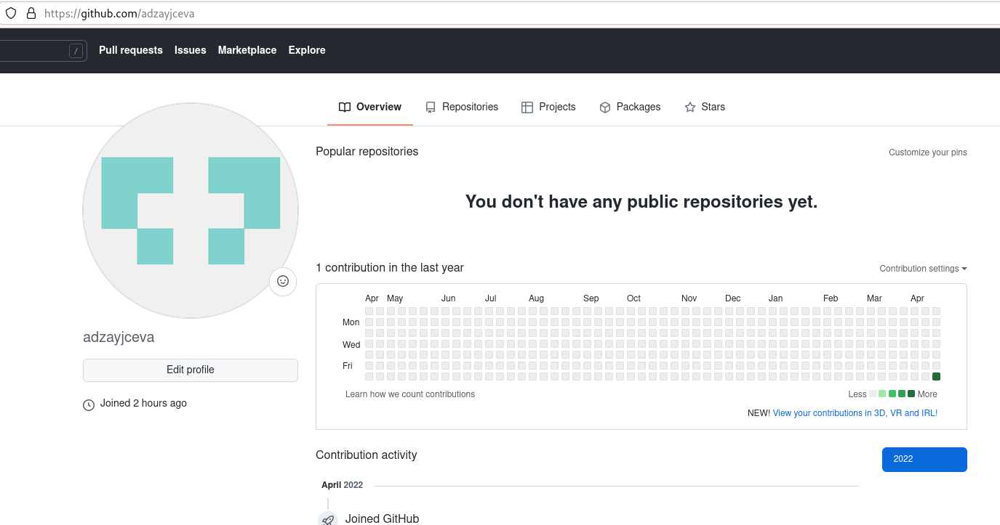{ #fig:001 width=70% }

**2) Произведём базовую настройку git. Задаём имя и email владельца репозитория, после чего настроим utf-8 в выводе сообщений git. (Рис. [-@fig:002]):**

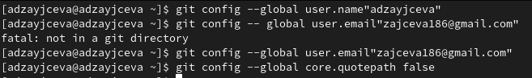{ #fig:002 width=70% }

**3) Создадим новый ключ на github. (*ssh-keygen -C"adzayjceva<zajceva186@gmail.com>"*) и привяжем его к компьютеру через консоль. Нам нужно загрузить сгенерённый нами заранее открытый ключ. Заходим на наш  github → «settings» → «ssh keys» → «add key». Копируем из локальной консоли ключ в буфер обмена (*cat ~/.ssh/id_rsa.pub | xclip -sel clip*) и вставляем ключ в появившееся на сайте поле. (Рис. [-@fig:003])**

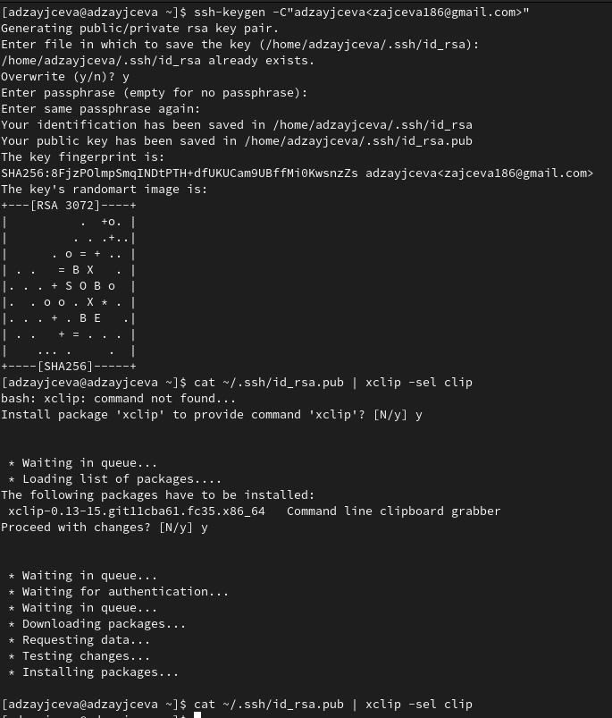{ #fig:003 width=70% }

Далее мы создадим и подключим репозиторий к  github. На сайте заходим в раздел «repositories» → «new» → создаём новый репозиторий (имя: «laboratory» и добавим файл README) (Рис. [-@fig:004]) И скопируем ссылку на репозиторий в консоль для дальнейшей работы с файлами. (Рис. [-@fig:005])

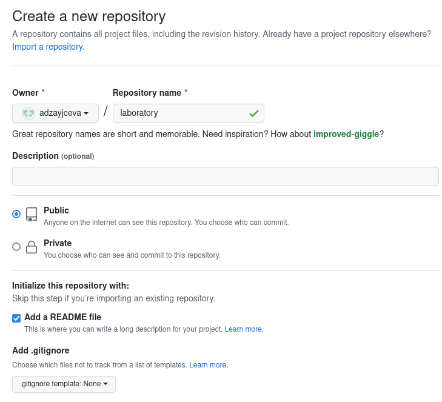{ #fig:004 width=70% }

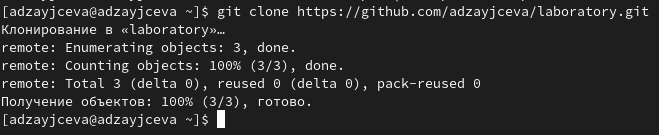{ #fig:005 width=70% }

**4) Алгоритм создания структуры каталога через консоль описан в лабораторной, но будет легче создать репозиторий на  github, после этого работать с каталогом и папками через консоль (перед этим нужно скопировать ссылку на репозиторий в консоль в формате https или ssh). Перед созданием файлов зайдём в наш репозиторий Рис. [-@fig:006]):**

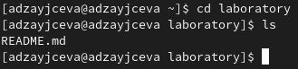{ #fig:006 width=70% }

После этого уже можно создавать файлы (Рис. [-@fig:007]):

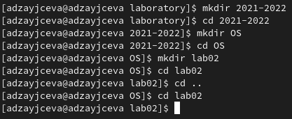{ #fig:007 width=70% }

**5) Добавим первый коммит и выложим его на  github. Для правильного размещения первого коммита нам необходимо добавить команду *git add .*, после чего с помощью команды *git  commit -am "first commit"* выкладываем коммит (Рис. [-@fig:008]):**

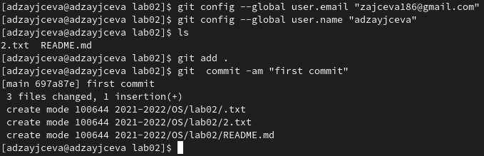{ #fig:008 width=70% }

**6) Сохраняем первый коммит, используя команду *git push* (Рис. [-@fig:009]):**

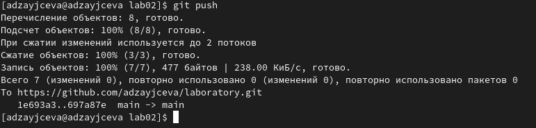{ #fig:009 width=70% }

**7) Первичная конфигурация:**

1. Добавим файл лицензии (Рис. [-@fig:010]):

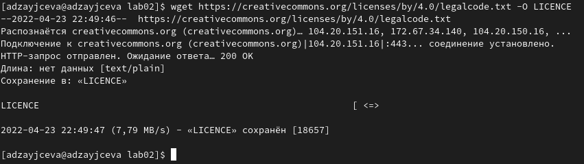{ #fig:010 width=70% }

2. Добавим шаблон  игнорируемых файлов. Просмотрим список имеющихся шаблонов (на скрине список неполный) (Рис. [-@fig:011]):

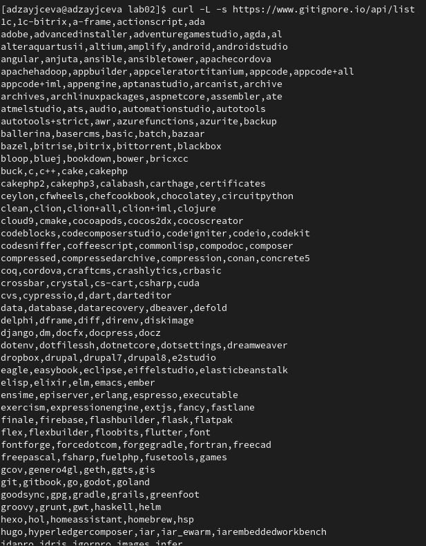{ #fig:011 width=70% }

3. Скачиваем шаблон, например, для С. Ещё добавляем новые файлы и выполняем коммит (Рис. [-@fig:012]):

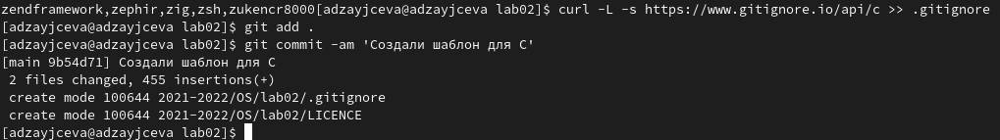{ #fig:012 width=70% }

4. Отправляем на  github (нужно сохранить все созданные шаблоны и файлы с помощью команды *git push*) (Рис. [-@fig:013]):

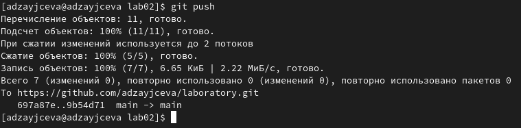{ #fig:013 width=70% }

**8) Работаем с конфигурацией git-flow**

1. Установка git-flow в Fedora Linux (Рис. [-@fig:014]):

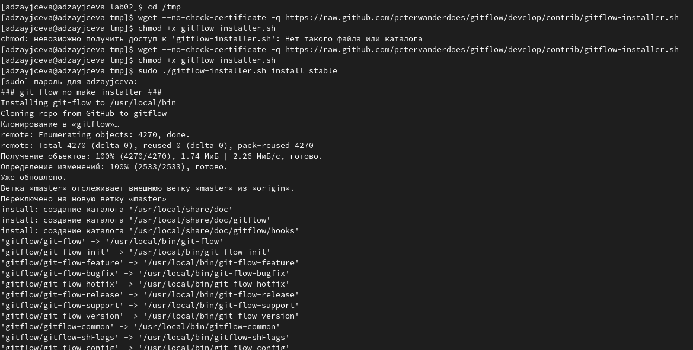{ #fig:014 width=70% }

2. Инициализируем  git-flow через команду *git flow init -f* (префикс для ярлыков установлен в v) (Рис. [-@fig:015]):

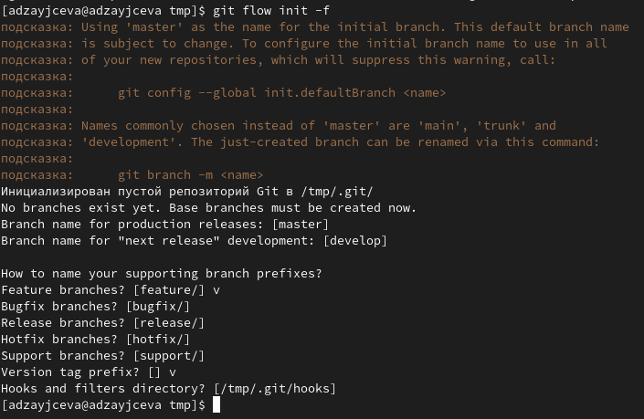{ #fig:015 width=70% }

3. Проверим, что мы находимся на ветке develop (команда git branch) (Рис. [-@fig:016]):

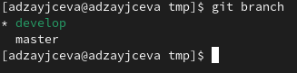{ #fig:016 width=70% }

4. Создадим релиз с версией 1.0.0 (Рис. [-@fig:017]):

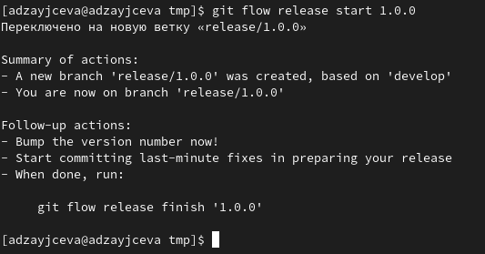{ #fig:017 width=70% }

5. Записываем версию и добавляем в индекс (Рис. [-@fig:018]):

*echo „hello world“>hello.txt*
*git add hello.txt*
*git commit -am „new file“*

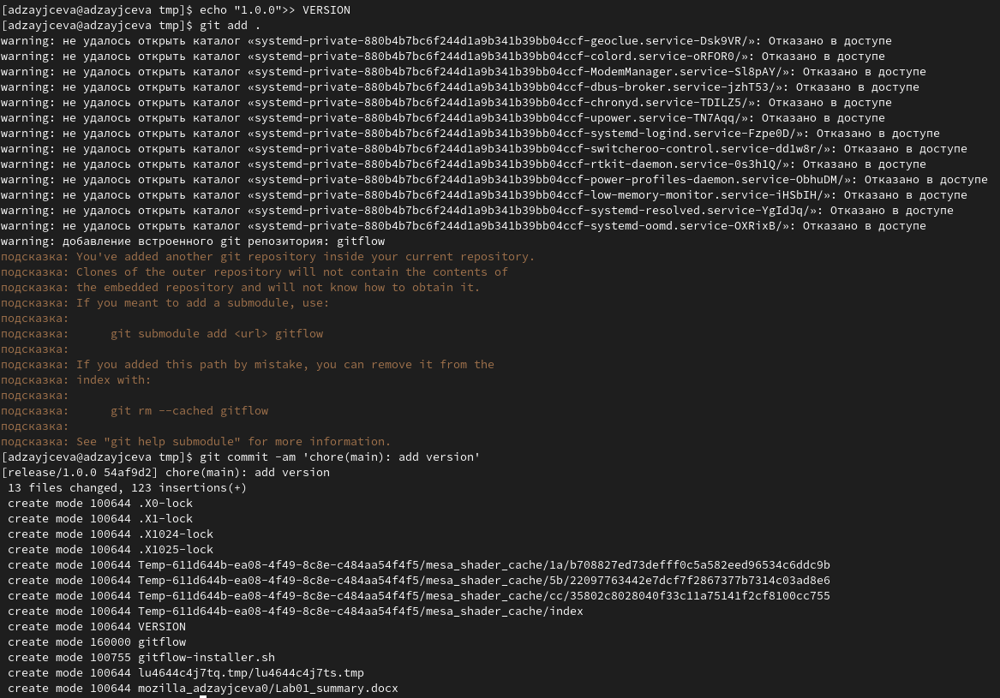{ #fig:018 width=70% }

6. Зальём релизную ветку в основную ветку (Рис. [-@fig:019]):

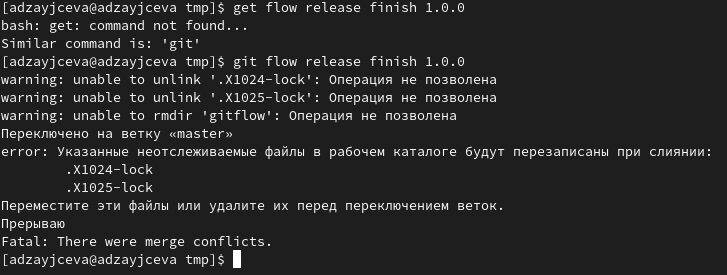{ #fig:019 width=70% }

7. Отправим данные на  github:

*git push —all*
*git push —tags*
Возникла ошибка. На этом лабораторная работа завершена.

# Контрольные вопросы:

1. Система контроля версий Git представляет собой набор программ командной строки. Доступ к ним можно получить из терминала посредством ввода команды git с различными опциями. Системы контроля версий (Version Control System, VCS)применяются при работе нескольких человек над одним проектом.

2. В классических системах контроля версий используется централизованная модель, предполагающая наличие единого репозитория для хранения файлов. Выполнение большинства функций по управлению версиями осуществляется специальным сервером. Участник проекта (пользователь) перед началом работы посредством определённых команд получает нужную ему версию файлов. После внесения изменений, пользователь размещает новую версию в хранилище. При этом предыдущие версии не удаляются из центрального хранилища и к ним можно вернуться в любой момент. Сервер может сохранять неполную версию изменённых файлов, а производить так называемую дельта-компрессию—сохранять только изменения между последовательными версиями, что позволяет уменьшить объём хранимых данных.
Системы контроля версий также могут обеспечивать дополнительные, более гибкие функциональные возможности. Например, они могут поддерживать работу с несколькими версиями одного файла, сохраняя общую историю изменений до точки ветвления версий и собственные истории изменений каждой ветви. Кроме того, обычно доступна информация о том, кто из участников, когда и какие изменения вносил. Обычно такого рода информация хранится в журнале изменений, доступ к которому можно ограничить.

3. Централизованные системы — это системы, которые используют архитектуру клиент / сервер, где один или несколько клиентских узлов напрямую подключены к центральному серверу. Пример - Wikipedia.
В децентрализованных системах каждый узел принимает свое собственное решение. Конечное поведение системы является совокупностью решений отдельных узлов. Пример — Bitcoin.
В классических системах контроля версий используется централизованная модель, предполагающая наличие единого репозитория для хранения файлов. Выполнение большинства функций по управлению версиями осуществляется специальным сервером.

4. Создадим локальный репозиторий. Сначала сделаем предварительную конфигурацию, указав имя и email владельца репозитория:
git config --global user.name"Имя Фамилия" git config --global user.email"work@mail"
и настроив utf-8 в выводе сообщений git:
git config --global quotepath false
Для инициализации локального репозитория, расположенного, например, в каталоге ~/tutorial, необходимо ввести в командной строке:
cd
mkdir tutorial
cd tutorial
git init

5. Для последующей идентификации пользователя на сервере репозиториев необходимо сгенерировать пару ключей (приватный и открытый): ssh-keygen -C"Имя Фамилия <work@mail>"
Ключи сохраняться в каталоге~/.ssh/.
Скопировав из локальной консоли ключ в буфер обмена
cat ~/.ssh/id_rsa.pub | xclip -sel clip вставляем ключ в появившееся на сайте поле.

6. У Git две основных задачи: первая — хранить информацию о всех изменениях в вашем коде, начиная с самой первой строчки, а вторая — обеспечение удобства командной работы над кодом.

7. Основные команды git:
**Наиболее часто используемые команды git:** – создание основного дерева репозитория :git init–получение обновлений (изменений) текущего дерева из центрального репозитория: git pull–отправка всех произведённых изменений локального дерева в центральный репозиторий:git push–просмотр списка изменённых файлов в текущей директории: git status–просмотр текущих изменения: git diff–сохранение текущих изменений:–добавить все изменённые и/или созданные файлы и/или каталоги: git add .–добавить конкретные изменённые и/или созданные файлы и/или каталоги: git add имена_файлов – удалить файл и/или каталог из индекса репозитория (при этом файл и/или каталог остаётся в локальной директории): git rm имена_файлов – сохранение добавленных изменений: – сохранить все добавленные изменения и все изменённые файлы: git commit -am 'Описание коммита'–сохранить добавленные изменения с внесением комментария через встроенный редактор: git commit–создание новой ветки, базирующейся на текущей: git checkout -b имя_ветки–переключение на некоторую ветку: git checkout имя_ветки (при переключении на ветку, которой ещё нет в локальном репозитории, она будет создана и связана с удалённой) – отправка
изменений конкретной ветки в центральный репозиторий: git push origin имя_ветки–слияние ветки стекущим деревом:git merge --no-ff имя_ветки–удаление ветки: – удаление локальной уже слитой с основным деревом ветки:git branch -d имя_ветки–принудительное удаление локальной ветки: git branch -D имя_ветки–удаление ветки с центрального репозитория: git push origin :имя_ветки

8. Использования git при работе с локальными репозиториями (добавления текстового документа в локальный репозиторий):
git add hello.txt
git commit -am 'Новый файл’

9. Проблемы, которые решают ветки git:
- нужно постоянно создавать архивы с рабочим кодом
- сложно "переключаться" между архивами
- сложно перетаскивать изменения между архивами
- легко что-то напутать или потерять

10. Во время работы над проектом так или иначе могут создаваться файлы, которые не требуется добавлять в последствии в репозиторий. Например, временные файлы, создаваемые редакторами, или объектные файлы, создаваемые компиляторами. Можно прописать шаблоны игнорируемых при добавлении в репозиторий типов файлов в файл.gitignore с помощью сервисов. Для этого сначала нужно получить списоки меняющихся шаблонов: curl -L -s https://www.gitignore.io/api/list
Затем скачать шаблон, например, для C и C++
curl -L -s https://www.gitignore.io/api/c >> .gitignore
curl -L -s https://www.gitignore.io/api/c++ >> .gitignore

# Вывод

Я изучила идеологию и применение контроля версий.
