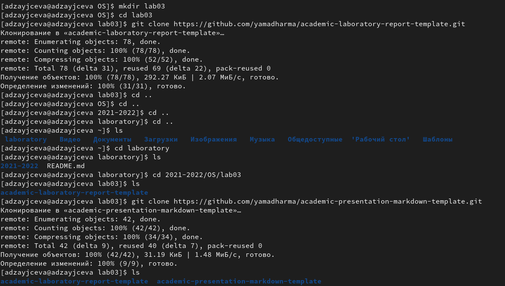
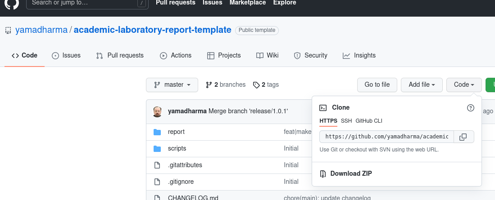
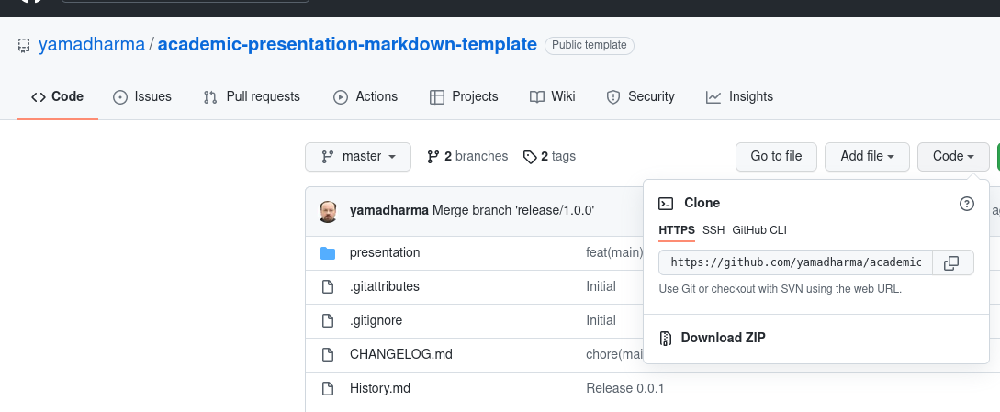
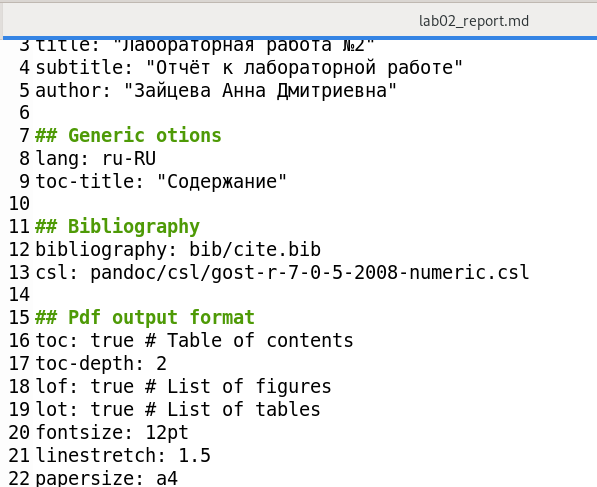
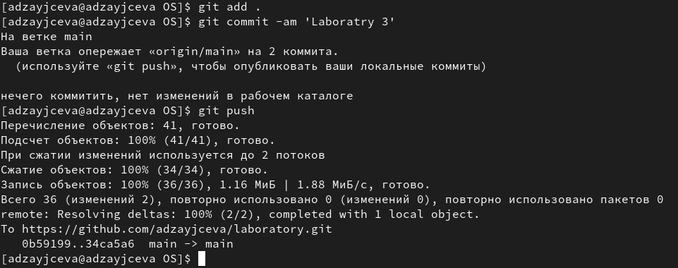

---
## Front matter
title: "Лабораторная работа №3"
subtitle: "Отчёт к лабораторной работе"
author: "Зайцева Анна Дмитриевна"

## Generic otions
lang: ru-RU
---

# Цель работы

Цель работы --- Научиться оформлять отчёты с помощью легковесного языка Markdown.

# Задание

- Сделать отчёт по предыдущей лабораторной работе в формате Markdown.
- Предоставить отчёты в 3 форматах: docx, pdf, md.

# Выполнение лабораторной работы

**1) В каталоге OS создадим каталог lab03 (Рис. [-@fig:001]) и скопируем в него шаблоны для отчёта (Рис. [-@fig:002]) и презентации (Рис. [-@fig:003]) в формате .md:**

{ #fig:001 width=70% }

{ #fig:002 width=70% }

{ #fig:003 width=70% }

**2) Редактируем скопированный документ с шаблоном отчёта и делаем это на основе отчёта к лабораторной работе №2 (Рис. [-@fig:004]):**

{ #fig:004 width=70% }

**3) Сохраняем отчёт в 3 форматах: docx, pdf, md.**

**4) Обновляем данные на GitHub (Рис. [-@fig:005]):**

{ #fig:005 width=70% }

# Вывод

Я научилась оформлять отчёты с помощью легковесного языка Markdown.
