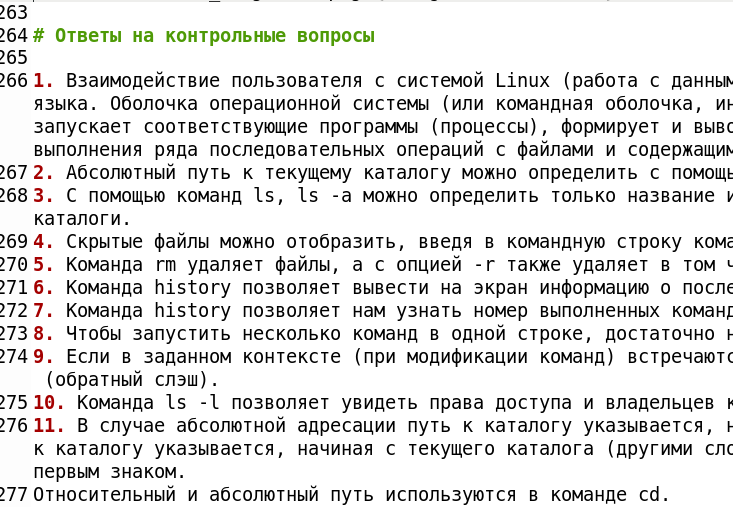
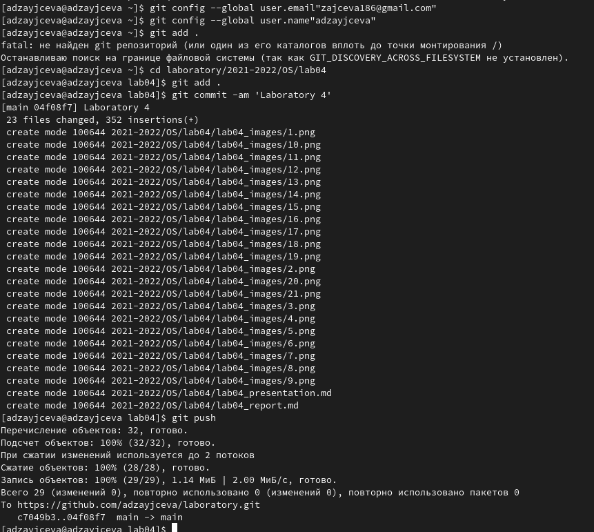

---
## Front matter
lang: ru-RU
title: Laboratory №4
author: |
	Anna D. Zaytseva\inst{1,3}
institute: |
	\inst{1}RUDN University, Moscow, Russian Federation
date: NEC--2022, 29 April, Moscow

## Formatting
toc: false
slide_level: 2
theme: metropolis
header-includes: 
 - \metroset{progressbar=frametitle,sectionpage=progressbar,numbering=fraction}
 - '\makeatletter'
 - '\beamer@ignorenonframefalse'
 - '\makeatother'
aspectratio: 43
section-titles: true
---

# Цель работы

Цель работы --- Приобретение практических навыков взаимодействия пользователя с системой по-
средством командной строки.

# Задание

1. Определите полное имя вашего домашнего каталога. Далее относительно этого ката-
лога будут выполняться последующие упражнения.
2. Выполните следующие действия:
   1. Перейдите в каталог /tmp.
   2. Выведите на экран содержимое каталога /tmp. Для этого используйте команду ls
с различными опциями. Поясните разницу в выводимой на экран информации.
   3. Определите, есть ли в каталоге /var/spool подкаталог с именем cron?
   4. Перейдите в Ваш домашний каталог и выведите на экран его содержимое. Опре-
делите,кто является владельцем файлов и подкаталогов?
3. Выполните следующие действия:
   1. В домашнем каталоге создайте новый каталог с именем newdir.
   2. В каталоге ~/newdir создайте новый каталог с именем morefun.
   3. В домашнем каталоге создайте одной командойтри новых каталога с именами
letters, memos, misk.Затем удалите эти каталоги одной командой.
   4. Попробуйте удалить ранее созданный каталог ~/newdir командой rm. Проверьте,
был ли каталог удалён.
   5. Удалите каталог ~/newdir/morefun из домашнего каталога.Проверьте, был ли
каталог удалён.
4. С помощью команды man определите, какую опцию команды ls нужно использо-
вать для просмотра содержимое не только указанного каталога, но и подкаталогов,
входящих в него.
5. С помощью команды man определите набор опций команды ls,позволяющий отсорти-
ровать по времени последнего изменения выводимый список содержимого каталога
с развёрнутым описанием файлов.
6. Используйте команду man для просмотра описания следующих команд: cd, pwd, mkdir, 
rmdir, rm. Поясните основные опции этих команд.
7. Используя информацию,полученную при помощи команды history, выполните мо-
дификацию и исполнение нескольких команд из буфера команд.

# Выполнение лабораторной работы

## Step 1

Создадим новую папку для лабораторной работы №4, а затем мы с помощью команды *cd* перейдём в домашний каталог и с помощью команды *pwd* мы определим полное имя нашего домашнего каталога. (Рис. [-@fig:001]):

{ #fig:001 width=70% }

## Step 2

Выполняем все задания из списка (Рис. [-@fig:002])(Рис. [-@fig:005])(Рис. [-@fig:013])(Рис. [-@fig:019])(Рис. [-@fig:021]):

{ #fig:002 width=70% }

{ #fig:005 width=70% }

{ #fig:013 width=70% }

{ #fig:019 width=70% }

{ #fig:021 width=70% }

## Steps 3 and 4

Отвечаем на контрольные вопросы (Рис. [-@fig:022]):

{ #fig:022 width=70% }

Обновляем данные на GitHub (Рис. [-@fig:023]):

{ #fig:023 width=70% }

# Вывод

Я научилась оформлять отчёты с помощью легковесного языка Markdown.

## {.standout}

Спасибо за внимание!
