---
## Front matter
title: "Лабораторная работа №4"
subtitle: "Отчёт к лабораторной работе"
author: "Зайцева Анна Дмитриевна"

## Generic options
lang: ru-RU

## Bibliography
bibliography: bib/cite.bib
csl: pandoc/csl/gost-r-7-0-5-2008-numeric.csl

## Pdf output format
toc: true # Table of contents
toc-depth: 2
lof: true # List of figures
lot: true # List of tables
fontsize: 12pt
linestretch: 1.5
papersize: a4
documentclass: scrreprt
## Fonts
mainfont: PT Serif
romanfont: PT Serif
sansfont: PT Sans
monofont: PT Mono
mainfontoptions: Ligatures=TeX
romanfontoptions: Ligatures=TeX
sansfontoptions: Ligatures=TeX,Scale=MatchLowercase
monofontoptions: Scale=MatchLowercase,Scale=0.9
## Pandoc-crossref LaTeX customization
figureTitle: "Рис."
tableTitle: "Таблица"
listingTitle: "Листинг"
lofTitle: "Список иллюстраций"
lotTitle: "Список таблиц"
lolTitle: "Листинги"
## Misc options
indent: true
header-includes:
  - \usepackage{indentfirst}
  - \usepackage{float} # keep figures where there are in the text
  - \floatplacement{figure}{H} # keep figures where there are in the text
---

# Цель работы

Цель работы --- Приобретение практических навыков взаимодействия пользователя с системой по-
средством командной строки.

# Задание

1. Определите полное имя вашего домашнего каталога. Далее относительно этого ката-
лога будут выполняться последующие упражнения.
2. Выполните следующие действия:
   1. Перейдите в каталог /tmp.
   2. Выведите на экран содержимое каталога /tmp. Для этого используйте команду ls
с различными опциями. Поясните разницу в выводимой на экран информации.
   3. Определите, есть ли в каталоге /var/spool подкаталог с именем cron?
   4. Перейдите в Ваш домашний каталог и выведите на экран его содержимое. Опре-
делите,кто является владельцем файлов и подкаталогов?
3. Выполните следующие действия:
   1. В домашнем каталоге создайте новый каталог с именем newdir.
   2. В каталоге ~/newdir создайте новый каталог с именем morefun.
   3. В домашнем каталоге создайте одной командойтри новых каталога с именами
letters, memos, misk.Затем удалите эти каталоги одной командой.
   4. Попробуйте удалить ранее созданный каталог ~/newdir командой rm. Проверьте,
был ли каталог удалён.
   5. Удалите каталог ~/newdir/morefun из домашнего каталога.Проверьте, был ли
каталог удалён.
4. С помощью команды man определите, какую опцию команды ls нужно использо-
вать для просмотра содержимое не только указанного каталога, но и подкаталогов,
входящих в него.
5. С помощью команды man определите набор опций команды ls,позволяющий отсорти-
ровать по времени последнего изменения выводимый список содержимого каталога
с развёрнутым описанием файлов.
6. Используйте команду man для просмотра описания следующих команд: cd, pwd, mkdir, 
rmdir, rm. Поясните основные опции этих команд.
7. Используя информацию,полученную при помощи команды history, выполните мо-
дификацию и исполнение нескольких команд из буфера команд.

# Выполнение лабораторной работы

1. Создадим новую папку для лабораторной работы №4, а затем мы с помощью команды *cd* перейдём в домашний каталог и с помощью команды *pwd* мы определим полное имя нашего домашнего каталога. (Рис. [-@fig:001]):

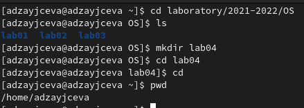{ #fig:001 width=70% }

2. Выполнила следующие действия:
   1. Перешла в каталог /tmp. (Рис. [-@fig:002])
   2. Вывела на экран содержимое каталога с помощью команды *ls* (Рис. [-@fig:002]):
   
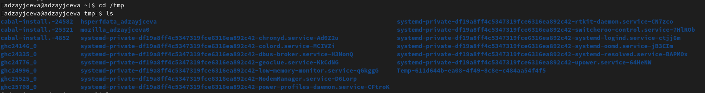{ #fig:002 width=70% }

      С помощью команды *ls -a* отобразила имена скрытых файлов (Рис. [-@fig:003]):
      
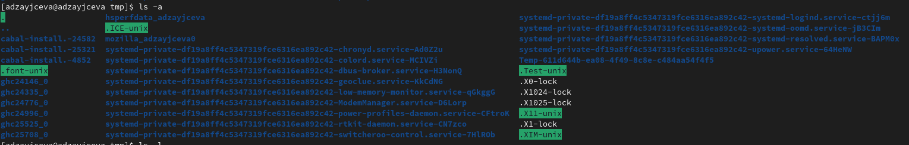{ #fig:003 width=70% }

      С помощью команды *ls -l* отобразила подробную информацию о файлах и каталогах (Рис. [-@fig:004]):
      
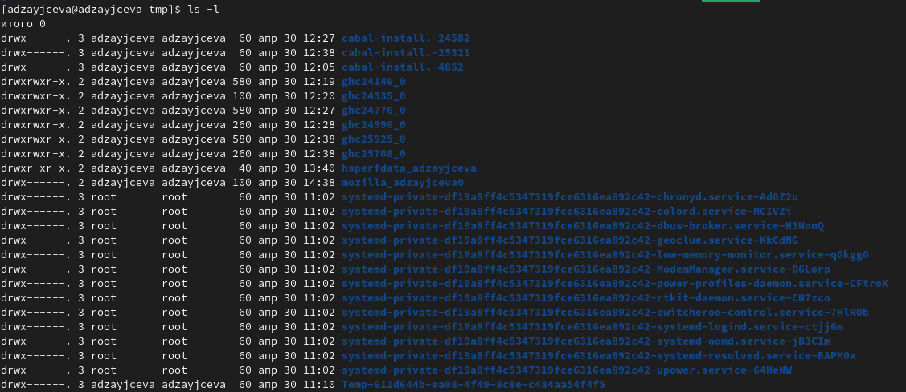{ #fig:004 width=70% }

      С помощью команды *ls -alF* отобразила имена скрытых файлов, подробную информацию о них (тип файла, права доступа, число ссылок, владелец, размер, дата последней ревизии, имя файла или каталога) и информацию о типах файлов (каталог, исполняемый файл, ссылка) (Рис. [-@fig:005]):
      
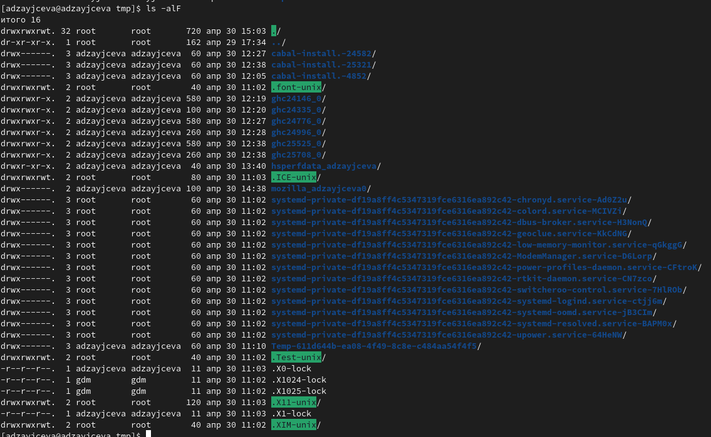{ #fig:005 width=70% }

   3. С помощью команды *cd /var/spool* перешла в каталог /var/spool и с помощью команды *ls* проверила, есть ли в нём подкаталог cron. У меня его нет (Рис. [-@fig:006]):
   
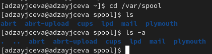{ #fig:006 width=70% }

   4. С помощью команды *cd* перешла в домашний каталог, и с помощью команды *ls -l* посмотрела владельца файлов и подкаталогов в домашнем каталоге (Рис. [-@fig:007]):
   
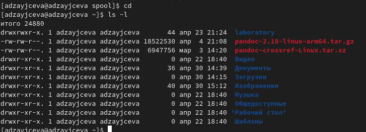{ #fig:007 width=70% }

3. Выполнила следующие действия:
   1. С помощью команды *mkdir* создаём подкаталог newdir в домашнем каталоге, в котором мы изначально находились (Рис. [-@fig:008]):
   
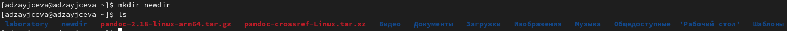{ #fig:008 width=70% }

   2. Переходим в подкаталог newdir и с помощью команды *mkdir* создаём подкаталог morefun (Рис. [-@fig:009]):
   
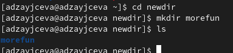{ #fig:009 width=70% }

   3. Переходим в домашний каталог и с помощью команды *mkdir letters memos misk* создаём 3 подкаталога: letters, memos, misk. Затем с помощью команды *rm -r letters memos misk* разом удаляем все 3 созданные ранее подкаталога. Поэтапно проверяем результаты работы команд с помощью команды *ls* (Рис. [-@fig:010]):
   
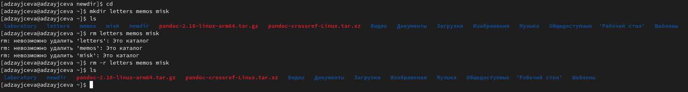{ #fig:010 width=70% }

   4. С помощью команды *rm* попробуем удалить каталог newdir. Затем с помощью команды *ls* проверим, был ли каталог удалён. Каталог удалён не был (Рис. [-@fig:011]):
   
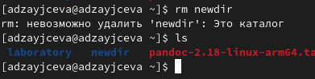{ #fig:011 width=70% }

   5. С помощью команды *rm -r newdir/morefun* попробуем удалить каталог newdir/morefun из домашнего каталога. Затем с помощью команды *ls* проверим, был ли каталог удалён. Каталог был удалён (Рис. [-@fig:012]):
   
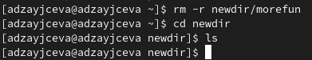{ #fig:012 width=70% }

4. С помощью команды *man ls* определим, какую опцию команды ls нужно использовать для просмотра содержимого не только указанного каталога, но и подкаталогов, входящих в него. Это команда *ls -R* (Рис. [-@fig:013]):
   
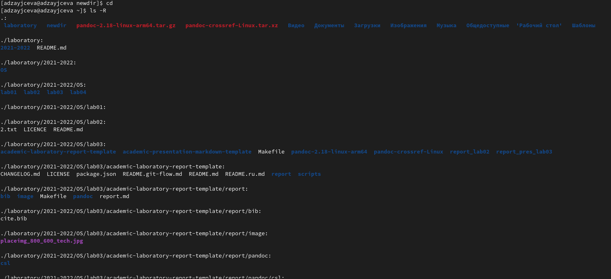{ #fig:013 width=70% }

5. С помощью команды *man ls* определим, какую опцию команды ls нужно использовать, чтобы отсортировать по времени последнего изменения выводимый список содержимого каталога с развёрнутым описанием файлов. Это команда *ls --sort=time -l* (Рис. [-@fig:014]):
   
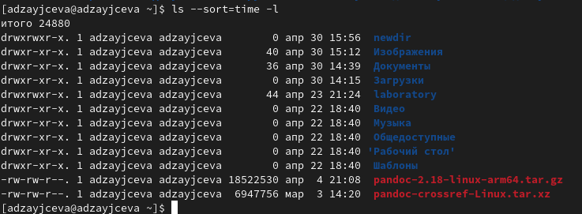{ #fig:014 width=70% }

6. Через команду man просмотрим описания следующих команд: cd, pwd, mkdir, rmdir, rm. (Рис. [-@fig:015]):
   
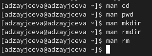{ #fig:015 width=70% }

Команда *cd* используется для перемещения по файловой системе операционной системы типа Linux.(Рис. [-@fig:016]); её основные опции: cd [-L|[-P [-e]] [-@]] [dir]

Change  the  current directory to dir.  if dir is not supplied, the value of the HOME shell variable is the default. Any additional arguments following dir are ignored.  The variable CDPATH defines the search path for the directory containing dir: each directory name in CDPATH is searched for dir.  Alternative directory names in CDPATH are separated by a colon (:).  A null directory name in CDPATH is the same as the  current  directory,  i.e.,  ``.''.  If dir begins with a slash (/), then CDPATH is not used.  The -P option causes cd to use the physical directory structure by resolving symbolic links while traversing dir and before processing instances of .. in dir (see also the -P option to the set builtin command); the -L option forces symbolic links to be followed by resolving the link after processing instances of .. in dir.  If .. appears in dir,  it  is processed  by  removing the immediately previous pathname component from dir, back to a slash or the beginning of dir.  If the -e option is supplied with -P, and the current working directory cannot be successfully determined after a successful directory change, cd will return an unsuccessful status.  On systems that support it, the -@ option presents the extended attributes associated with a file as a directory.  An argument of  - is  converted to $OLDPWD before the directory change is attempted.  If a non-empty directory name from CDPATH is used, or if - is the first argument, and the directory change is successful, the absolute pathname of the new working directory is written to the standard output.  The return value is true if the directory was successfully changed; false otherwise.

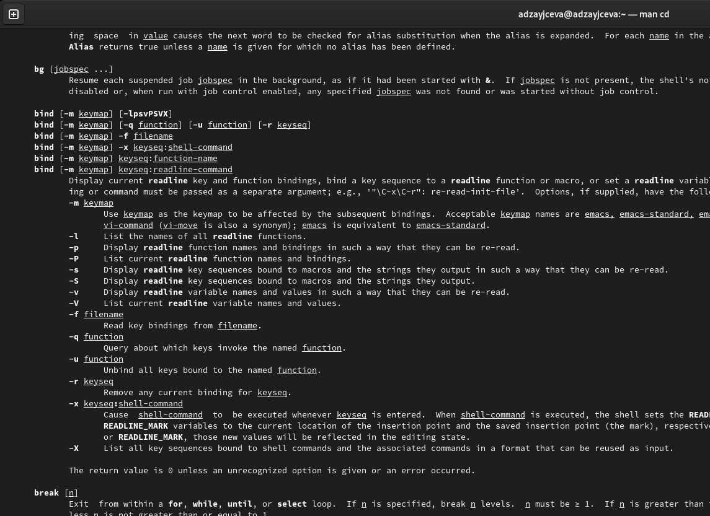{ #fig:016 width=70% }

Команда *pwd* используется для определения абсолютного пути к текущему каталогу (Рис. [-@fig:017]); её основные опции: 
       -L, --logical
              use PWD from environment, even if it contains symlinks

       -P, --physical
              avoid all symlinks

       --help display this help and exit

       --version
              output version information and exit

       If no option is specified, -P is assumed.

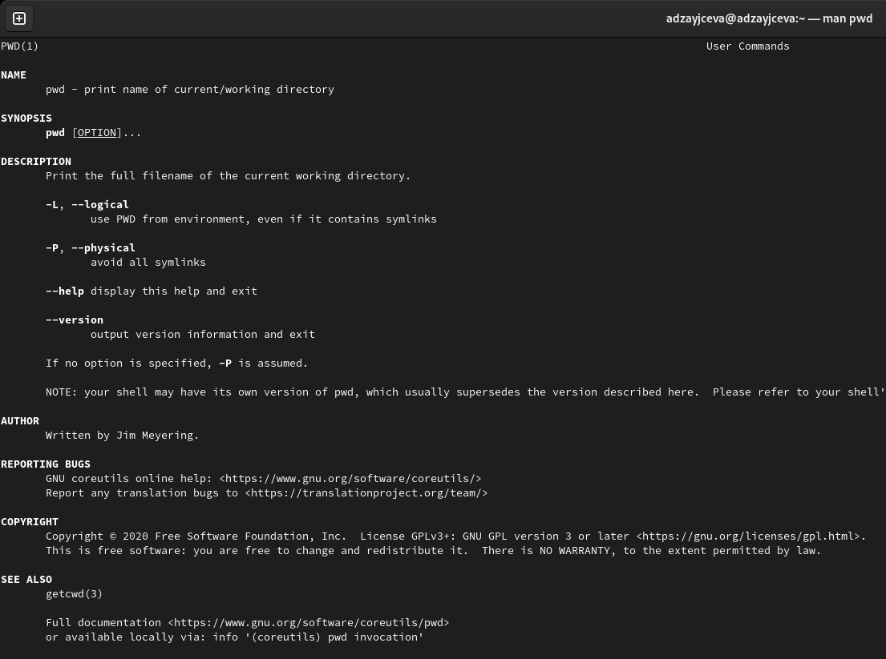{ #fig:017 width=70% }

Команда *mkdir* используется для создания каталогов (Рис. [-@fig:018]); её основные опции: 
Mandatory arguments to long options are mandatory for short options too.

       -m, --mode=MODE
              set file mode (as in chmod), not a=rwx - umask

       -p, --parents
              no error if existing, make parent directories as needed

       -v, --verbose
              print a message for each created directory

       -Z     set SELinux security context of each created directory to the default type

       --context[=CTX]
              like -Z, or if CTX is specified then set the SELinux or SMACK security context to CTX

       --help display this help and exit

       --version
              output version information and exit

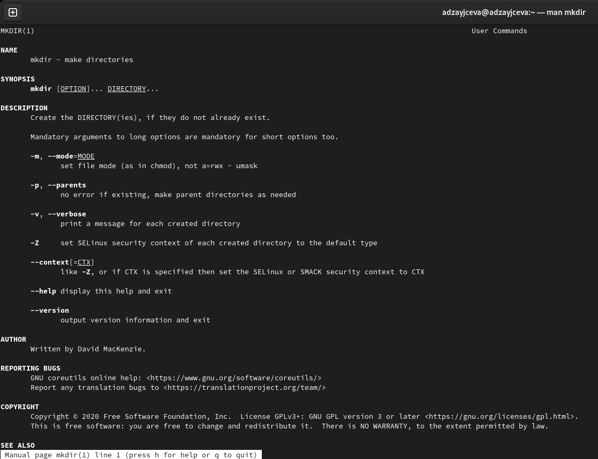{ #fig:018 width=70% }

Команда *rmdir* используется для создания каталогов (Рис. [-@fig:019]); её основные опции: 
       --ignore-fail-on-non-empty

              ignore each failure that is solely because a directory

              is non-empty

       -p, --parents
              remove DIRECTORY and its ancestors; e.g., 'rmdir -p a/b/c' is similar to 'rmdir a/b/c a/b a'

       -v, --verbose
              output a diagnostic for every directory processed

       --help display this help and exit

       --version
              output version information and exit

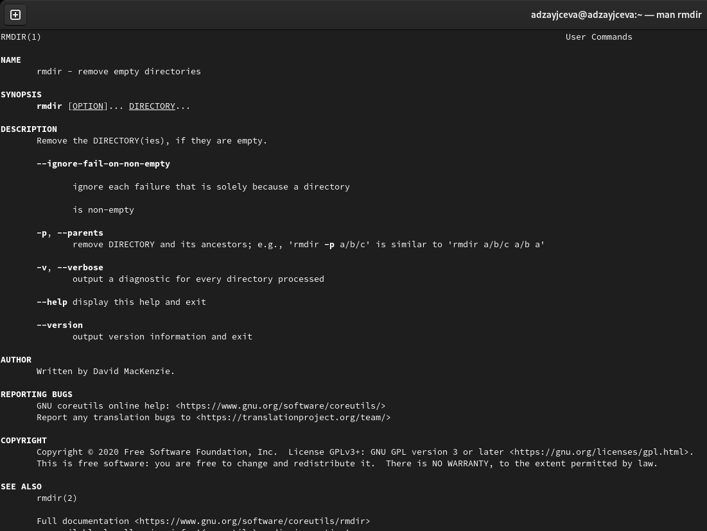{ #fig:019 width=70% }

Команда *rm* используется для создания каталогов (Рис. [-@fig:020]); её основные опции: 
       -f, --force
              ignore nonexistent files and arguments, never prompt

       -i     prompt before every removal

       -I     prompt once before removing more than three files, or when removing recursively; less intrusive than -i, while still giving protection against most mistakes

       --interactive[=WHEN]
              prompt according to WHEN: never, once (-I), or always (-i); without WHEN, prompt always

       --one-file-system
              when removing a hierarchy recursively, skip any directory that is on a file system different from that of the corresponding command line argument

       --no-preserve-root
              do not treat '/' specially

       --preserve-root[=all]
              do not remove '/' (default); with 'all', reject any command line argument on a separate device from its parent

       -r, -R, --recursive
              remove directories and their contents recursively

       -d, --dir
              remove empty directories

       -v, --verbose
              explain what is being done

       --help display this help and exit

       --version
              output version information and exit

       By default, rm does not remove directories.  Use the --recursive (-r or -R) option to remove each listed directory, too, along with all of its contents.

       To remove a file whose name starts with a '-', for example '-foo', use one of these commands:

              rm -- -foo

              rm ./-foo

       Note that if you use rm to remove a file, it might be possible to recover some of its contents, given sufficient expertise and/or time.  For greater assurance that the contents are truly unrecoverable, consider using shred.

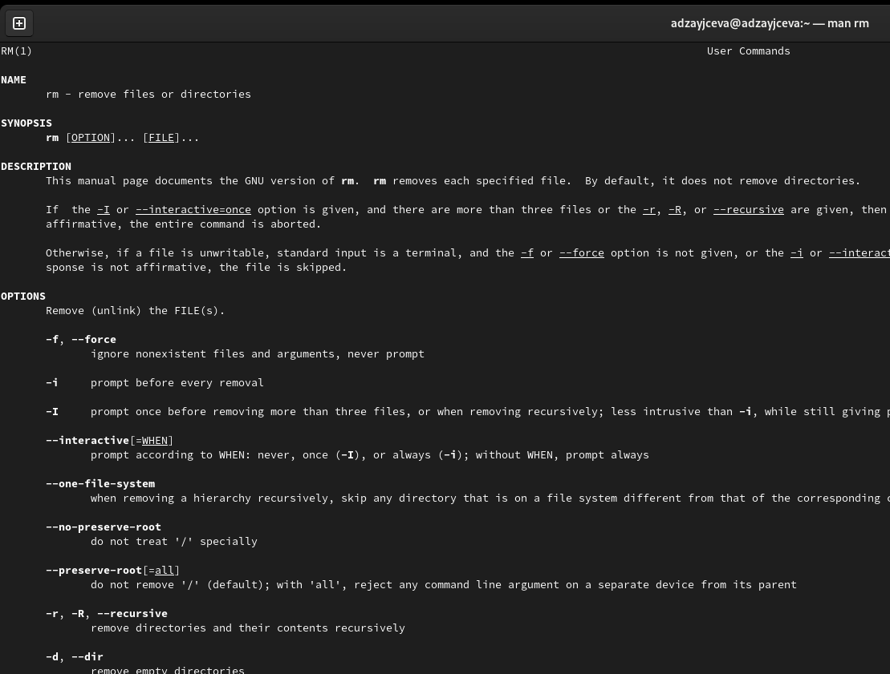{ #fig:020 width=70% }

7. Используя информацию, полученную при помощи команды *history*, выполнила модификацию и исполнение нескольких команд из буфера команд. !<номер_команды>:s/<что_меняем>/<на_что_меняем> (Рис. [-@fig:021]):

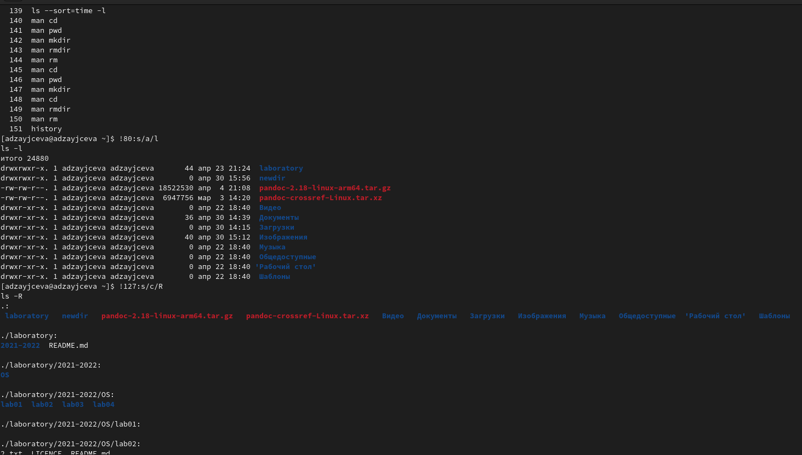{ #fig:021 width=70% }

# Ответы на контрольные вопросы

1. Взаимодействие пользователя с системой Linux (работа с данными и управление работающими в системе процессами) происходит в интерактивном режиме посредством командного языка. Оболочка операционной системы (или командная оболочка, интерпретатор команд) — интерпретирует (т.е. переводит на машинный язык) вводимые пользователем команды, запускает соответствующие программы (процессы), формирует и выводит ответные сообщения. Кроме того, на языке командной оболочки можно писать небольшие программы для выполнения ряда последовательных операций с файлами и содержащимися в них данными — сценарии (скрипты).
2. Абсолютный путь к текущему каталогу можно определить с помощью команды pwd.
3. С помощью команд ls, ls -a можно определить только название и формат файлов и каталогов. Отличаются они только тем, что вторая команда выводит также скрытые файлы и каталоги.
4. Скрытые файлы можно отобразить, введя в командную строку команду ls -a.
5. Команда rm удаляет файлы, а с опцией -r также удаляет в том числе непустые каталоги. Пустые каталоги можно удалить, используя команду rmdir.
6. Команда history позволяет вывести на экран информацию о последних выполненных пользователем команд.
7. Команда history позволяет нам узнать номер выполненных команд, который нужен чтобы модифицировать их. Например, !:s//.
8. Чтобы запустить несколько команд в одной строке, достаточно написать их через точку с запятой. Например, cd; ls.
9. Если в заданном контексте (при модификации команд) встречаются специальные символы (типа «.», «/», «*» и т.д.), надо перед ними поставить символ экранирования  (обратный слэш).
10. Команда ls -l позволяет увидеть права доступа и владельцев каталогов и файлов.
11. В случае абсолютной адресации путь к каталогу указывается, начиная с корневого каталога, и далее вниз по дереву папок до требуемого. При относительной адресации путь к каталогу указывается, начиная с текущего каталога (другими словами, относительно текущего каталога). Когда используется относительная адресация, слэш никогда не бывает первым знаком.
Относительный и абсолютный путь используются в команде cd. 
Например,
cd ~/work/study
cd work/study
Используя и первую, и вторую команду, мы сможем попасть в папку study. Их отличе в том, что в первом случае мы указывали абсолютный путь, тогда как во втором - только относительный.
12. Чтобы полчуить информацию о какой-либо команде, нужно ввести man .
13. Для автоматического дополнения вводимых команд служит клавиша Tab.

# Вывод

Я приобрела практические навыки взаимодействия пользователя с системой посредством командной строки.
