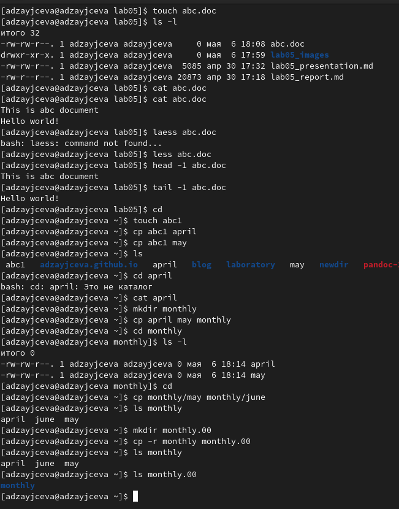
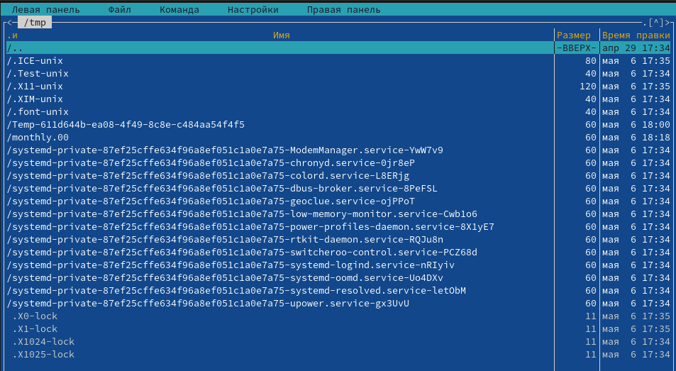
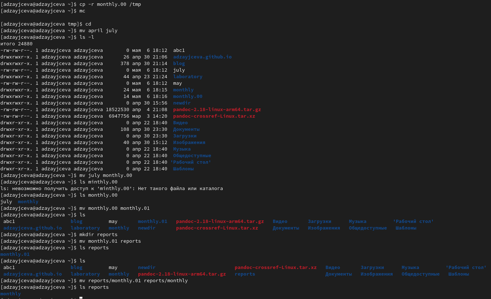
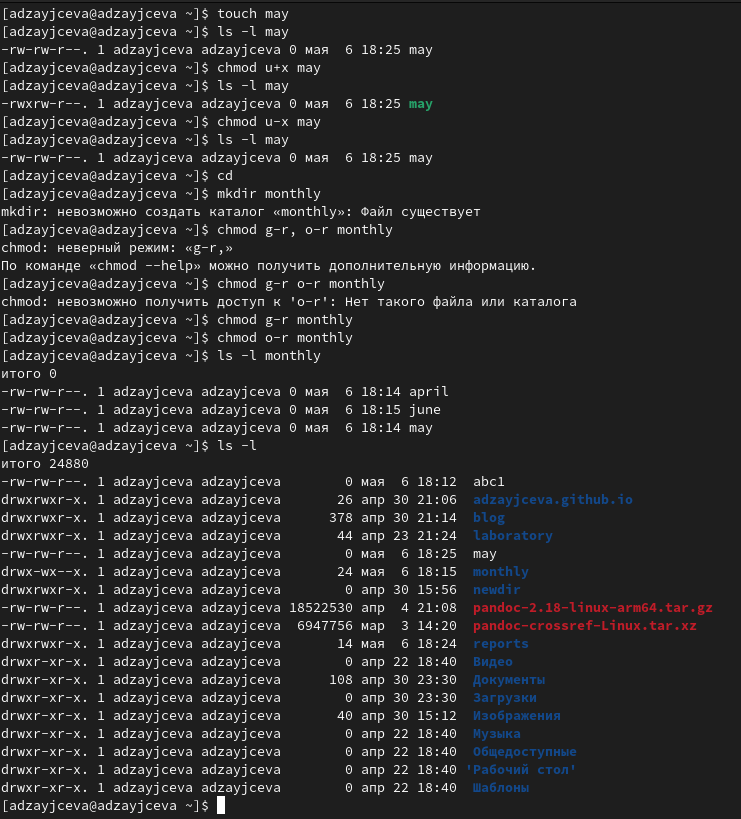
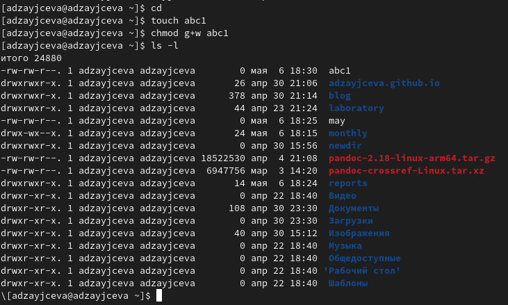
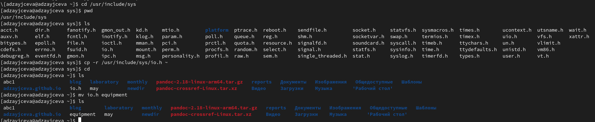
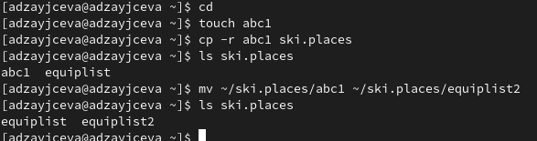
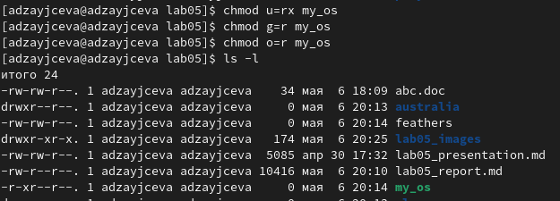
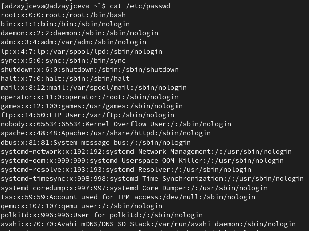
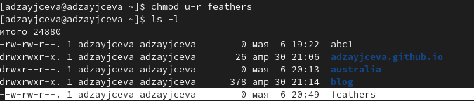

---
## Front matter
lang: ru-RU
title: Laboratory №5
author: |
	Anna D. Zaytseva\inst{1,3}
institute: |
	\inst{1}RUDN University, Moscow, Russian Federation
date: NEC--2022, 6 May, Moscow

## Formatting
toc: false
slide_level: 2
theme: metropolis
header-includes: 
 - \metroset{progressbar=frametitle,sectionpage=progressbar,numbering=fraction}
 - '\makeatletter'
 - '\beamer@ignorenonframefalse'
 - '\makeatother'
aspectratio: 43
section-titles: true
---

# Цель работы

Цель работы --- Ознакомление с файловой системой Linux, её структурой, именами и содержанием
каталогов. Приобретение практических навыков по применению команд для работы
с файлами и каталогами,по управлению процессами (и работами),по проверке исполь-
зования диска и обслуживанию файловой системы.

# Задание

1. Выполните все примеры,приведённые в первой части описания лабораторной работы.
2. Выполните следующие действия, зафиксировав в отчёте по лабораторной работе используемые при этом команды и результаты их выполнения:
   1. Скопируйте файл /usr/include/sys/io.h в домашний каталог и назовите его equipment. Если файла io.h нет,то используйтелюбойдругой файл в каталоге /usr/include/sys/ вместо него.
   2. В домашнем каталоге создайте директорию ~/ski.plases.
   3. Переместите файл equipment в каталог ~/ski.plases.
   4. Переименуйте файл ~/ski.plases/equipment в ~/ski.plases/equiplist.
   5. Создайте в домашнем каталоге файл abc1 и скопируйте его в каталог ~/ski.plases,назовите его equiplist2.
   6. Создайте каталог с именем equipment в каталоге ~/ski.plases.
   7. Переместите файлы ~/ski.plases/equiplist и equiplist2 в каталог ~/ski.plases/equipment.
   8. Создайте и переместите каталог ~/newdir в каталог ~/ski.plases и назовите
его plans.
3. Определите опции команды chmod,необходимые для того,чтобы присвоить перечисленным ниже файлам выделенные права доступа, считая, что в начале таких прав
нет:
   1. drwxr--r-- ... australia
   2. drwx--x--x ... play
   3. -r-xr--r-- ... my_os
   4. -rw-rw-r-- ... feathers
При необходимости создайте нужные файлы.
4. Проделайте приведённые ниже упражнения, записывая в отчёт по лабораторной работе используемые при этом команды:
   1. Просмотрите содержимое файла /etc/password.
   2. Скопируйте файл ~/feathers в файл ~/file.old.
   3. Переместите файл ~/file.old в каталог ~/play.
   4. Скопируйте каталог ~/play в каталог ~/fun.
   5. Переместите каталог ~/fun в каталог ~/play и назовите его games.
   6. Лишите владельца файла ~/feathers права на чтение.
   7. Что произойдёт,если вы попытаетесь просмотреть файл ~/feathers командой cat?
   8. Что произойдёт,если вы попытаетесь скопировать файл ~/feathers?
   9. Дайте владельцу файла ~/feathers право на чтение.
   10. Лишите владельца каталога ~/play права на выполнение.
   11. Перейдите в каталог ~/play.Что произошло?
   12. Дайте владельцу каталога ~/play право на выполнение.
5. Прочитайте man по командам mount,fsck,mkfs,kill и кратко их охарактеризуйте, приведя пример

# Выполнение лабораторной работы

## Step 1

Я выполнила все примеры, приведённые в первой части описания лабораторной работы (Рис. [-@fig:001])(Рис. [-@fig:002])(Рис. [-@fig:003])(Рис. [-@fig:004])(Рис. [-@fig:005]):

{ #fig:001 width=70% }

{ #fig:002 width=70% }

{ #fig:003 width=70% }

{ #fig:004 width=70% }

{ #fig:005 width=70% }

## Step 2

Поработала с файлами и каталогами (Рис. [-@fig:006])(Рис. [-@fig:010])(Рис. [-@fig:017])(Рис. [-@fig:019])(Рис. [-@fig:024]):

{ #fig:006 width=70% }

{ #fig:010 width=70% }

{ #fig:017 width=70% }

{ #fig:019 width=70% }

{ #fig:024 width=70% }

## Steps 3 and 4

Ответила на контрольные вопросы и обновила данные на GitHub

# Вывод

В ходе лабораторной работы я ознакомилась с файловой системой Linux, её структурой, именами и содержанием каталогов. Приобрела практические навыки по применению команд для работы с файлами и каталогами, по управлению процессами (и работами), по проверке использования диска и обслуживанию файловой системы.

## {.standout}

Спасибо за внимание!
