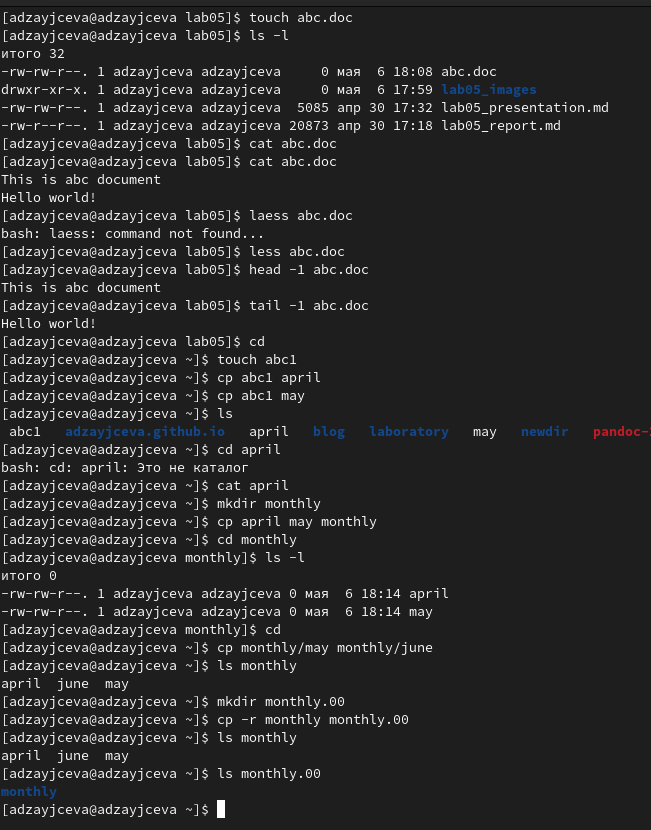
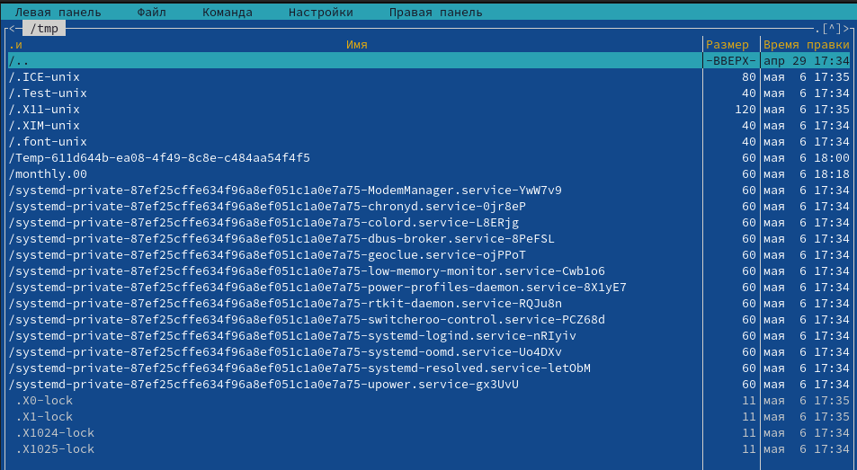
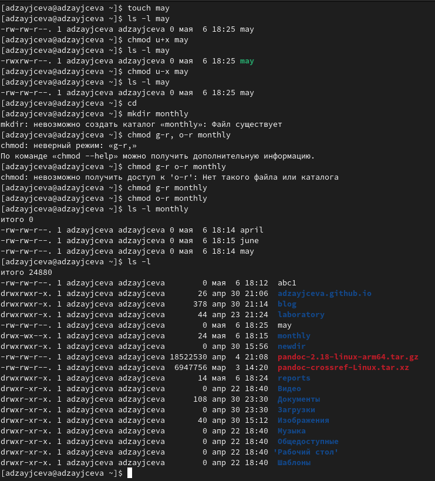
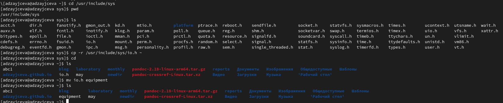
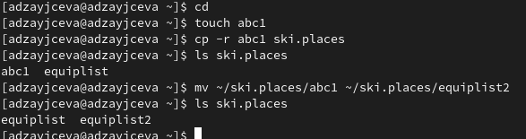
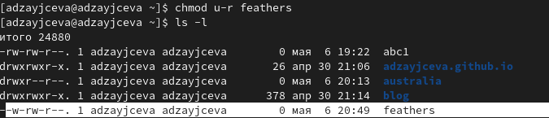

---
## Front matter
title: "Лабораторная работа №5"
subtitle: "Отчёт к лабораторной работе"
author: "Зайцева Анна Дмитриевна"

## Generic options
lang: ru-RU

## Bibliography
bibliography: bib/cite.bib
csl: pandoc/csl/gost-r-7-0-5-2008-numeric.csl

## Pdf output format
toc: true # Table of contents
toc-depth: 2
lof: true # List of figures
lot: true # List of tables
fontsize: 12pt
linestretch: 1.5
papersize: a4
documentclass: scrreprt
## Fonts
mainfont: PT Serif
romanfont: PT Serif
sansfont: PT Sans
monofont: PT Mono
mainfontoptions: Ligatures=TeX
romanfontoptions: Ligatures=TeX
sansfontoptions: Ligatures=TeX,Scale=MatchLowercase
monofontoptions: Scale=MatchLowercase,Scale=0.9
## Pandoc-crossref LaTeX customization
figureTitle: "Рис."
tableTitle: "Таблица"
listingTitle: "Листинг"
lofTitle: "Список иллюстраций"
lotTitle: "Список таблиц"
lolTitle: "Листинги"
## Misc options
indent: true
header-includes:
  - \usepackage{indentfirst}
  - \usepackage{float} # keep figures where there are in the text
  - \floatplacement{figure}{H} # keep figures where there are in the text
---

# Цель работы

Цель работы --- Ознакомление с файловой системой Linux, её структурой, именами и содержанием
каталогов. Приобретение практических навыков по применению команд для работы
с файлами и каталогами,по управлению процессами (и работами),по проверке исполь-
зования диска и обслуживанию файловой системы.

# Задание

1. Выполните все примеры,приведённые в первой части описания лабораторной работы.
2. Выполните следующие действия, зафиксировав в отчёте по лабораторной работе используемые при этом команды и результаты их выполнения:
   1. Скопируйте файл /usr/include/sys/io.h в домашний каталог и назовите его equipment. Если файла io.h нет,то используйтелюбойдругой файл в каталоге /usr/include/sys/ вместо него.
   2. В домашнем каталоге создайте директорию ~/ski.plases.
   3. Переместите файл equipment в каталог ~/ski.plases.
   4. Переименуйте файл ~/ski.plases/equipment в ~/ski.plases/equiplist.
   5. Создайте в домашнем каталоге файл abc1 и скопируйте его в каталог ~/ski.plases,назовите его equiplist2.
   6. Создайте каталог с именем equipment в каталоге ~/ski.plases.
   7. Переместите файлы ~/ski.plases/equiplist и equiplist2 в каталог ~/ski.plases/equipment.
   8. Создайте и переместите каталог ~/newdir в каталог ~/ski.plases и назовите
его plans.
3. Определите опции команды chmod,необходимые для того,чтобы присвоить перечисленным ниже файлам выделенные права доступа, считая, что в начале таких прав
нет:
   1. drwxr--r-- ... australia
   2. drwx--x--x ... play
   3. -r-xr--r-- ... my_os
   4. -rw-rw-r-- ... feathers
При необходимости создайте нужные файлы.
4. Проделайте приведённые ниже упражнения, записывая в отчёт по лабораторной работе используемые при этом команды:
   1. Просмотрите содержимое файла /etc/password.
   2. Скопируйте файл ~/feathers в файл ~/file.old.
   3. Переместите файл ~/file.old в каталог ~/play.
   4. Скопируйте каталог ~/play в каталог ~/fun.
   5. Переместите каталог ~/fun в каталог ~/play и назовите его games.
   6. Лишите владельца файла ~/feathers права на чтение.
   7. Что произойдёт,если вы попытаетесь просмотреть файл ~/feathers командой cat?
   8. Что произойдёт,если вы попытаетесь скопировать файл ~/feathers?
   9. Дайте владельцу файла ~/feathers право на чтение.
   10. Лишите владельца каталога ~/play права на выполнение.
   11. Перейдите в каталог ~/play.Что произошло?
   12. Дайте владельцу каталога ~/play право на выполнение.
5. Прочитайте man по командам mount,fsck,mkfs,kill и кратко их охарактеризуйте, приведя пример

# Выполнение лабораторной работы

1. Я выполнила все примеры, приведённые в первой части описания лабораторной работы (Рис. [-@fig:001])(Рис. [-@fig:002])(Рис. [-@fig:003])(Рис. [-@fig:004])(Рис. [-@fig:005]):

{ #fig:001 width=70% }

{ #fig:002 width=70% }

{ #fig:003 width=70% }

{ #fig:004 width=70% }

{ #fig:005 width=70% }

2. Выполнила следующие действия:

   1. С помощью команды *cd /usr/include/sys* я перешла в нужный нам каталог, чтобы затем с помощью команды *ls* проверить в каталоге наличие файла io.h. Далее с помощью команды *cp -r /usr/include/sys/io.h ~* я скопировала этот файл в домашний каталог. С командой *cd* я перешла в домашний каталог и с командой *ls* проверила, скопировался ли выбранный нами файл в домашний каталог. Он скопировался. Далее командой *mv io.h equipment* я переименовала наш файл. И с командой *ls* проверила, выполнилось ли переименование. Оно успешно выполнилось (Рис. [-@fig:006]):
   
{ #fig:006 width=70% }

   2. В домашнем каталоге с помощью команды *mkdir ski.places* я создала новую директорию. И командой *ls* проверила её наличие в домашнем каталоге (Рис. [-@fig:007]):
      
{ #fig:007 width=70% }

   3. Переместила файл equipment в каталог ~/ski.plases с помощью команды *mv equipment ski.places*, и с помощью команд *ls* и *ls ski.places* проверила правильность выполнения действий. Всё верно (Рис. [-@fig:008]):
   
{ #fig:008 width=70% }

   4. Переименовала файл ~/ski.plases/equipment в ~/ski.plases/equiplist с помощью команды *mv equipment ski.places*, и с помощью команды *ls ski.places* проверила правильность выполнения действий. Всё верно (Рис. [-@fig:009]):
   
{ #fig:009 width=70% }

   5. Перешла в домашний каталог с помощью команды *cd*. Создала в домашнем каталоге файл abc1 (команда: *touch abc1*) и скопировала его в каталог ~/ski.plases (команда: *cp -r abc1 ski.places*), и назвала его equiplist2(команда: *mv ~/ski.places/abc1 ~/ski.places/equiplist2*). И с помощью команды *ls ski.places* проверила правильность выполнения действий. Всё верно (Рис. [-@fig:010]):
   
{ #fig:010 width=70% }

   6. Перешла в каталог ~/ski.plases (команда: *cd ski.places*). Создала каталог с именем equipment в каталоге ~/ski.plases (команда: *mkdir equipment*). И с помощью команды *ls* проверила правильность выполнения действий. Всё верно (Рис. [-@fig:011]):
   
{ #fig:011 width=70% }

   7. Переместила файлы ~/ski.plases/equiplist и equiplist2 в каталог ~/ski.plases/equipment (команда: *mv equiplist equiplist2 equipment*). И с помощью команд *ls* и *ls equipment* проверила правильность выполнения действий. Всё верно (Рис. [-@fig:012]):
   
{ #fig:012 width=70% }

   8. Перешла в домашний каталог с помощью команды *cd*. Создала (команда: *mkdir newdir*) и переместила каталог ~/newdir в каталог ~/ski.plases (команда: *mv newdir ~/ski.places*), перешла в каталог ~/ski.plases (команда: *cd ski.places*) и переименовала перемещённый каталог newdir в plans (команда: *mv newdir plans*). Проверку своих шагов я осуществляла командой *ls*. Всё получилось (Рис. [-@fig:013]):
   
{ #fig:013 width=70% }

3. Перешла в каталог для текущей лабораторной работы. Создала нужные файлы и директории (команды: *mkdir australia play* и *touch my_os feathers*) (Рис. [-@fig:014]):
   
{ #fig:014 width=70% }

   1. Выделила такие права доступа: drwxr--r-- ... australia (команды: *chmod u=rwx australia*, *chmod g=r australia* и *chmod o=r australia*). Проверку своих шагов я осуществляла командой *ls -l*. Всё получилось (Рис. [-@fig:015]):
   
{ #fig:015 width=70% }

   2. Выделила такие права доступа: drwx--x--x ... play (команды: *chmod u=rwx play*, *chmod g=x play* и *chmod o=x play*). Проверку своих шагов я осуществляла командой *ls -l*. Всё получилось (Рис. [-@fig:016]):
   
{ #fig:016 width=70% }

   3. Выделила такие права доступа: -r-xr--r-- ... my_os (команды: *chmod u=rx my_os*, *chmod g=r my_os* и *chmod o=r my_os*). Проверку своих шагов я осуществляла командой *ls -l*. Всё получилось (Рис. [-@fig:017]):
   
{ #fig:017 width=70% }

   4. Выделила такие права доступа: -rw-rw-r-- ... feathers (команды: *chmod u=rw feathers*, *chmod g=rw feathers* и *chmod o=r feathers*). Проверку своих шагов я осуществляла командой *ls -l*. Всё получилось (Рис. [-@fig:018]):
   
{ #fig:018 width=70% }

4. Проделала следующие упражнения:

   1. Просмотрела содержимое файла /etc/passwd (команда: *cat /etc/passwd*) (Рис. [-@fig:019]):
   
{ #fig:019 width=70% }

   2. Перенесла файл feathers в корневую директорию (команда: *cp feathers ~*). Скопировала файл ~/feathers в файл ~/file.old, предварительно создав его (команды: *touch file.old* и *cp feathers file.old*) (Рис. [-@fig:020]):
   
{ #fig:020 width=70% }

   3. Я перенесла всё, что создавала в 3 глобальном пункте задания, в корневой каталог. Переместила файл ~/file.old в каталог ~/play (команда: *mv file.old ~/play*) Проверку своих шагов я осуществляла командой *ls play*. Всё получилось (Рис. [-@fig:021]):
   
{ #fig:021 width=70% }

   4. Создала каталог ~/fun (команда: *mkdir fun*). Скопировала каталог ~/play в каталог ~/fun (команда: *cp -r play ~/fun*) Проверку своих шагов я осуществляла командами *ls* и *ls fun*. Всё получилось (Рис. [-@fig:022]):
   
{ #fig:022 width=70% }

   5. Переместила каталог ~/fun в каталог ~/play (команда: *mv fun ~/play*) и назвала его games (последовательно команды: *cd play* и *mv fun games*). Проверку своих шагов я осуществляла командами *ls* и *ls play*. Всё получилось (Рис. [-@fig:023]):
   
{ #fig:023 width=70% }

   6. Лишила владельца файла ~/feathers права на чтение (команда: *chmod u-r feathers*). Проверку своих шагов я осуществляла командой *ls -l*. Всё получилось (Рис. [-@fig:024]):
   
{ #fig:024 width=70% }

   7. Командой *cat* я попробовала просмотреть файл ~/feathers. Вот, что было выведено в ответ на вызов этой команды в терминале (Рис. [-@fig:025]):
   
{ #fig:025 width=70% }

   8. Я попыталась скопировать файл ~/feathers (команда: *cp feathers ~/fun*). Вот, что было выведено в ответ на вызов этой команды в терминале (Рис. [-@fig:026]):
   
{ #fig:026 width=70% }

   9. Дайте владельцу файла ~/feathers право на чтение (команда: *chmod u+r feathers*). Проверку своих шагов я осуществляла командой *ls -l*. Всё получилось (Рис. [-@fig:027]):
   
{ #fig:027 width=70% }

   10. Лишила владельца каталога ~/play права на выполнение (команда: *chmod u-r feathers*). Проверку своих шагов я осуществляла командой *ls -l*. Всё получилось (Рис. [-@fig:028]):
   
{ #fig:028 width=70% }

   11. Перешла в каталог ~/play (команда: *chmod u-r feathers*). Вот, что было выведено в ответ на вызов этой команды в терминале (Рис. [-@fig:029]):
   
{ #fig:029 width=70% }

   12. Дала владельцу каталога ~/play право на выполнение (команда: *chmod u+x play*). Проверку своих шагов я осуществляла командой *ls -l*. Всё получилось (Рис. [-@fig:030]):
   
{ #fig:030 width=70% }

5. Прочитала man по командам mount, fsck, mkfs, kill (Рис. [-@fig:031]):
   
{ #fig:031 width=70% }

   1. Команда mount: предназначена для монтирования файловой системы. Все файлы, доступные в Unix системах, составляют иерархическую файловую структуру, котораяимеет ветки (каталоги) и листья (файлы в каталогах). Корень этого дерева обозначается как слеш. Физически файлы могут располагаться на различных устройствах. Команда mount служит для подключения файловых систем разных устройств к этому большому дереву. Наиболее часто встречающаяся форма команды mount выглядит следующим образом: «mount -t vfstype device dir». Такая команда предлагает ядру смонтировать (подключить) файловую систему указанного типа vfstype, расположенную на устройстве device, к заданному каталогу dir, который часто называют точкой монтирования.
   
   2. Команда fsck: это утилита командной строки, которая позволяет выполнять проверки согласованности и интерактивное исправление в одной или нескольких файловых системах Linux. Он использует программы, специфичные для типа файловой системы, которую он проверяет.У команды fsck следующий синтаксис: fsck [параметр] --[параметры ФС] [<файловая система> . . .]. Например, если нужно восстановить («починить») файловую систему на некотором устройстве /dev/sdb2, следует воспользоваться командой: «sudo fsck -y /dev/sdb2». Опция -y необходима, т.к. при её отсутствии придётся слишком часто давать подтверждение.
   
   3. Команда mkfs: создаёт новую файловую систему Linux. Имеет следующий синтаксис: mkfs[-V] [-tfstype] [fs-options] filesys [blocks] mkfs используется для создания файловой системы Linux на некотором устройстве, обычно в разделе жёсткого диска. В качестве аргумента file sys для файловой системы может выступать или название устройства (например,/dev/hda1,/dev/sdb2) или точка монтирования (например,/,/usr,/home). Аргументом blocks указывается количество блоков, которые выделяются для использования этой файловой системой. По окончании работы mkfs возвращает 0 -в случае успеха, а 1 при неудачной операции. Например, команда «mkfs -t ext2 /dev/hdb1» создаёт файловую систему типа ext 2 в разделе /dev/hdb1(второй жёсткий диск).
   
   4. Команда kill: посылает сигнал процессу или выводит список допустимых сигналов. Имеет следующий синтаксис: kill [опции] PID, где PID – это PID (числовой идентификатор) процесса или несколько PID процессов, если требуется послать сигнал сразу нескольким процессам. Например, команда «kill -KILL 3121» посылает сигнал KILL процессу с PID 3121, чтобы принудительно завершить процесс.
   
# Ответы на контрольные вопросы

1. Чтобы узнать, какие файловые системы существуют на жёстком диске моего компьютера, использую команду «df -Th». После выполнения команды видно, что на моем компьютере есть следующие файловые системы: devtmpfs, tmpfs, ext4, iso9660. devtmpfs позволяет ядру создать экземпляр tmpfs с именем devtmpfs при инициализации ядра, прежде чем регистрируется какое-либо устройство с драйверами. Каждое устройство с майором / минором будет предоставлять узел устройства в devtmpfs. devtmpfs монтируется на /dev и содержит специальные файлы устройств для всех устройств. tmpfs − временное файловое хранилище во многих Unix-подобных ОС. Предназначена для монтирования файловой системы, но размещается в ОЗУ вместо ПЗУ. Подобная конструкция является RAM диском. Данная файловая система также предназначенная для быстрого и ненадёжного хранения временных данных. Хорошо подходит для /tmp и массовой сборки пакетов/образов. Предполагает наличие достаточного объёма виртуальной памяти. Файловая система tmpfs предназначена для того, чтобы использоватьчасть физической памяти сервера как обычный дисковый раздел, в котором можно сохранять данные (чтение и запись). Поскольку данные размещены в памяти, то чтение или запись происходят во много раз быстрее, чем с обычного HDD диска. ext4 − имеет обратную совместимость с предыдущими версиями ФС. Эта версия была выпущена в 2008 году. Является первой ФС из «семейства» Ext, использующая механизм «extent file system», который позволяет добиться меньшей фрагментации файлов и увеличить общую производительность файловой системы. Кроме того,в Ext4 реализован механизм отложенной записи (delayed allocation − delalloc), который так же уменьшает фрагментацию диска и снижает нагрузку на CPU. С другой стороны, хотя механизм отложенной записи и используется во многих ФС, но в силу сложности своей реализации он повышает вероятность утери данных. Характеристики: -максимальный размер файла: 16 TB; -максимальный размер раздела: 16 TB; -максимальный размер имени файла: 255 символов. Рекомендации по использованию: -наилучший выбор для SSD; -наилучшая производительность по сравнению с предыдущими Etx-системами; -она так же отлично подходит в качестве файловой системы для серверов баз данных, хотя сама система и моложе Ext3. ISO 9660 − стандарт, выпущенный Международной организацией по стандартизации, описывающий файловую систему для дисков CD-ROM. Также известен как CDFS (Compact Disc File System). Целью стандарта является обеспечить совместимость носителей под разными операционными системами, такими, как Unix, Mac OS, Windows.

2. Файловая система Linux/UNIX физически представляет собой пространство раздела диска разбитое на блоки фиксированного размера, кратные размеру сектора − 1024, 2048, 4096 или 8120 байт. Размер блока указывается при создании файловой системы. В файловой структуре Linux имеется один корневой раздел − / (он же root, корень). Все разделы жесткого диска (если их несколько) представляют собой структуру подкаталогов, "примонтированных" к определенным каталогам. / − корень Это главный каталог в системе Linux. По сути, это и есть файловая система Linux. Адреса всех файлов начинаются с корня, а дополнительные разделы,флешки или оптические диски подключаются в папки корневого каталога. Только пользователь root имеет право читать и изменять файлы в этом каталоге. /BIN – бинарные файлы пользователя Этот каталог содержит исполняемые файлы. Здесь расположены программы, которые можно использовать в однопользовательском режиме или режиме восстановления. /SBIN – системные испольняемые файлы Так же как и /bin, содержит двоичные исполняемые файлы, которые доступны на ранних этапах загрузки, когда не примонтирован каталог /usr. Но здесь находятся программы, которые можно выполнять только с правами суперпользователя. /ETC – конфигурационные файлы В этой папке содержатся конфигурационные файлы всех программ, установленных в системе. Кроме конфигурационных файлов, в системе инициализации Init Scripts, здесь находятся скрипты запуска и завершения системных демонов, монтирования файловых систем и автозагрузки программ. /DEV – файлы устройств В Linux все, в том числе внешние устройства являются файлами. Таким образом, все подключенные флешки, клавиатуры, микрофоны, камеры − это просто файлы в каталоге /dev/. Выполняется сканирование всех подключенных устройств и создание для них специальных файлов. /PROC – информация о процессах По сути, это псевдофайловая система, содержащая подробную информацию о каждом процессе, его Pid, имя исполняемого файла, параметры запуска, доступ к оперативной памяти и так далее. Также здесь можно найти информацию об использовании системных ресурсов. /VAR – переменные файлыНазвание каталога /var говорит само за себя, он должен содержать файлы, которые часто изменяются. Размер этих файлов постоянно увеличивается. Здесь содержатся файлы системных журналов, различные кеши, базы данных и так далее. /TMP – временные файлы В этом каталоге содержатся временные файлы, созданные системой, любыми программами или пользователями. Все пользователи имеют право записи в эту директорию. /USR – программы пользователя Это самый большой каталог с большим количеством функций. Здесь находятся исполняемые файлы, исходники программ, различные ресурсы приложений, картинки, музыку и документацию. /HOME – домашняя папка В этой папке хранятся домашние каталоги всех пользователей. В них они могут хранить свои личные файлы, настройки программ и т. д. /BOOT – файлы загрузчика Содержит все файлы, связанные с загрузчиком системы. Это ядро vmlinuz, образ initrd, а также файлы загрузчика, находящие в каталоге /boot/grub. /LIB – системные библиотеки Содержит файлы системных библиотек, которые используются исполняемыми файлами в каталогах /bin и /sbin. /OPT – дополнительные программы В эту папку устанавливаются проприетарные программы, игры или драйвера. Это программы созданные в виде отдельных исполняемых файлов самими производителями. /MNT – монтирование В этот каталог системные администраторы могут монтировать внешние или дополнительные файловые системы. /MEDIA – съемные носителиВ этот каталог система монтирует все подключаемые внешние накопители –USB флешки, оптические диски и другие носители информации. /SRV – сервер В этом каталоге содержатся файлы серверов и сервисов. /RUN - процессы Каталог, содержащий PID файлы процессов, похожий на /var/run, но в отличие от него, он размещен в TMPFS, а поэтому после перезагрузки все файлы теряются.

3. Чтобы содержимое некоторой файловой системы было доступно операционной системе необходимо воспользоваться командой mount.

4. Целостность файловой системы может быть нарушена из-за перебоев в питании, неполадок в оборудовании или из-за некорректного/внезапного выключения компьютера. Чтобы устранить повреждения файловой системы необходимо использовать команду fsck.

5. Файловую систему можно создать, используя команду mkfs.

6. Для просмотра текстовых файлов существуют следующие команды: сat Задача команды cat очень проста − она читает данные из файла или стандартного ввода и выводит их на экран. Синтаксис утилиты: cat [опции] файл1 файл2 ... Основные опции: -b – нумеровать только непустые строки -E – показывать символ $ в конце каждой строки -n – нумеровать все строки -s – удалять пустые повторяющиеся строки -T – отображать табуляции в виде ^I -h – отобразить справку -v – версия утилиты nl Команда nl действует аналогично команде cat, но выводит еще и номера строк в столбце слева. less Cущественно более развитая команда для пролистывания текста. При чтении данных со стандартного ввода она создает буфер,который позволяет листать текст как вперед, так и назад, а также искать как по направлению к концу, так и по направлению к началу текста. Синтаксис аналогичный синтаксису команды cat. Некоторые опции: -g – при поиске подсвечивать только текущее найденное слово (по умолчанию подсвечиваются все вхождения) -N – показывать номера строк head Команда head выводит начальные строки (по умолчанию − 10) из одного или нескольких документов. Также она может показывать данные, которые передает на вывод другая утилита. Синтаксис аналогичный синтаксису команды cat. Основные опции: -c (--bytes) − позволяет задавать количество текста не в строках, а в байтах -n (--lines) − показывает заданное количество строк вместо 10, которые выводятся по умолчанию -q (--quiet, --silent) − выводит только текст, не добавляя к нему название файла -v (--verbose) − перед текстом выводит название файла-z (--zero-terminated) − символы перехода на новую строку заменяет символами завершения строк tail Эта команда позволяет выводить заданное количество строк с конца файла, а также выводить новые строки в интерактивном режиме. Синтаксис аналогичный синтаксису команды cat. Основные опции: -c − выводить указанное количество байт с конца файла -f − обновлять информацию по мере появления новых строк в файле -n − выводить указанное количество строк из конца файла --pid − используется с опцией -f, позволяет завершить работу утилиты, когда завершится указанный процесс -q − не выводить имена файлов --retry − повторять попытки открыть файл, если он недоступен -v − выводить подробную информацию о файле

7. Утилита cp позволяет полностью копировать файлы и директории. Cинтаксис: cp [опции] файл-источник файл-приемник После выполнения команды файл-источник будет полностью перенесен в файл-приемник. Если в конце указан слэш, файл будет записан в заданную директорию с оригинальным именем. Основные опции: --attributes-only − не копировать содержимое файла, а только флаги доступа и владельца -f, --force − перезаписывать существующие файлы -i, --interactive − спрашивать, нужно ли перезаписывать существующие файлы -L − копировать не символические ссылки, а то, на что они указывают -n − не перезаписывать существующие файлы -P − не следовать символическим ссылкам -r − копировать папку Linux рекурсивно -s − не выполнять копирование файлов в Linux, а создавать символические ссылки -u − скопировать файл, только если он был изменён -x − не выходить за пределы этой файловой системы -p − сохранять владельца, временные метки и флаги доступа при копировании -t − считать файл-приемник директорией и копировать файл-источник в эту директорию

8. Команда mv используется для перемещения одного или нескольких файлов (или директорий) в другую директорию, а также для переименования файлов и директорий. Синтаксис: mv [-опции] старый_файл новый_файл Основные опции: --help − выводит на экран официальную документацию об утилите --version − отображает версию mv -b − создает копию файлов, которые были перемещены или перезаписаны -f − при активации не будет спрашивать разрешение у владельца файла, если речь идет о перемещении или переименовании файла -i − наоборот, будет спрашивать разрешение у владельца -n − отключает перезапись уже существующих объектов --strip-trailing-slashes — удаляет завершающий символ / у файла при его наличии -t [директория] — перемещает все файлы в указанную директорию -u − осуществляет перемещение только в том случае, если исходный файл новее объекта назначения -v − отображает сведения о каждом элементе во время обработки команды Команда rename также предназначена, чтобы переименовать файл. Синтаксис: rename [опции] старое_имя новое_имя файлы Основные опции: -v − вывести список обработанных файлов -n − тестовый режим, на самом деле никакие действия выполнены не будут -f − принудительно перезаписывать существующие файлы

9. Права доступа − совокупность правил, регламентирующих порядок и условия доступа субъекта к объектам информационной системы (информации, её установленных носителям, правовыми процессам и документами другим или ресурсам) собственником,владельцем информации. Права доступа к файлу или каталогу можно изменить, воспользовавшись командой chmod. Сделать это может владелец файла (или каталога) или пользователь с правами администратора. Синтаксис команды: chmod режим имя_файла Режим имеет следующие компоненты структуры и способ записи: = установить право

* лишить права

* дать право r чтение w запись x выполнение u (user) владелец файла g (group) группа, к которой принадлежит владелец файла o (others) все остальные

# Вывод

В ходе лабораторной работы я ознакомилась с файловой системой Linux, её структурой, именами и содержанием каталогов. Приобрела практические навыки по применению команд для работы с файлами и каталогами, по управлению процессами (и работами), по проверке использования диска и обслуживанию файловой системы.
