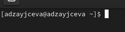

---
## Front matter
lang: ru-RU
title: Laboratory №6
author: |
	Anna D. Zaytseva\inst{1,3}
institute: |
	\inst{1}RUDN University, Moscow, Russian Federation
date: NEC--2022, 7 May, Moscow

## Formatting
toc: false
slide_level: 2
theme: metropolis
header-includes: 
 - \metroset{progressbar=frametitle,sectionpage=progressbar,numbering=fraction}
 - '\makeatletter'
 - '\beamer@ignorenonframefalse'
 - '\makeatother'
aspectratio: 43
section-titles: true
---

# Цель работы

Цель работы --- Ознакомление с инструментами поиска файлов и фильтрации текстовых данных. Приобретение практических навыков: по управлению процессами (и заданиями), по проверке использования диска и обслуживанию файловых систем.

# Задание

1. Осуществите вход в систему, используя соответствующее имя пользователя.
2. Запишите в файл file.txt названия файлов, содержащихся в каталоге /etc. Допишите в этот же файл названия файлов, содержащихся в вашем домашнем каталоге.
3. Выведите имена всех файлов из file.txt, имеющих расширение .conf, после чего запишите их в новый текстовой файл conf.txt.
4. Определите, какие файлы в вашем домашнем каталоге имеют имена, начинавшиеся с символа c? Предложите несколько вариантов, как это сделать.
5. Выведите на экран (постранично) имена файлов из каталога /etc, начинающиеся с символа h.
6. Запустите в фоновом режиме процесс, который будет записывать в файл ~/logfile файлы, имена которых начинаются с log.
7. Удалите файл ~/logfile.
8. Запустите из консоли в фоновом режиме редактор gedit.
9. Определите идентификатор процесса gedit, используя команду ps,конвейер и фильтр grep. Как ещё можно определить идентификатор процесса?
10. Прочтите справку (man) команды kill, после чего используйте её для завершения процесса gedit.
11. Выполните команды df и du, предварительно получив более подробную информацию об этих командах, с помощью команды man.
12. Воспользовавшись справкой команды find, выведите имена всех директорий, имеющихся в вашем домашнем каталоге.

# Выполнение лабораторной работы

## Step 1

Я осуществила вход в систему, используя соответствующее имя пользователя и пароль и перешла в терминал (Рис. [-@fig:001]):

{ #fig:001 width=70% }

## Step 2

Поработала с инструментами поиска файлов и фильтрации текстовых данных (Рис. [-@fig:002])(Рис. [-@fig:004])(Рис. [-@fig:009])(Рис. [-@fig:015])(Рис. [-@fig:016]):

{ #fig:002 width=70% }

{ #fig:004 width=70% }

{ #fig:009 width=70% }

{ #fig:015 width=70% }

{ #fig:016 width=70% }

## Steps 3 and 4

Ответила на контрольные вопросы и обновила данные на GitHub

# Вывод

В ходе лабораторной работы я ознакомилась с инструментами поиска файлов и фильтрации текстовых данных. Приобрела практические навыки: по управлению процессами (и заданиями), по проверке использования диска и обслуживанию файловых систем.

## {.standout}

Спасибо за внимание!
