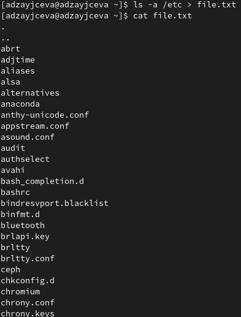
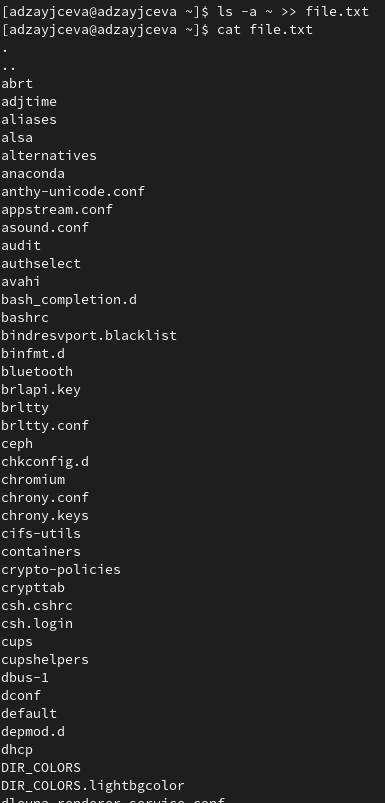
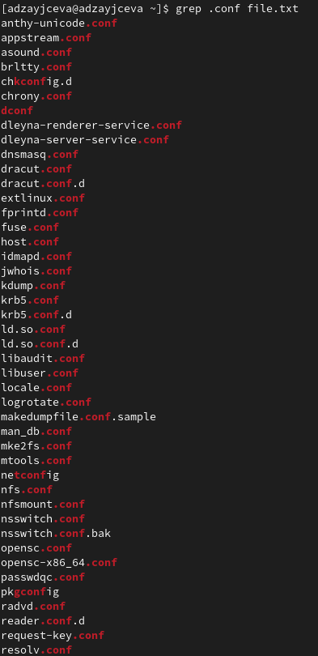
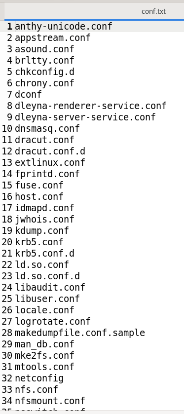
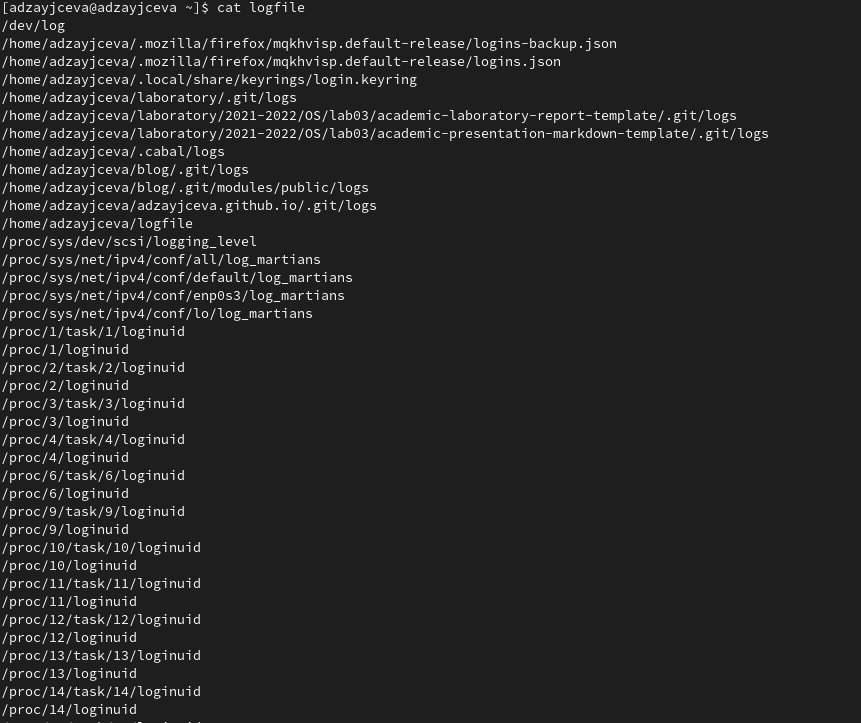
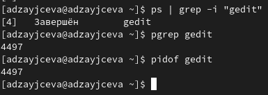
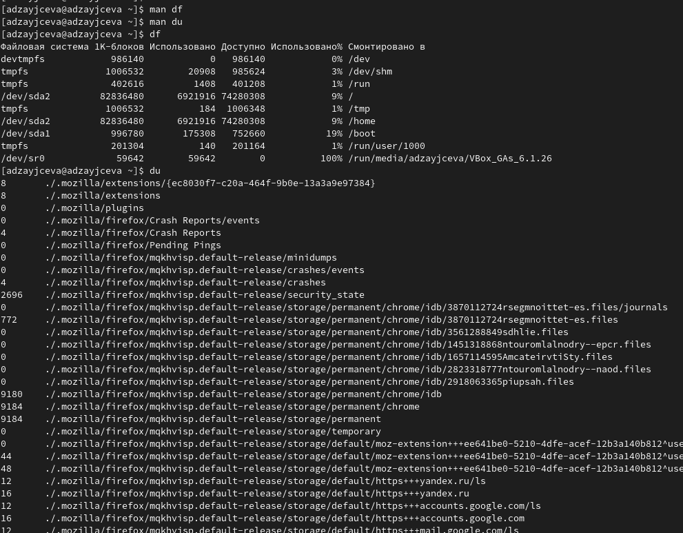

---
## Front matter
title: "Лабораторная работа №6"
subtitle: "Отчёт к лабораторной работе"
author: "Зайцева Анна Дмитриевна"

## Generic options
lang: ru-RU

## Bibliography
bibliography: bib/cite.bib
csl: pandoc/csl/gost-r-7-0-5-2008-numeric.csl

## Pdf output format
toc: true # Table of contents
toc-depth: 2
lof: true # List of figures
lot: true # List of tables
fontsize: 12pt
linestretch: 1.5
papersize: a4
documentclass: scrreprt
## Fonts
mainfont: PT Serif
romanfont: PT Serif
sansfont: PT Sans
monofont: PT Mono
mainfontoptions: Ligatures=TeX
romanfontoptions: Ligatures=TeX
sansfontoptions: Ligatures=TeX,Scale=MatchLowercase
monofontoptions: Scale=MatchLowercase,Scale=0.9
## Pandoc-crossref LaTeX customization
figureTitle: "Рис."
tableTitle: "Таблица"
listingTitle: "Листинг"
lofTitle: "Список иллюстраций"
lotTitle: "Список таблиц"
lolTitle: "Листинги"
## Misc options
indent: true
header-includes:
  - \usepackage{indentfirst}
  - \usepackage{float} # keep figures where there are in the text
  - \floatplacement{figure}{H} # keep figures where there are in the text
---

# Цель работы

Цель работы --- Ознакомление с инструментами поиска файлов и фильтрации текстовых данных. Приобретение практических навыков: по управлению процессами (и заданиями), по проверке использования диска и обслуживанию файловых систем.

# Задание

1. Осуществите вход в систему, используя соответствующее имя пользователя.
2. Запишите в файл file.txt названия файлов, содержащихся в каталоге /etc. Допишите в этот же файл названия файлов, содержащихся в вашем домашнем каталоге.
3. Выведите имена всех файлов из file.txt, имеющих расширение .conf, после чего запишите их в новый текстовой файл conf.txt.
4. Определите, какие файлы в вашем домашнем каталоге имеют имена, начинавшиеся с символа c? Предложите несколько вариантов, как это сделать.
5. Выведите на экран (постранично) имена файлов из каталога /etc, начинающиеся с символа h.
6. Запустите в фоновом режиме процесс, который будет записывать в файл ~/logfile файлы, имена которых начинаются с log.
7. Удалите файл ~/logfile.
8. Запустите из консоли в фоновом режиме редактор gedit.
9. Определите идентификатор процесса gedit, используя команду ps,конвейер и фильтр grep. Как ещё можно определить идентификатор процесса?
10. Прочтите справку (man) команды kill, после чего используйте её для завершения процесса gedit.
11. Выполните команды df и du, предварительно получив более подробную информацию об этих командах, с помощью команды man.
12. Воспользовавшись справкой команды find, выведите имена всех директорий, имеющихся в вашем домашнем каталоге.

# Выполнение лабораторной работы

1. Я осуществила вход в систему, используя соответствующее имя пользователя и пароль и перешла в терминал (Рис. [-@fig:001]):

{ #fig:001 width=70% }

2. Записала в файл file.txt названия файлов, содержащихся в каталоге /etc (команда: *ls -a /etc > file.txt*) (Рис. [-@fig:002]). Дописала в этот же файл названия файлов, содержащихся в вашем домашнем каталоге (команда: *ls -a ~ >> file.txt*) (Рис. [-@fig:003]). Проверку своих действий я осуществляла с помощью команды *cat file.txt*.

{ #fig:002 width=70% }

{ #fig:003 width=70% }

3. Вывела имена всех файлов из file.txt, имеющих расширение .conf (команда: *grep .conf file.txt*) (Рис. [-@fig:004]), после чего записала их в новый текстовой файл conf.txt (команда: *grep .conf file.txt > conf.txt*) (Рис. [-@fig:005]):

{ #fig:004 width=70% }

{ #fig:005 width=70% }

4. Определила, какие файлы в моём домашнем каталоге имеют имена, начинающиеся с символа 'c' (команды: *find ~ -maxdepth 1 -name "c*" -print*, *ls -a ~ | grep c**) (Рис. [-@fig:006])(Рис. [-@fig:007]):

{ #fig:006 width=70% }

{ #fig:007 width=70% }

5. Вывела на экран (постранично) имена файлов из каталога /etc, начинающиеся с символа h (команда: *find /etc -maxdepth 1 -name "h*" -print*) (Рис. [-@fig:008]):

{ #fig:008 width=70% }

6. Запустила в фоновом режиме процесс, который будет записывать в файл ~/logfile файлы, имена которых начинаются с log (команда: *find / -name "log*" > logfile &*) (Рис. [-@fig:009]). Проверила правильность выполнения команды с помощью команды *cat logfile* (Рис. [-@fig:010]):

{ #fig:009 width=70% }

{ #fig:010 width=70% }

7. Удалила файл ~/logfile (команда: *rm logfile*). Правильность выполнения команды проверила командой *ls* (Рис. [-@fig:011]):

{ #fig:011 width=70% }

8. Запустила из консоли в фоновом режиме редактор gedit (команда: *gedit &*) (Рис. [-@fig:012]). Открылось отдельное окно с редактором с файлом "Без имени 1":

{ #fig:012 width=70% }

9. Определила идентификатор процесса gedit, используя команду ps,конвейер и фильтр grep (команда: *ps | grep -i "gedit"*). Также можно определить идентификатор процесса с помощью команд *pgrep gedit* и *pidof gedit* (Рис. [-@fig:013]):

{ #fig:013 width=70% }

10. Прочла справку (man) команды kill (команда: *man kill*), после чего использовала её для завершения процесса gedit (команда: *kill 4497*), посольку в 9 пункте я получила именно такой идентификатор для процесса gedit (Рис. [-@fig:014]):

{ #fig:014 width=70% }

11. Выполнила команды df и du, предварительно получив более подробную информацию об этих командах, с помощью команды man (команды: *man df* и *man du*) (Рис. [-@fig:015]):

{ #fig:015 width=70% }

12. Воспользовавшись справкой команды find (команда: *man find*), вывела имена всех директорий, имеющихся в моём домашнем каталоге (команда: *find ~ -type d*) (Рис. [-@fig:016]):

{ #fig:016 width=70% }

# Ответы на контрольные вопросы

1. В системе по умолчанию открыто три специальных потока: – stdin − стандартный поток ввода (по умолчанию: клавиатура), файловый дескриптор 0; – stdout − стандартный поток вывода (по умолчанию: консоль), файловый дескриптор 1; – stderr − стандартный поток вывод сообщений об ошибках (по умолчанию: консоль), файловый дескриптор 2. Большинство используемых в консоли команд и программ записывают результаты своей работы в стандартный поток вывода stdout.

2. ">" Перенаправление вывода в файл ">>" Перенаправление вывода в файл и открытие файла в режиме добавления (данные добавляются в конец файла).

3. Конвейер служит для объединения простых команд или утилит в цепочки, в которых результат работы предыдущей команды передаётся последующей. Синтаксис следующий: команда 1 | команда 2 (это означает, что вывод команды 1 передастся на ввод команде 2).

4. Процесс рассматривается операционной системой как заявка на потребление всех видов ресурсов, кроме одного − процессорного времени. Этот последний важнейший ресурс распределяется операционной системой между другими единицами работы − потоками, которые и получили свое название благодаря тому, что они представляют собой последовательности (потоки выполнения) команд. Процесс − это выполнение программы. Он считается активной сущностью и реализует действия, указанные в программе. Программа представляет собой статический набор команд, а процесс это набор ресурсов и данных, использующихся при выполнении программы.

5. pid: идентификатор процесса (PID) процесса (process ID), к которому вызывают метод gid: идентификатор группы UNIX, в котором работает программа.

6. Любую выполняющуюся в консоли команду или внешнюю программу можно запустить в фоновом режиме. Для этого следует в конце имени команды указать знак амперсанда &. Запущенные фоном программы называются задачами. Ими можно управлять с помощью команды jobs, которая выводит список запущенных в данный момент задач.

7. top − это консольная программа, которая показывает список работающих процессов в системе. Программа в реальном времени отсортирует запущенные процессы по их нагрузке на процессор. htop − это продвинутый консольный мониторинг процессов. Утилита выводит постоянно меняющийся список системных процессов, который сортируется в зависимости от нагрузки на ЦПУ. Если делать сравнение с top, то htop показывает абсолютно все процессы в системе, время их непрерывного использования, загрузку процессоров и расход оперативной памяти.

8. find − это команда для поиска файлов и каталогов на основе специальных условий. Ее можно использовать в различных обстоятельствах, например, для поиска файлов по разрешениям, владельцам, группам, типу, размеру и другим подобным критериям. Команда find имеет такой синтаксис: find [папка] [параметры] критерий шаблон [действие] Папка − каталог в котором будем искать Параметры − дополнительные параметры, например, глубина поиска, и т д Критерий − по какому критерию будем искать: имя, дата создания, права, владелец и т д. Шаблон – непосредственно значение по которому будем отбирать файлы. Основные параметры: -P никогда не открывать символические ссылки -L - получает информацию о файлах по символическим ссылкам. Важно для дальнейшей обработки, чтобы обрабатывалась не ссылка, а сам файл. -maxdepth - максимальная глубина поиска по подкаталогам, для поиска только в текущем каталоге установите 1. -depth - искать сначала в текущем каталоге, а потом в подкаталогах -mount искать файлы только в этой файловой системе. -version - показать версию утилиты find -print - выводить полные имена файлов -type f - искать только файлы -type d - поиск папки в Linux Основные критерии: -name - поиск файлов по имени -perm - поиск файлов в Linux по режиму доступа -user - поиск файлов по владельцу -group - поиск по группе -mtime - поиск по времени модификации файла -atime - поиск файлов по дате последнего чтения -nogroup - поиск файлов, не принадлежащих ни одной группе -nouser - поиск файлов без владельцев -newer - найти файлы новее чем указанный -size - поиск файлов в Linux по их размеру Примеры: find ~ -type d поиск директорий в домашнем каталоге find ~ -type f -name ".*" поиск скрытых файлов в домашнем каталог

9. Файл по его содержимому можно найти с помощью команды grep: «grep-r "слово/выражение, которое нужно найти"».

10. Утилита df, позволяет проанализировать свободное пространство на всех подключенных к системе разделах.

11. При выполнении команды du (без указания папки и опции) можно получить все файлы и папки текущей директории с их размерами. Для домашнего каталога: du ~/

12. Основные сигналы (каждый сигнал имеет свой номер), которые используются для завершения процесса:

SIGINT – самый безобидный сигнал завершения, означает Interrupt. Он отправляется процессу, запущенному из терминала с помощью сочетания клавиш Ctrl+C. Процесс правильно завершает все свои действия и возвращает управление;

SIGQUIT – это еще один сигнал, который отправляется с помощью сочетания клавиш, программе, запущенной в терминале. Он сообщает ей что нужно завершиться и программа может выполнить корректное завершение или проигнорировать сигнал. В отличие от предыдущего, она генерирует дамп памяти. Сочетание клавиш Ctrl+/;

SIGHUP – сообщает процессу, что соединение с управляющим терминалом разорвано, отправляется, в основном, системой при разрыве соединения с интернетом;

SIGTERM – немедленно завершает процесс, но обрабатывается программой, поэтому позволяет ей завершить дочерние процессы и освободить все ресурсы;

SIGKILL – тоже немедленно завершает процесс, но, в отличие от предыдущего варианта, он не передается самому процессу, а обрабатывается ядром. Поэтому ресурсы и дочерние процессы остаются запущенными.

Также для передачи сигналов процессам в Linux используется утилита kill,её синтаксис: kill [-сигнал] [pid_процесса](PID – уникальный идентификатор процесса). Сигнал представляет собой один из выше перечисленных сигналов для завершения процесса. Перед тем, как выполнить остановку процесса, нужно определить его PID. Для этого используют команды ps и grep. Команда ps предназначена для вывода списка активных процессов в системе и информации о них. Команда grep запускается одновременно с ps (в канале) и будет выполнять поиск по результатам команды ps.

Утилита pkill – это оболочка для kill, она ведет себя точно так же, и имеет тот же синтаксис, только в качестве идентификатора процесса ей нужно передать его имя.

killall работает аналогично двум предыдущим утилитам. Она тоже принимает имя процесса в качестве параметра и ищет его PID в директории /proc. Но эта утилита обнаружит все процессы с таким именем и завершит их.

# Вывод

В ходе лабораторной работы я ознакомилась с инструментами поиска файлов и фильтрации текстовых данных. Приобрела практические навыки: по управлению процессами (и заданиями), по проверке использования диска и обслуживанию файловых систем.
