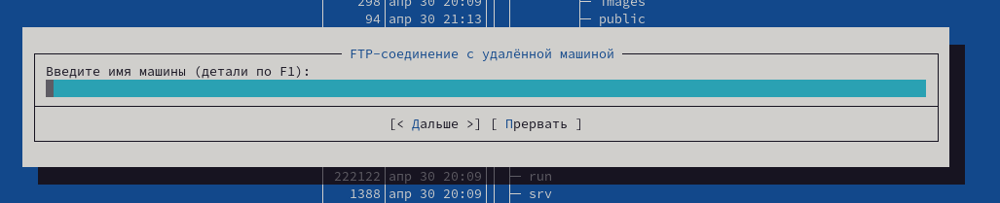

---
## Front matter
title: "Лабораторная работа №7"
subtitle: "Отчёт к лабораторной работе"
author: "Зайцева Анна Дмитриевна"

## Generic options
lang: ru-RU

## Bibliography
bibliography: bib/cite.bib
csl: pandoc/csl/gost-r-7-0-5-2008-numeric.csl

## Pdf output format
toc: true # Table of contents
toc-depth: 2
lof: true # List of figures
lot: true # List of tables
fontsize: 12pt
linestretch: 1.5
papersize: a4
documentclass: scrreprt
## Fonts
mainfont: PT Serif
romanfont: PT Serif
sansfont: PT Sans
monofont: PT Mono
mainfontoptions: Ligatures=TeX
romanfontoptions: Ligatures=TeX
sansfontoptions: Ligatures=TeX,Scale=MatchLowercase
monofontoptions: Scale=MatchLowercase,Scale=0.9
## Pandoc-crossref LaTeX customization
figureTitle: "Рис."
tableTitle: "Таблица"
listingTitle: "Листинг"
lofTitle: "Список иллюстраций"
lotTitle: "Список таблиц"
lolTitle: "Листинги"
## Misc options
indent: true
header-includes:
  - \usepackage{indentfirst}
  - \usepackage{float} # keep figures where there are in the text
  - \floatplacement{figure}{H} # keep figures where there are in the text
---

# Цель работы

Цель работы --- Освоение основных возможностей командной оболочки Midnight Commander. Приобретение навыков практической работы по просмотру каталогов и файлов; манипуляций с ними.

# Задание

1. Задание по mc.
   1. Изучите информацию о mc, вызвав в командной строке man mc.
   2. Запустите из командной строки mc, изучите его структуру и меню.
   3. Выполните несколько операций в mc, используя управляющие клавиши (операции с панелями; выделение/отмена выделения файлов, копирование/перемещение файлов, получение информации о размере и правах доступа на файлы и/или каталоги и т.п.)
   4. Выполните основные команды меню левой (или правой) панели. Оцените степень подробности вывода информации о файлах.
   5. Используя возможности подменю Файл, выполните:
      – просмотр содержимого текстового файла;
      – редактирование содержимого текстового файла (без сохранения результатов редактирования);
      – создание каталога;
      – копирование файлов в созданный каталог.
   6. С помощью соответствующих средств подменю Команда осуществите:
      – поиск в файловой системе файла с заданными условиями (например, файла с расширением .c или .cpp, содержащего строку main);
      – выбор и повторение одной из предыдущих команд;
      – переход в домашний каталог;
      – анализ файла меню и файла расширений.
   7. Вызовите подменю Настройки. Освойте операции, определяющие структуру экрана mc (Full screen, Double Width, Show Hidden Files и т.д.).
   
2. Задание по встроенному редактору mc.
   1. Создайте текстовой файл text.txt.
   2. Откройте этот файл с помощью встроенного в mc редактора.
   3. Вставьте в открытый файл небольшой фрагмент текста, скопированный из любого другого файла или Интернета.
   4. Проделайте с текстом следующие манипуляции, используя горячие клавиши:
      1. Удалите строку текста.
      2. Выделите фрагмент текста и скопируйте его на новую строку.
      3. Выделите фрагмент текста и перенесите его на новую строку.
      4. Сохраните файл.
      5. Отмените последнее действие.
      6. Перейдите в конец файла (нажав комбинацию клавиш) и напишите некоторый текст.
      7. Перейдите в начало файла (нажав комбинацию клавиш) и напишите некоторый текст.
      8. Сохраните и закройте файл.
   5. Откройте файл с исходным текстом на некотором языке программирования (например C или Java)
   6. Используя меню редактора, включите подсветку синтаксиса, если она не включена

# Выполнение лабораторной работы

**Задание 1**

1. Я изучила информацию о mc, вызвав в командной строке *man mc* (Рис. [-@fig:001]):

{ #fig:001 width=70% }

2. Запустила из командной строки mc (команда: *mc*) и изучила его структуру и меню (Рис. [-@fig:002])(Рис. [-@fig:003])(Рис. [-@fig:004])(Рис. [-@fig:005])(Рис. [-@fig:006]):

{ #fig:002 width=70% }

{ #fig:003 width=70% }

{ #fig:004 width=70% }

{ #fig:005 width=70% }

{ #fig:006 width=70% }

3. Выполнила несколько операций в mc, используя управляющие клавиши (операции с панелями (например, сочетание: *Ctrl+x i* (получение информации о выбранном файле) (Рис. [-@fig:007])); выделение/отмена выделения файлов (например, сочетание: * (обратить выделение) (Рис. [-@fig:008])(Выделение) (Рис. [-@fig:009])(Отмена выделения)), копирование/перемещение файлов (например, сочетание: *Fn+F5* (Копирование) (Рис. [-@fig:010])), получение информации о размере и правах доступа на файлы и/или каталоги (например, сочетание: *Ctrl+x i* (получение информации о выбранном файле или каталоге) (Рис. [-@fig:011]) и т.п.):

{ #fig:007 width=70% }

{ #fig:008 width=70% }

{ #fig:009 width=70% }

{ #fig:010 width=70% }

{ #fig:011 width=70% }

4. Выполнила основные команды меню левой панели (Рис. [-@fig:012])(Рис. [-@fig:013])(Рис. [-@fig:014])(Рис. [-@fig:015])(Рис. [-@fig:016])(Рис. [-@fig:017])(Рис. [-@fig:018])(Рис. [-@fig:019])(Рис. [-@fig:020]):

{ #fig:012 width=70% }

{ #fig:013 width=70% }

{ #fig:014 width=70% }

{ #fig:015 width=70% }

{ #fig:016 width=70% }

{ #fig:017 width=70% }

{ #fig:018 width=70% }

{ #fig:019 width=70% }

{ #fig:020 width=70% }

5. Используя возможности подменю Файл, выполнила

   1. Просмотр содержимого текстового файла (Рис. [-@fig:021]), (Рис. [-@fig:022]):

{ #fig:021 width=70% }

{ #fig:022 width=70% }

   2. Редактирование содержимого текстового файла (без сохранения результатов редактирования)(сочетание: *Fn+F4*) (Рис. [-@fig:023]), (Рис. [-@fig:024]):

{ #fig:023 width=70% }

{ #fig:024 width=70% }

   3. Создание каталога (сочетание: *Fn+F7*) (Рис. [-@fig:025]), (Рис. [-@fig:026]):

{ #fig:025 width=70% }

{ #fig:026 width=70% }

   4. Копирование файлов в созданный каталог (сочетание: *Fn+F5*) (Рис. [-@fig:027]). Всё получилось (Рис. [-@fig:028]):

{ #fig:027 width=70% }

{ #fig:028 width=70% }

6. С помощью соответствующих средств подменю Команда осуществила

   1. Поиск в файловой системе файла с заданными условиями (например, файла с расширением, начинающимся с .c)(Рис. [-@fig:029]). Всё получилось (Рис. [-@fig:030]):

{ #fig:029 width=70% }

{ #fig:030 width=70% }

   2. Выбор и повторение одной из предыдущих команд (Рис. [-@fig:031]):

{ #fig:031 width=70% }

   3. Переход в домашний каталог (Рис. [-@fig:032]):

{ #fig:032 width=70% }

   4. Анализ файла меню (Рис. [-@fig:033]) и файла расширений (Рис. [-@fig:034]):

{ #fig:033 width=70% }

{ #fig:034 width=70% }

7. Вызвала подменю Настройки. Освоила операции, определяющие структуру экрана mc (Full screen, Double Width, Show Hidden Files и т.д.)(Рис. [-@fig:035])(Рис. [-@fig:036])(Рис. [-@fig:037])(Рис. [-@fig:038])(Рис. [-@fig:039])(Рис. [-@fig:040])(Рис. [-@fig:041])(Рис. [-@fig:042])(Рис. [-@fig:043])(Рис. [-@fig:044]):

{ #fig:035 width=70% }

{ #fig:036 width=70% }

{ #fig:037 width=70% }

{ #fig:038 width=70% }

{ #fig:039 width=70% }

{ #fig:040 width=70% }

{ #fig:041 width=70% }

{ #fig:042 width=70% }

{ #fig:043 width=70% }

{ #fig:044 width=70% }

**Задание 2**

1. Создала текстовой файл text.txt (команда: *touch text.txt*) (Рис. [-@fig:045]):

{ #fig:045 width=70% }

2. Открыла этот файл с помощью встроенного в mc редактора (сочетание: *Fn+F4*) (Рис. [-@fig:046]):

{ #fig:046 width=70% }

3. Вставила в открытый файл небольшой фрагмент текста, скопированный из Интернета (Рис. [-@fig:047]):

{ #fig:047 width=70% }

4. Проделала с текстом следующие манипуляции, используя горячие клавиши

   1. Удалила строку текста (сочетание: *Ctrl+y*) (Рис. [-@fig:048]):

{ #fig:048 width=70% }

   2. Выделила фрагмент текста и скопировала его на новую строку (сочетание: *Fn+F5*, перенесла курсор в нужное место и далее нажала сочетание: *Fn+F6*) (Рис. [-@fig:049]):

{ #fig:049 width=70% }

   3. Выделите фрагмент текста и перенесите его на новую строку (сочетание: *Fn+F6*) (Рис. [-@fig:050]):

{ #fig:050 width=70% }

   4. Сохранила файл (сочетание: *Fn+F2*) (Рис. [-@fig:051]):

{ #fig:051 width=70% }

   5. Отменила последнее действие (сочетание: *Ctrl+u*) (Рис. [-@fig:052]):

{ #fig:052 width=70% }

   6. Перешла в конец файла (сочетание: *Ctrl+End* и *Ctrl+x*) и написала некоторый текст (Рис. [-@fig:053]):

{ #fig:053 width=70% }

   7. Перешла в начало файла (сочетание: *Ctrl+Home* и *Ctrl+z*) и написала некоторый текст (Рис. [-@fig:054]):

{ #fig:054 width=70% }

   8. Сохранила и закрыла файл (сочетание: *Fn+F2* и *Fn+F10*) и написала некоторый текст (Рис. [-@fig:055]):

{ #fig:055 width=70% }

5. Открыла файл с исходным текстом на некотором языке программирования (Рис. [-@fig:056]):

{ #fig:056 width=70% }

6. Используя меню редактора, выключила подсветку синтаксиса (сочетание: *Ctrl+s*) (Рис. [-@fig:057]), а затем той же комбинацией клавиш включила её обратно:

{ #fig:057 width=70% }

# Ответы на контрольные вопросы

1. Панели могут дополнительно быть переведены в один из двух режимов: «Информация» или «Дерево». В режиме «Информация» на панель выводятся сведения о файле и текущей файловой системе, расположенных на активной панели. В режиме «Дерево» на одной из панелей выводится структура дерева каталогов.

2. Как с помощью команд shell, так и с помощью меню (комбинаций клавиш) mc можно выполнить следующие операции с файлами:

* копирование «F5» («cp имя_файла имя_каталога(в который копируем)»)
* перемещение/переименование «F6» («mv имя_файла имя_каталога(в который перемещаем)»)
* создание каталога «F7» («mkdir имя_каталога»)
* удаление «F8» («rm имя_файла»)
* изменение прав доступа «ctrl+x» («chmod u+x имя_файла»)

3. Перейти в строку меню панелей mc можно с помощью функциональной клавиши «F9». В строке меню имеются пять меню: «Левая панель», «Файл», «Команда», «Настройки» и «Правая панель». Подпункт меню «Быстрый просмотр» позволяет выполнить быстрый просмотр содержимого панели. Подпункт меню «Информация» позволяет посмотреть информацию о файле или каталоге. В меню каждой (левой или правой) панели можно выбрать «Формат списка»:

* стандартный − выводит список файлов и каталогов с указанием размера и времени правки;
* ускоренный − позволяет задать число столбцов, на которые разбивается панель при выводе списка имён файлов или каталогов без дополнительной информации;
* расширенный − помимо названия файла или каталога выводит сведения о правах доступа, владельце, группе, размере, времени правки;
* определённый пользователем − позволяет вывести те сведения о файле или каталоге, которые задаст сам пользователь.Подпункт меню «Порядок сортировки» позволяет задать критерии сортировки при выводе списка файлов и каталогов: без сортировки, по имени, расширенный, время правки, время доступа, время изменения атрибута, размер, узел.

Команды меню «Файл»:

* Просмотр («F3») − позволяет посмотреть содержимое текущего (или выделенного) файла без возможности редактирования.
* Просмотр вывода команды («М» + «!») − функция запроса команды с параметрами (аргумент к текущему выбранному файлу).
* Правка («F4») − открывает текущий (или выделенный) файл для его редактирования.
* Копирование («F5») − осуществляет копирование одного или нескольких файлов или каталогов в указанное пользователем во всплывающем окне место.
* Права доступа («Ctrl-x» «c») − позволяет указать (изменить) права доступа к одному или нескольким файлам или каталогам.
* Жёсткая ссылка («Ctrl-x» «l») − позволяет создать жёсткую ссылку к текущему (или выделенному) файлу.
* Символическая ссылка («Ctrl-x» «s») − позволяет создать cимволическую ссылку к текущему (или выделенному) файлу.
* Владелец/группа («Ctrl-x» «o») − позволяет задать (изменить) владельца и имя группы для одного или нескольких файлов или каталогов.
* Права (расширенные) − позволяет изменить права доступа и владения для одного или нескольких файлов или каталогов.
* Переименование («F6») − позволяет переименовать (или переместить) один или несколько файлов или каталогов.
* Создание каталога («F7») − позволяет создать каталог.
* Удалить («F8») − позволяет удалить один или несколько файловили каталогов.
* Выход («F10») − завершает работу mc.

5. Меню Команда В меню Команда содержатся более общие команды для работы с mc. Команды меню Команда:

* Дерево каталогов − отображает структуру каталогов системы.
* Поиск файла − выполняет поиск файлов по заданным параметрам.
* Переставить панели − меняет местами левую и правую панели.
* Сравнить каталоги («Ctrl-x» «d») − сравнивает содержимое двух каталогов.
* Размеры каталогов − отображает размер и время изменения каталога (по умолчанию в mc размер каталога корректно не отображается).
* История командной строки − выводит на экран список ранее выполненных в оболочке команд.
* Каталоги быстрого доступа ( Ctrl-\») − при вызове выполняется быстрая смена текущего каталога на один из заданного списка.
* Восстановление файлов − позволяет восстановить файлы на файловых системах ext2 и ext3.
* Редактировать файл расширений − позволяет задать с помощью определённого синтаксиса действия при запуске файлов с определённым расширением (например, какое программного обеспечение запускать для открытия или редактирования файлов с расширением doc или docx).
* Редактировать файл меню − позволяет отредактировать контекстное меню пользователя, вызываемое по клавише «F2».
* Редактировать файл расцветки имён − позволяет подобрать оптимальную для пользователя расцветку имён файлов в зависимости от их типа.

6. Меню Настройки содержит ряд дополнительных опций по внешнему виду и функциональности mc. Меню Настройки содержит:

* Конфигурация − позволяет скорректировать настройки работы с панелями.
* Внешний вид и Настройки панелей − определяет элементы(строка меню, командная строка, подсказки и прочее), отображаемые при вызове mc, а также геометрию расположения панелей и цветовыделение.
* Биты символов − задаёт формат обработки информации локальным терминалом.
* Подтверждение − позволяет установить или убрать вывод окна с запросом подтверждения действий при операциях удаления и перезаписи файлов, а также при выходе из программы.
* Распознание клавиш − диалоговое окно используется для тестирования функциональных клавиш, клавиш управления курсором и прочее.
* Виртуальные ФС − настройки виртуальной файловой системы: тайм-аут, пароль и прочее.

7. Функциональные клавиши mc:

* F1 – вызов контекстно-зависимой подсказки
* F2 – вызов пользовательского меню с возможностью создания и/или дополнения дополнительных функций
* F3 – просмотр содержимого файла, на который указывает подсветка в активной панели (без возможности редактирования)
* F4 – вызов встроенного в mc редактора для изменения содержания файла, на который указывает подсветка в активной панели
* F5 – копирование одного или нескольких файлов, отмеченныхв первой (активной) панели, в каталог, отображаемый на второй панели
* F6 – перенос одного или нескольких файлов, отмеченных в первой (активной) панели, в каталог, отображаемый на второй панели
* F7 – создание подкаталога в каталоге, отображаемом в активной панели
* F8 – удаление одного или нескольких файлов (каталогов), отмеченных в первой (активной) панели файлов
* F9 – вызов меню mc
* F10 – выход из mc

8. Встроенный в mc редактор вызывается с помощью функциональной клавиши «F4». В нём удобно использовать различные комбинации клавиш при редактировании содержимого (как правило текстового) файла. Клавиши для редактирования файла:

* «Ctrl-y» − удалить строку
* «Ctrl-u» − отмена последней операции
* «ins» вставка/замена
*  «F7» − поиск (можно использовать регулярные выражения)
* «↑-F7» − повтор последней операции поиска
* «F4» − замена
* «F3» − первое нажатие − начало выделения, второе − окончание выделения
* «F5» − копировать выделенный фрагмент
* «F6» − переместить выделенный фрагмент
* «F8» − удалить выделенный фрагмент
* «F2» − записать изменения в файл
* «F10» − выйти из редактор

9. Для редактирования меню пользователя, которое вызывается клавишей «F2», необходимо перейти в пункт «Редактировать файл меню» - «Команда» и изменить настройки файла.

10. Часть команд «Меню пользователя», а также меню «Файл» позволяют выполнять действия, определяемые пользователем, над текущим файлом. Например, копирование каталога или файла,переименование, перемещение, архивирование.

# Вывод

В ходе лабораторной работы я освоила основные возможности командной оболочки Midnight Commander и приобрела навыки практической работы по просмотру каталогов и файлов; манипуляций с ними.
