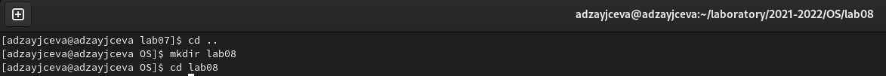
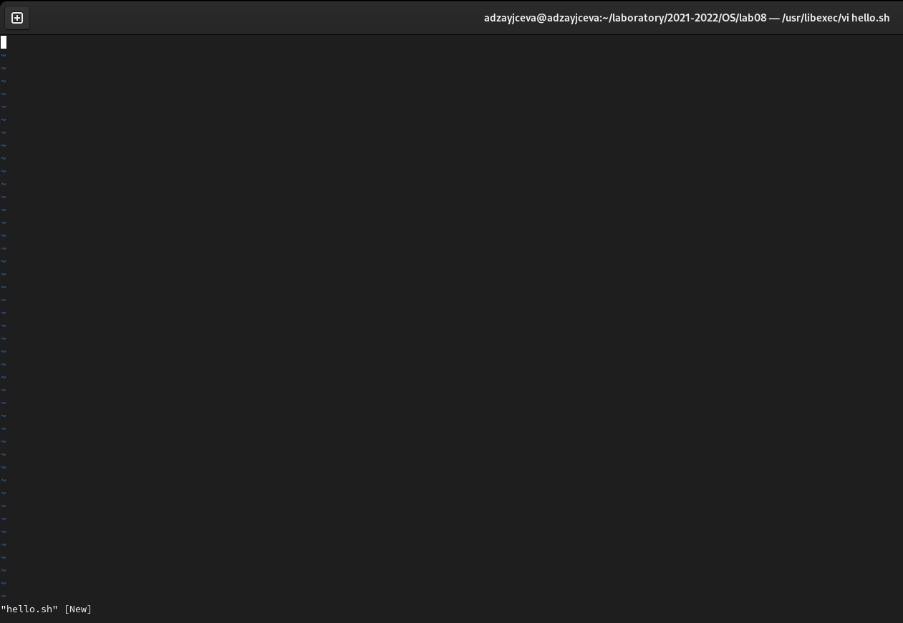
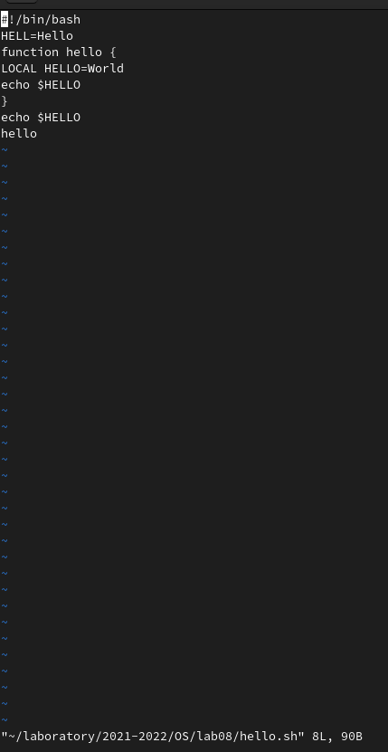
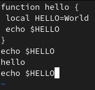

---
## Front matter
lang: ru-RU
title: Laboratory №8
author: |
	Anna D. Zaytseva\inst{1,3}
institute: |
	\inst{1}RUDN University, Moscow, Russian Federation
date: NEC--2022, 14 May, Moscow

## Formatting
toc: false
slide_level: 2
theme: metropolis
header-includes: 
 - \metroset{progressbar=frametitle,sectionpage=progressbar,numbering=fraction}
 - '\makeatletter'
 - '\beamer@ignorenonframefalse'
 - '\makeatother'
aspectratio: 43
section-titles: true
---

# Цель работы

Цель работы --- Познакомиться с операционной системой Linux. Получить практические навыки работы с редактором vi, установленным по умолчанию практически во всех дистрибутивах.

# Задание

**Задание 1**
1. Создайте каталог с именем ~/work/os/lab06.
2. Перейдите во вновь созданный каталог.
3. Вызовите vi и создайте файл hello.sh
4. Нажмите клавишу i и вводите следующий текст.
5. Нажмите клавишу Esc для перехода в командный режим после завершения ввода текста.
6. Нажмите : для перехода в режим последней строки и внизу вашего экрана появится приглашение в виде двоеточия.
7. Нажмите w (записать)и q (выйти), а затем нажмите клавишу Enter для сохранения вашего текста и завершения работы.
8. Сделайте файл исполняемым

**Задание 2**

1. Вызовите vi на редактирование файла
2. Установите курсор в конец слова HELL второй строки.
3. Перейдите в режим вставки и замените на HELLO. Нажмите Esc для возврата в командный режим.
4. Установите курсор на четвертую строку и сотрите слово LOCAL.
5. Перейдите в режим вставки и наберите следующий текст: local, нажмите Esc для возврата в командный режим.
6. Установите курсор на последней строке файла. Вставьте после неё строку, содержащую следующий текст: echo $HELLO.
7. Нажмите Esc для перехода в командный режим.
8. Удалите последнюю строку.
9. Введите команду отмены изменений u для отмены последней команды.
10. Введите символ ":" для перехода в режим последней строки. Запишите произведённые изменения и выйдите из vi.

# Выполнение лабораторной работы

## Step 1

Я создала каталог с именем ~/laboratory/2021-2022/OS/lab08 (команда: *mkdir lab08*). И перешла в него  (команда: *cd lab08*)(Рис. [-@fig:001]):

{ #fig:001 width=70% }

## Step 2

Поработала с редактором vi (Рис. [-@fig:002])(Рис. [-@fig:008])(Рис. [-@fig:014])(Рис. [-@fig:019]):

{ #fig:002 width=70% }

{ #fig:008 width=70% }

{ #fig:014 width=70% }

{ #fig:019 width=70% }

## Steps 3 and 4

Ответила на контрольные вопросы и обновила данные на GitHub

# Вывод

В ходе лабораторной работы я познакомилась с операционной системой Linux. Получила практические навыки работы с редактором vi, установленным по умолчанию практически во всех дистрибутивах.

## {.standout}

Спасибо за внимание!
