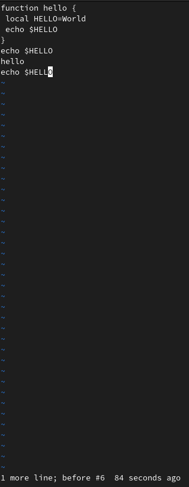

---
## Front matter
title: "Лабораторная работа №8"
subtitle: "Отчёт к лабораторной работе"
author: "Зайцева Анна Дмитриевна"

## Generic options
lang: ru-RU

## Bibliography
bibliography: bib/cite.bib
csl: pandoc/csl/gost-r-7-0-5-2008-numeric.csl

## Pdf output format
toc: true # Table of contents
toc-depth: 2
lof: true # List of figures
lot: true # List of tables
fontsize: 12pt
linestretch: 1.5
papersize: a4
documentclass: scrreprt
## Fonts
mainfont: PT Serif
romanfont: PT Serif
sansfont: PT Sans
monofont: PT Mono
mainfontoptions: Ligatures=TeX
romanfontoptions: Ligatures=TeX
sansfontoptions: Ligatures=TeX,Scale=MatchLowercase
monofontoptions: Scale=MatchLowercase,Scale=0.9
## Pandoc-crossref LaTeX customization
figureTitle: "Рис."
tableTitle: "Таблица"
listingTitle: "Листинг"
lofTitle: "Список иллюстраций"
lotTitle: "Список таблиц"
lolTitle: "Листинги"
## Misc options
indent: true
header-includes:
  - \usepackage{indentfirst}
  - \usepackage{float} # keep figures where there are in the text
  - \floatplacement{figure}{H} # keep figures where there are in the text
---

# Цель работы

Цель работы --- Познакомиться с операционной системой Linux. Получить практические навыки работы с редактором vi, установленным по умолчанию практически во всех дистрибутивах.

# Задание

**Задание 1**
1. Создайте каталог с именем ~/work/os/lab06.
2. Перейдите во вновь созданный каталог.
3. Вызовите vi и создайте файл hello.sh
4. Нажмите клавишу i и вводите следующий текст.
5. Нажмите клавишу Esc для перехода в командный режим после завершения ввода текста.
6. Нажмите : для перехода в режим последней строки и внизу вашего экрана появится приглашение в виде двоеточия.
7. Нажмите w (записать)и q (выйти), а затем нажмите клавишу Enter для сохранения вашего текста и завершения работы.
8. Сделайте файл исполняемым

**Задание 2**

1. Вызовите vi на редактирование файла
2. Установите курсор в конец слова HELL второй строки.
3. Перейдите в режим вставки и замените на HELLO. Нажмите Esc для возврата в командный режим.
4. Установите курсор на четвертую строку и сотрите слово LOCAL.
5. Перейдите в режим вставки и наберите следующий текст: local, нажмите Esc для возврата в командный режим.
6. Установите курсор на последней строке файла. Вставьте после неё строку, содержащую следующий текст: echo $HELLO.
7. Нажмите Esc для перехода в командный режим.
8. Удалите последнюю строку.
9. Введите команду отмены изменений u для отмены последней команды.
10. Введите символ ":" для перехода в режим последней строки. Запишите произведённые изменения и выйдите из vi.

# Выполнение лабораторной работы

**Задание 1**

1. Я создала каталог с именем ~/laboratory/2021-2022/OS/lab08 (команда: *mkdir lab08*).

2. И перешла в него  (команда: *cd lab08*)(Рис. [-@fig:001]):

{ #fig:001 width=70% }

3. Вызвала vi и создала файл hello.sh (команда: *vi hello.sh*)(Рис. [-@fig:002]):

{ #fig:002 width=70% }

4. Нажала клавишу i и ввела текст из указаний к лабораторной работе №8 (Рис. [-@fig:003]):

{ #fig:003 width=70% }

5. Нажала клавишу Esc для перехода в командный режим после завершения ввода текста (Рис. [-@fig:004]):

{ #fig:004 width=70% }

6. Нажала ":" для перехода в режим последней строки, и внизу моего экрана появилось приглашение в виде двоеточия (Рис. [-@fig:005]):

{ #fig:005 width=70% }

7. Нажала w (записать)и q (выйти), а затем нажала клавишу Enter для сохранения моего текста и завершения работы (Рис. [-@fig:006]):

{ #fig:006 width=70% }

8. Сделала файл исполняемым (команда: *chmod +x hello.sh*)(Рис. [-@fig:007]):

{ #fig:007 width=70% }

**Задание 2**

1. Вызвала vi на редактирование файла (команда: *vi ~/laboratory/2021-2022/OS/lab08/hello.sh*)(Рис. [-@fig:008]):

{ #fig:008 width=70% }

2. Установила курсор в конец слова HELL второй строки (Рис. [-@fig:009]):

{ #fig:009 width=70% }

3. Перешла в режим вставки и замените на HELLO (Рис. [-@fig:010]). Нажала Esc для возврата в командный режим (Рис. [-@fig:011]):

{ #fig:010 width=70% }

{ #fig:011 width=70% }

4. Установила курсор на четвертую строку и стёрла слово LOCAL (Рис. [-@fig:012]):

{ #fig:012 width=70% }

5. Перешла в режим вставки и набрала следующий текст: local, нажала Esc для возврата в командный режим (Рис. [-@fig:013]):

{ #fig:013 width=70% }

6. Установила курсор на последней строке файла. Вставила после неё строку, содержащую следующий текст: echo $HELLO (Рис. [-@fig:014]):

{ #fig:014 width=70% }

7. Нажала Esc для перехода в командный режим (Рис. [-@fig:015]):

{ #fig:015 width=70% }

8. Удалила последнюю строку (Рис. [-@fig:016]):

{ #fig:016 width=70% }

9. Ввела команду отмены изменений u для отмены последней команды (Рис. [-@fig:017]):

{ #fig:017 width=70% }

10. Ввела символ ":" для перехода в режим последней строки. Записала произведённые изменения и вышла из vi (Рис. [-@fig:018]):

{ #fig:018 width=70% }

# Ответы на контрольные вопросы

1. Редактор vi имеет три режима работы:
- командный режим − предназначен для ввода команд редактирования и навигации по редактируемому файлу;
- режим вставки − предназначен для ввода содержания редактируемого файла;
- режим последней (или командной) строки − используется для записи изменений в файл и выхода из редактора.

2. Чтобы выйти из редактора, не сохраняя произведённые изменения, нужно в режиме командной строки нажать клавиши «:» «q» «!».

3. Команды позиционирования:
- «0» (ноль) − переход в начало строки;
- «$» − переход в конец строки;
- «G» − переход в конец файла;
- n«G» − переход на строку с номером n.

4. При использовании прописных W и B под разделителями понимаются только пробел, табуляция и возврат каретки. При использовании строчных w и b под разделителями понимаются также любые знаки пунктуации.

5. Чтобы из любого места редактируемого файла перейти в начало (конец) файла, нужно в режиме командной строки нажать клавиши «1» «G» («G»).

6. Команды редактирования:
Вставка текста
- «а» − вставить текст после курсора;
- «А» − вставить текст в конец строки;
- «i» − вставить текст перед курсором;
- n «i» − вставить текст n раз;
- «I» − вставить текст в начало строки.
Вставка строки
- «о» − вставить строку под курсором;
- «О» − вставить строку над курсором.
Удаление текста
- «x» − удалить один символ в буфер;
- «d» «w» − удалить одно слово в буфер;
- «d» «$» − удалить в буфер текст от курсора до конца строки;
- «d» «0» − удалить в буфер текст от начала строки до позиции
курсора;
- «d» «d» − удалить в буфер одну строку;
- n «d» «d» − удалить в буфер n строк.
Отмена и повтор произведённых изменений
- «u» − отменить последнее изменение;
- «.» − повторить последнее изменение.Копирование текста в буфер
- «Y» − скопировать строку в буфер;
- n «Y» − скопировать n строк в буфер;
- «y» «w» − скопировать слово в буфер.
Вставка текста из буфера
- «p» − вставить текст из буфера после курсора;
- «P» − вставить текст из буфера перед курсором.
Замена текста
- «c» «w» − заменить слово;
- n «c» «w» − заменить n слов;
- «c» «$» − заменить текст от курсора до конца строки;
- «r» − заменить слово;
- «R» − заменить текст.
Поиск текста
- «/» текст − произвести поиск вперёд по тексту указанной строки символов текст;
- «?» текст − произвести поиск назад по тексту указанной строки символов текст.
Копирование и перемещение текста
- «:» n,m «d» – удалить строки с n по m;
- «:» i,j «m» k – переместить строки с i по j, начиная со строки k;
- «:» i,j «t» k – копировать строки с i по j в строку k;
- «:» i,j «w» имя-файла – записать строки с i по j в файл с именем имя-файла.

7. Чтобы заполнить строку символами $, необходимо для начала перейти на эту строку, нажав клавиши n «G», где n – номер строки, далее нажать «0» для перехода в начало строки. Теперь необходимо нажать «c» «$», чтобы заменить текст от курсора до конца строки, и ввести символы $.

8. Чтобы отменить по одному предыдущему действию последовательно,необходимо нажать «u». Чтобы отменить все изменения, произведённые со времени последней записи, нужно нажать «:» «e» «!».

9. Команды редактирования в режиме командной строки
Копирование и перемещение текста
- «:» n,m «d» − удалить строки с n по m;
- «:» i,j «m» k − переместить строки с i по j, начиная со строки k;
- «:» i,j «t» k − копировать строки с i по j в строку k;
- «:» i,j «w» имя-файла − записать строки с i по j в файл с именем имя-файла.
Запись в файл и выход из редактора
- «:» «w» − записать изменённый текст в файл, не выходя из vi;
- «:» «w» имя-файла − записать изменённый текст в новый файл с
именем имя-файла;
- «:» «w» «!» имя-файла − записать изменённый текст в файл с именем имя-файла;
- «:» «w» «q» − записать изменения в файл и выйти из vi;
- «:» «q» − выйти из редактора vi;
- «:» «q» «!» − выйти из редактора без записи;
- «:» «e» «!» − вернуться в командный режим, отменив все изменения, произведённые со времени последней записи.
Опции
Опции редактора vi позволяют настроить рабочую среду. Для задания опций используется команда set (в режиме последней строки):
- «:» set all − вывести полный список опций;
- «:» set nu − вывести номера строк;
- «:» set list − вывести невидимые символы;
- «:» set ic − не учитывать при поиске, является ли символ прописным или строчным.
Если вы хотите отказаться от использования опции, то в команде setперед именем опции надо поставить no.

10. Чтобы определить, не перемещая курсора, позицию, в которой заканчивается строка, нужно в командном режиме находясь на нужной строке нажать «$» и посмотреть на число после запятой в правом нижнем углу экрана.

11. Опции редактора vi позволяют настроить рабочую среду. Для задания опций используется команда set (в режиме командной строки). Если вы хотите отказаться от использования опции, то в команде set перед именем опции надо поставить no. Чтобы просмотреть опции редактора vi, необходимо нажать «:» set all. Нажав «:» help “название_опции”, можно узнать назначение конкретной опции.

12. В режиме командной строки внизу редактора присутствует «:», в режиме ввода – «-- ВСТАВКА --», в командном режиме внизу ничего нет.

13. Граф взаимосвязи режимов работы редактора vi. (Рис. [-@fig:019])

{ #fig:019 width=70% }

# Вывод

В ходе лабораторной работы я познакомилась с операционной системой Linux. Получила практические навыки работы с редактором vi, установленным по умолчанию практически во всех дистрибутивах.
