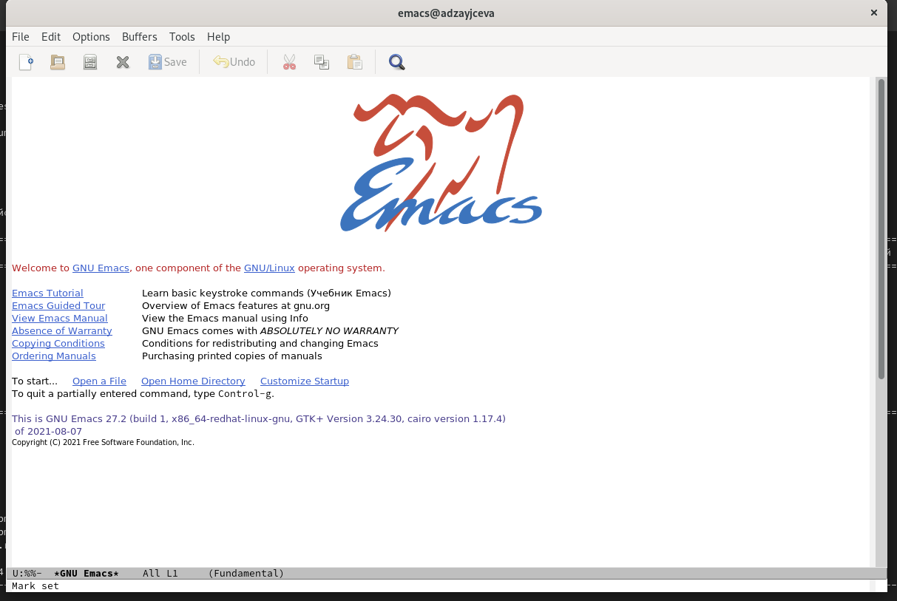
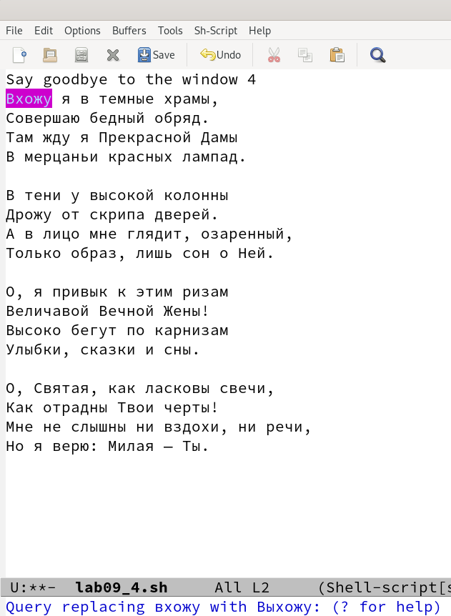

---
## Front matter
lang: ru-RU
title: Laboratory №9
author: |
	Anna D. Zaytseva\inst{1,3}
institute: |
	\inst{1}RUDN University, Moscow, Russian Federation
date: NEC--2022, 20 May, Moscow

## Formatting
toc: false
slide_level: 2
theme: metropolis
header-includes: 
 - \metroset{progressbar=frametitle,sectionpage=progressbar,numbering=fraction}
 - '\makeatletter'
 - '\beamer@ignorenonframefalse'
 - '\makeatother'
aspectratio: 43
section-titles: true
---

# Цель работы

Цель работы --- Познакомиться с операционной системой Linux.Получить практические навыки работы с редактором Emacs.

# Задание

1. Открыть emacs.
2. Создать файл lab09.sh с помощью комбинации Ctrl-x Ctrl-f (C-x C-f).
3. Наберите текст (указанный в задании к лабораторной).
4. Сохранить файл с помощью комбинации Ctrl-x Ctrl-s (C-x C-s).
5. Проделать с текстом стандартные процедуры редактирования, каждое действие должно осуществляться комбинацией клавиш.
   1. Вырезать одной командой целую строку (С-k).
   2. Вставить эту строку в конец файла (C-y).
   3. Выделить область текста (C-space).
   4. Скопировать область в буфер обмена (M-w).
   5. Вставить область в конец файла.
   6. Вновь выделить эту область и на этот раз вырезать её (C-w).
   7. Отмените последнее действие (C-/).
6. Научитесь использовать команды по перемещению курсора.
   1. Переместите курсор в начало строки (C-a).
   2. Переместите курсор в конец строки (C-e).
   3. Переместите курсор в начало буфера (M-<).
   4. Переместите курсор в конец буфера (M->).
7. Управление буферами.
   1. Вывести список активных буферов на экран (C-x C-b).
   2. Переместитесь во вновь открытое окно (C-x) o со списком открытых буферов и переключитесь на другой буфер.
   3. Закройте это окно (C-x 0).
   4. Теперь вновь переключайтесь между буферами, но уже без вывода их списка на экран (C-x b).
8. Управление окнами.
   1. Поделите фрейм на 4 части: разделите фрейм на два окна по вертикали (C-x 3), а затем каждое из этих окон на две части по горизонтали (C-x 2) (см.рис. 9.1 в указаниях к лабораторной работе).
   2. В каждом из четырёх созданных окон откройте новый буфер (файл) и введите несколько строк текста.
9. Режим поиска
   1. Переключитесьв режим поиска (C-s) и найдите несколько слов, присутствующих в тексте.
   2. Переключайтесь между результатами поиска, нажимая C-s.
   3. Выйдите из режима поиска, нажав C-g.
   4. Перейдите в режим поиска и замены (M-%), введите текст, который следует найти и заменить, нажмите Enter, затем введите текст для замены. После того как будут подсвечены результаты поиска, нажмите ! для подтверждения замены.
   5. Испробуйте другой режим поиска, нажав M-s o. Объясните, чем он отличается от обычного режима?

# Выполнение лабораторной работы

## Step 1

Я установила (команда: *sudo yum install emacs*) и открыла emacs (команда: *emacs*) (Рис. [-@fig:001]):

{ #fig:001 width=70% }

## Step 2

Поработала с редактором emacs (Рис. [-@fig:016])(Рис. [-@fig:019])(Рис. [-@fig:026])(Рис. [-@fig:028]):

{ #fig:016 width=70% }

{ #fig:019 width=70% }

{ #fig:026 width=70% }

{ #fig:028 width=70% }

## Steps 3 and 4

Ответила на контрольные вопросы и обновила данные на GitHub

# Вывод

В ходе лабораторной работы я познакомилась с операционной системой Linux. Получить практические навыки работы с редактором Emacs.

## {.standout}

Спасибо за внимание!
