---
## Front matter
title: "Лабораторная работа №9"
subtitle: "Отчёт к лабораторной работе"
author: "Зайцева Анна Дмитриевна"

## Generic options
lang: ru-RU

## Bibliography
bibliography: bib/cite.bib
csl: pandoc/csl/gost-r-7-0-5-2008-numeric.csl

## Pdf output format
toc: true # Table of contents
toc-depth: 2
lof: true # List of figures
lot: true # List of tables
fontsize: 12pt
linestretch: 1.5
papersize: a4
documentclass: scrreprt
## Fonts
mainfont: PT Serif
romanfont: PT Serif
sansfont: PT Sans
monofont: PT Mono
mainfontoptions: Ligatures=TeX
romanfontoptions: Ligatures=TeX
sansfontoptions: Ligatures=TeX,Scale=MatchLowercase
monofontoptions: Scale=MatchLowercase,Scale=0.9
## Pandoc-crossref LaTeX customization
figureTitle: "Рис."
tableTitle: "Таблица"
listingTitle: "Листинг"
lofTitle: "Список иллюстраций"
lotTitle: "Список таблиц"
lolTitle: "Листинги"
## Misc options
indent: true
header-includes:
  - \usepackage{indentfirst}
  - \usepackage{float} # keep figures where there are in the text
  - \floatplacement{figure}{H} # keep figures where there are in the text
---

# Цель работы

Цель работы --- Познакомиться с операционной системой Linux. Получить практические навыки работы с редактором Emacs.

# Задание

1. Открыть emacs.
2. Создать файл lab09.sh с помощью комбинации Ctrl-x Ctrl-f (C-x C-f).
3. Наберите текст (указанный в задании к лабораторной).
4. Сохранить файл с помощью комбинации Ctrl-x Ctrl-s (C-x C-s).
5. Проделать с текстом стандартные процедуры редактирования, каждое действие должно осуществляться комбинацией клавиш.
   1. Вырезать одной командой целую строку (С-k).
   2. Вставить эту строку в конец файла (C-y).
   3. Выделить область текста (C-space).
   4. Скопировать область в буфер обмена (M-w).
   5. Вставить область в конец файла.
   6. Вновь выделить эту область и на этот раз вырезать её (C-w).
   7. Отмените последнее действие (C-/).
6. Научитесь использовать команды по перемещению курсора.
   1. Переместите курсор в начало строки (C-a).
   2. Переместите курсор в конец строки (C-e).
   3. Переместите курсор в начало буфера (M-<).
   4. Переместите курсор в конец буфера (M->).
7. Управление буферами.
   1. Вывести список активных буферов на экран (C-x C-b).
   2. Переместитесь во вновь открытое окно (C-x) o со списком открытых буферов и переключитесь на другой буфер.
   3. Закройте это окно (C-x 0).
   4. Теперь вновь переключайтесь между буферами, но уже без вывода их списка на экран (C-x b).
8. Управление окнами.
   1. Поделите фрейм на 4 части: разделите фрейм на два окна по вертикали (C-x 3), а затем каждое из этих окон на две части по горизонтали (C-x 2) (см.рис. 9.1 в указаниях к лабораторной работе).
   2. В каждом из четырёх созданных окон откройте новый буфер (файл) и введите несколько строк текста.
9. Режим поиска
   1. Переключитесьв режим поиска (C-s) и найдите несколько слов, присутствующих в тексте.
   2. Переключайтесь между результатами поиска, нажимая C-s.
   3. Выйдите из режима поиска, нажав C-g.
   4. Перейдите в режим поиска и замены (M-%), введите текст, который следует найти и заменить, нажмите Enter, затем введите текст для замены. После того как будут подсвечены результаты поиска, нажмите ! для подтверждения замены.
   5. Испробуйте другой режим поиска, нажав M-s o. Объясните, чем он отличается от обычного режима?

# Выполнение лабораторной работы

1. Я установила (команда: *sudo yum install emacs*) и открыла emacs (команда: *emacs*) (Рис. [-@fig:001]):

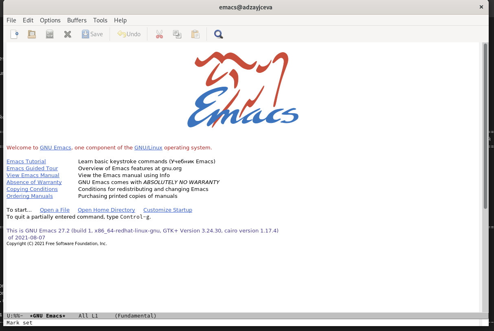{ #fig:001 width=70% }

2. Создала файл lab09.sh с помощью комбинации Ctrl-x Ctrl-f (C-x C-f) (Рис. [-@fig:002]):

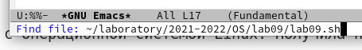{ #fig:002 width=70% }

3. Набрала текст (указанный в задании к лабораторной). (Рис. [-@fig:003]):

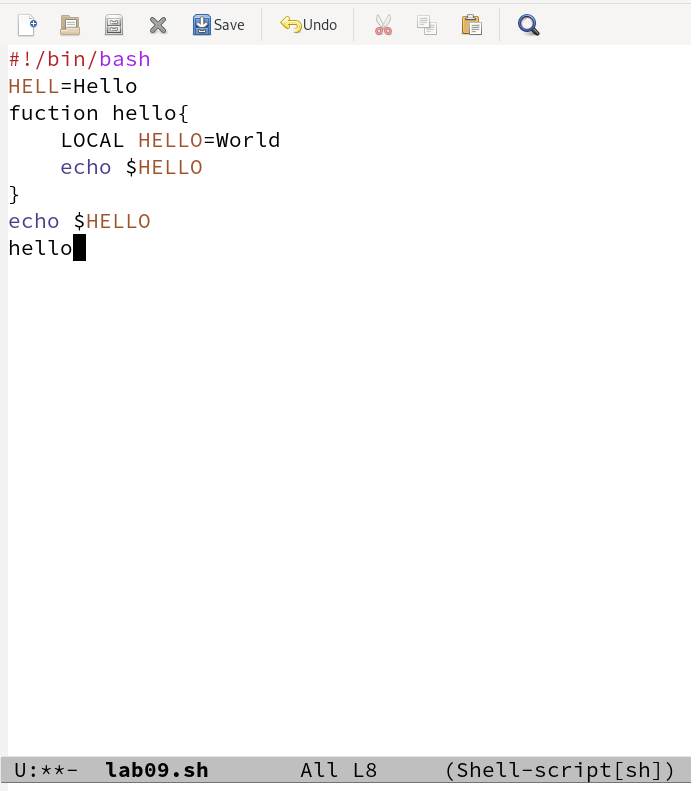{ #fig:003 width=70% }

4. Сохранила файл с помощью комбинации Ctrl-x Ctrl-s (C-x C-s). (Рис. [-@fig:004]):

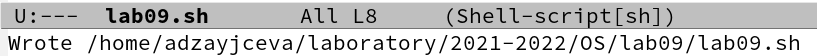{ #fig:004 width=70% }

5. Проделала с текстом стандартные процедуры редактирования, осуществив каждое действие комбинацией клавиш.

   1. Вырезала одной командой целую строку (С-k), предварительно выделив её командой (C-space и стрелочками). (Рис. [-@fig:005]):

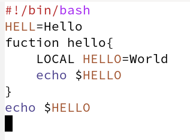{ #fig:005 width=70% }

   2. Вставила эту строку в конец файла (C-y). (Рис. [-@fig:006]):

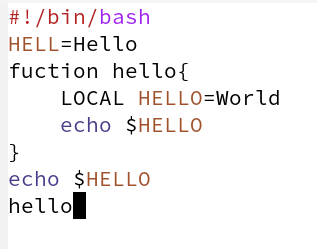{ #fig:006 width=70% }

   3. Выделила область текста (C-space). (Рис. [-@fig:007]):

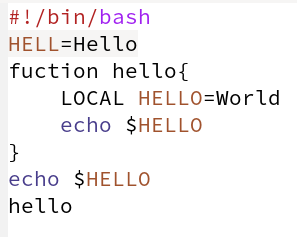{ #fig:007 width=70% }

   4. Скопировала область в буфер обмена (Alt-w).
   
   5. Вставила область в конец файла (C-y). (Рис. [-@fig:008]):

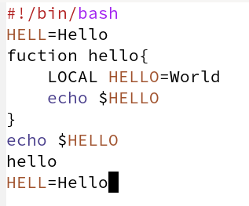{ #fig:008 width=70% }

   6. Вновь выделила эту область и на этот раз вырезала её (C-w). (Рис. [-@fig:009]):

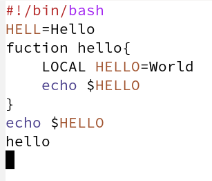{ #fig:009 width=70% }

   7. Отменила последнее действие (C-/). (Рис. [-@fig:010]):

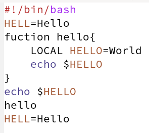{ #fig:010 width=70% }

6. Научилась использовать команды по перемещению курсора.

   1. Переместила курсор в начало строки (C-a). (Рис. [-@fig:011]):

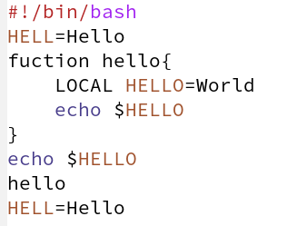{ #fig:011 width=70% }
   
   2. Переместила курсор в конец строки (C-e). (Рис. [-@fig:012]):

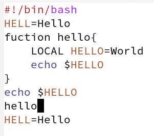{ #fig:012 width=70% }
   
   3. Переместила курсор в начало буфера (Esc-<). (Рис. [-@fig:013]):

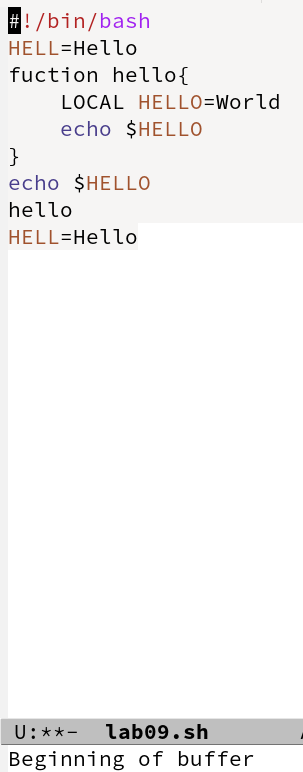{ #fig:013 width=70% }
   
   4. Переместила курсор в конец буфера (Esc->). (Рис. [-@fig:014]):

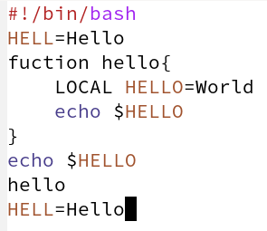{ #fig:014 width=70% }
   
7. Управление буферами.

   1. Вывела список активных буферов на экран (C-x C-b). (Рис. [-@fig:015]):

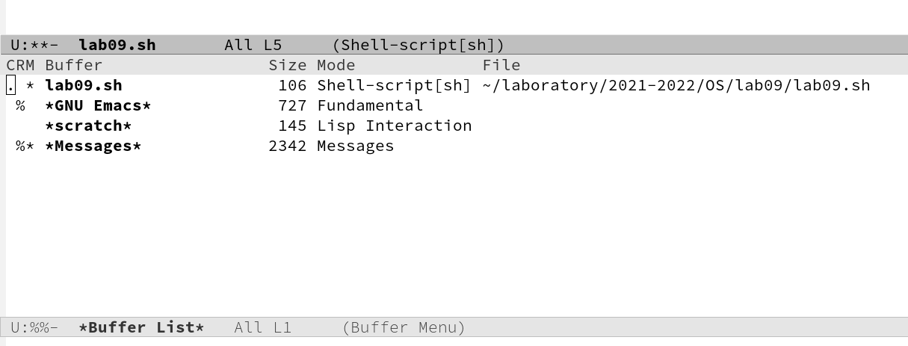{ #fig:015 width=70% }
   
   2. Переместилась во вновь открытое окно (C-x) со списком открытых буферов и переключилась на другой буфер. (Рис. [-@fig:016]):

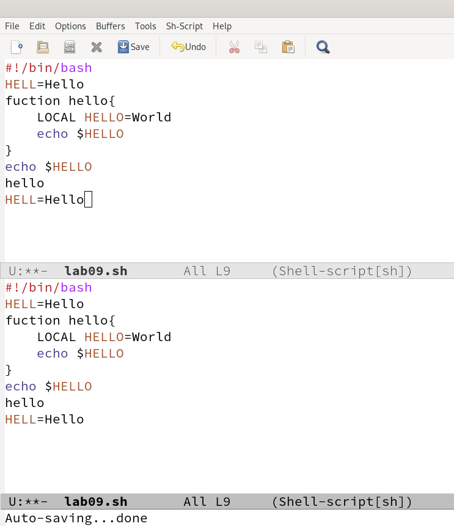{ #fig:016 width=70% }
   
   3. Закрыла это окно (C-x 0). (Рис. [-@fig:017]):

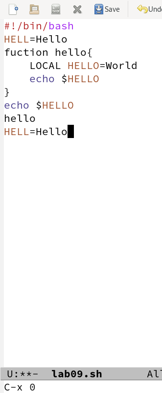{ #fig:017 width=70% }
   
   4. Теперь вновь переключилась между буферами, но уже без вывода их списка на экран (C-x b). (Рис. [-@fig:018]):

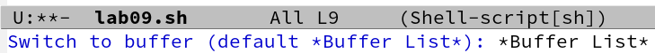{ #fig:018 width=70% }

8. Управление окнами.

   1. Поделила фрейм на 4 части: разделила фрейм на два окна по вертикали (C-x 3), а затем каждое из этих окон на две части по горизонтали (C-x 2) (см.рис. 9.1 в указаниях к лабораторной работе). (Рис. [-@fig:019]):

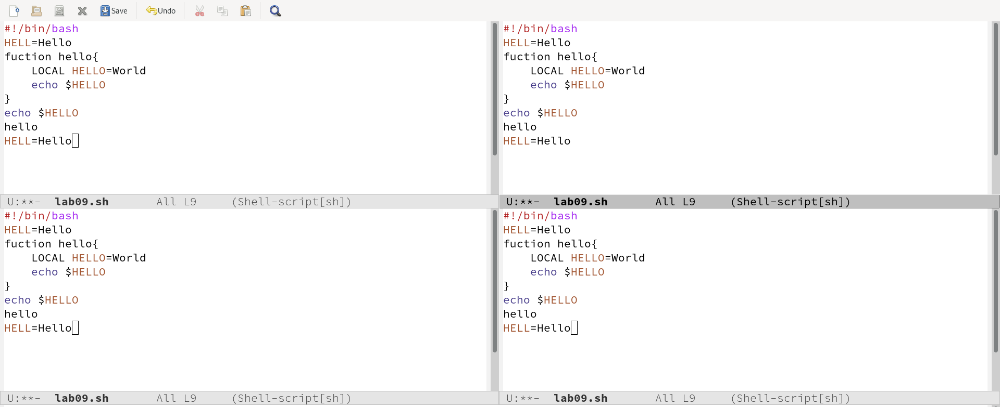{ #fig:019 width=70% }
   
   2. В каждом из четырёх созданных окон открыла новый буфер (файл) (C-x C-f) и ввела несколько строк текста, затем сохранив их (C-x C-s). (Рис. [-@fig:020]):

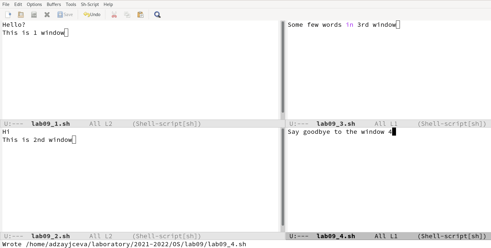{ #fig:020 width=70% }

9. Режим поиска

   1. Переключилась в режим поиска (C-s) и нашла несколько слов, присутствующих в тексте. (Рис. [-@fig:021])(Рис. [-@fig:022])(Рис. [-@fig:023]):

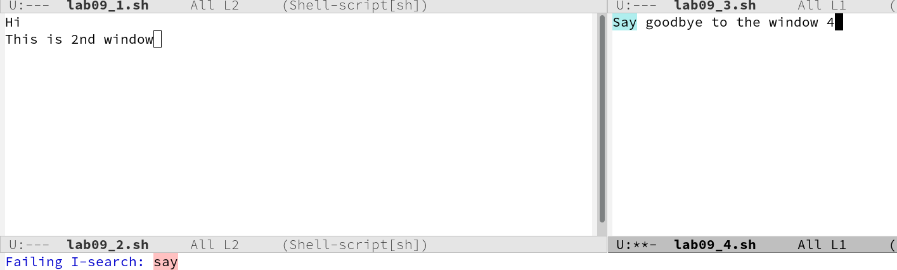{ #fig:021 width=70% }

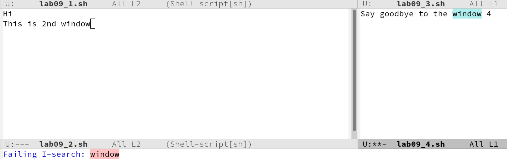{ #fig:022 width=70% }

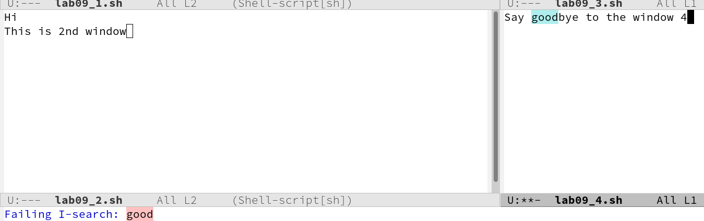{ #fig:023 width=70% }
   
   2. Переключалась между результатами поиска, нажимая C-s. (Рис. [-@fig:024]):

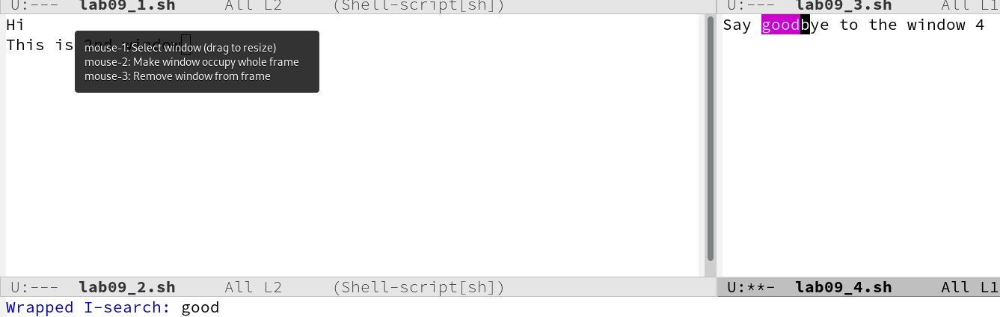{ #fig:024 width=70% }
   
   3. Вышла из режима поиска, нажав C-g. (Рис. [-@fig:025]):

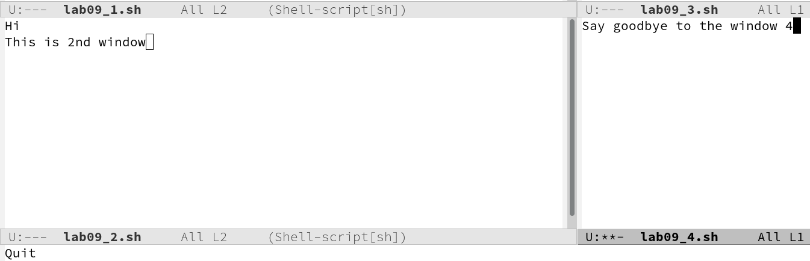{ #fig:025 width=70% }
   
   4. Перешла в режим поиска и замены (Esc-%), ввела текст, который следует найти и заменить, нажала Enter, затем ввела текст для замены. После того как были подсвечены результаты поиска, нажала ! для подтверждения замены. (Рис. [-@fig:026])(Рис. [-@fig:027]):

{ #fig:026 width=70% }

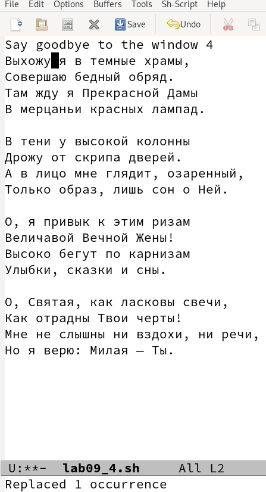{ #fig:027 width=70% }
   
   5. Испробовала другой режим поиска, нажав M-s o. От обычного режима он отличается тем, что найденные слова подсвечиваются в новом окне ,да ещё и отображаются в целых строках, номера которых подписаны. (Рис. [-@fig:028]):

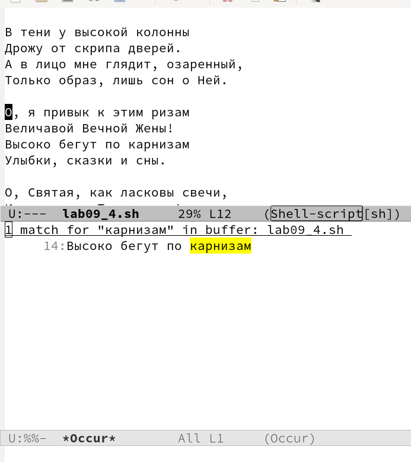{ #fig:028 width=70% }
   
   
# Ответы на контрольные вопросы

1) Emacs − один из наиболее мощных и широко распространённых редакторов, используемых в мире Unix. По популярности он соперничает с редактором vi и его клонами. В зависимости от ситуации, Emacs может быть текстовым редактором; программой для чтения почты и новостей Usenet; интегрированной средой разработки (IDE); операционной системой и т.д. Всё это разнообразие достигается благодаря архитектуре Emacs, которая позволяет расширять возможности редактора при помощи языка Emacs Lisp. На языке C написаны лишь самые базовые и низкоуровневые части Emacs, включая полнофункциональный. интерпретатор языка Lisp. Таким образом, Emacs имеет встроенный язык программирования, который может использоваться для настройки, расширения и изменения поведения редактора. В действительности, большая часть того редактора, с которым пользователи Emacs работают в наши дни, написана на языке Lisp.

2) Основную трудность для новичков при освоенииданного редактора могутсоставлять большое количество команд, комбинаций клавиш, которые не получится все запомнить с первого раза и поэтоупридется часто обращаться к справочным материалам.

3) Буфер – это объект, представляющий собой текст. Если имеется несколько буферов, то редактировать можно только один. Обычно буфер считывает данные из файла или записывает в файл данные из буфера.Окно –это область экрана, отображающая буфер. При запуске редактора отображается одно окно, но при обращении к некоторым функциям могут открыться дополнительные окна. Окна Emacsи окна графической среды XWindow–разные вещи. Одно окно XWindowможет быть разбито на несколько окон в смысле Emacs, в каждом из которых отображается отдельный буфер.

4) Да, можно.

5). При запуске Emacsпо умолчанию создаются следующие буферы: «scratch»(буфер для несохраненного текста) «Messages»(журнал ошибок, включающий такжеинформацию, которая появляется в области EchoArea) «GNUEmacs»(справочный буфер о редакторе).

6) C-c |сначала, удерживая «ctrl»,нажимаю «c»,после –отпускаюобе клавишии нажимаю «|» C-cC-|сначала, удерживая «ctrl»,нажимаю «с», после –отпускаю обе клавиши и, удерживая «ctrl», нажимаю «|».

7) Чтобы поделить окно на две части необходимо воспользоваться комбинацией «Ctrl-x 3»(по вертикали) или «Ctrl-x 2» (по горизонтали).

8) Настройки Emacs хранятся в файле .emacs.

9) По умолчанию клавиша «←» удаляет символ перед курсором, но в редакторе её можно переназначить. Для этого необхдимо изменить конфигурацию файла .emacs.

10) Более удобным я считаю редактор emacs, потому что в нем проще открывать другие файлы, можно использовать сразу несколько окон, нет «Командного режима», «Режима ввода», «Режима командной строки», которые являются немного непривычными и в какой-то степени неудобными.

# Вывод

В ходе лабораторной работы я познакомилась с операционной системой Linux. Получить практические навыки работы с редактором Emacs.
