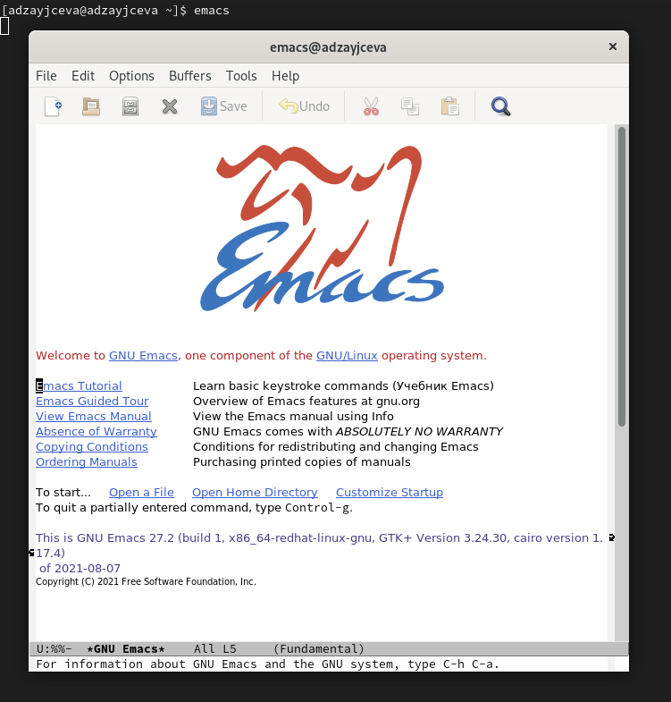
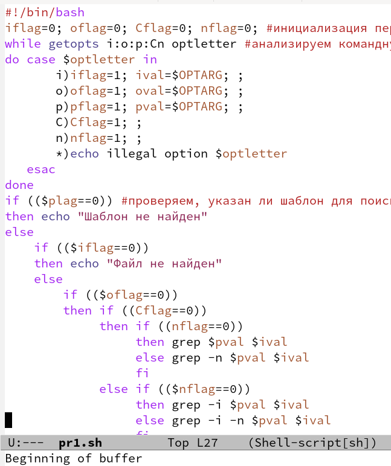
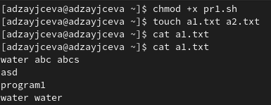
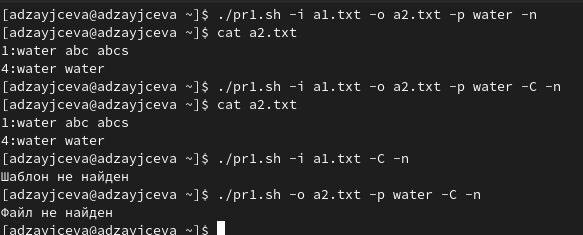
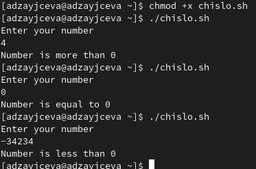
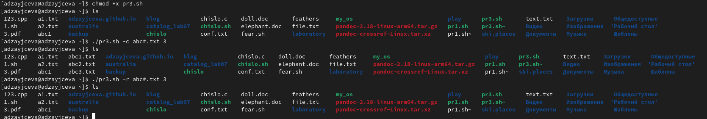
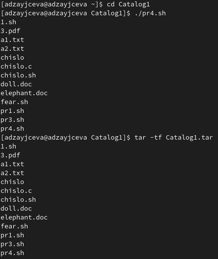

---
## Front matter
lang: ru-RU
title: Laboratory №11
author: |
	Anna D. Zaytseva\inst{1,3}
institute: |
	\inst{1}RUDN University, Moscow, Russian Federation
date: NEC--2022, 28 May, Moscow

## Formatting
toc: false
slide_level: 2
theme: metropolis
header-includes: 
 - \metroset{progressbar=frametitle,sectionpage=progressbar,numbering=fraction}
 - '\makeatletter'
 - '\beamer@ignorenonframefalse'
 - '\makeatother'
aspectratio: 43
section-titles: true
---

# Цель работы

Цель работы --- Изучить основы программирования в оболочке ОС UNIX. Научится писать более сложные командные файлы с использованием логических управляющих конструкций и циклов.

# Задание

1. Используя команды getopts grep, написать командный файл, который анализирует командную строку с ключами:
- -iinputfile —прочитатьданные из указанного файла;
- -ooutputfile —вывести данные в указанный файл;
- -pшаблон —указать шаблон для поиска;
- -C —различать большие и малые буквы;
- -n —выдавать номера строк.
а затем ищет в указанном файле нужные строки, определяемые ключом -p.
2. Написала на языке Си программу, которая вводит число и определяет, является ли оно больше нуля, меньше нуля или равно нулю. Затем программа завершается с помощью функции exit(n), передавая информацию о коде завершения в оболочку. Командный файл должен вызывать эту программу и, проанализировав с помощью команды $?, выдать сообщение о том, какое число было введено.
3. Написать командный файл, создающий указанное число файлов, пронумерованных последовательно от 1 до 𝑁 (например 1.tmp, 2.tmp, 3.tmp, 4.tmp и т.д.). Число файлов, которые необходимо создать, передаётся в аргументы командной строки. Этот же командный файл должен уметь удалять все созданные им файлы (если они существуют).
4. Написать командный файл, который с помощью команды tar запаковывает в архив все файлы в указанной директории. Модифицировать его так, чтобы запаковывались только те файлы, которые были изменены менее недели тому назад (использовать команду find).

# Выполнение лабораторной работы

## Step 1

1. Я открыла emacs (команда: *emacs*) (Рис. [-@fig:001]):

{ #fig:001 width=70% }

2. Создала файл pr1.sh с помощью комбинации Ctrl-x Ctrl-f (C-x C-f). Написала скрипт, используя команды getopts grep, написала командный файл, который анализирует командную строку с ключами:
- -iinputfile —прочитатьданные из указанного файла;
- -ooutputfile —вывести данные в указанный файл;
- -pшаблон —указать шаблон для поиска;
- -C —различать большие и малые буквы;
- -n —выдавать номера строк.
а затем ищет в указанном файле нужные строки, определяемые ключом -p. (Рис. [-@fig:002]):

{ #fig:002 width=70% }

Добавила право на исполнение файла (команда: *chmod +x pr1.sh*) и создала 2 файла, которые необходимы для выполнения программы (команда: *touch a1.txt a2.txt*) (Рис. [-@fig:003]):

{ #fig:003 width=70% }

Скрипт работает корректно (Рис. [-@fig:004]):

{ #fig:004 width=70% }

## Step 2

3. Создала файлы chislo.sh и chislo.c с помощью комбинации Ctrl-x Ctrl-f (C-x C-f). Написала на языке Си программу, которая вводит число и определяет, является ли оно больше нуля, меньше нуля или равно нулю. Затем программа завершается с помощью функции exit(n), передавая информацию о коде завершения в оболочку. Командный файл должен вызывать эту программу и, проанализировав с помощью команды $?, выдать сообщение о том, какое число было введено.

Добавила право на исполнение файла (команда: *chmod +x chislo.sh*) и запустила скрипт несколько раз (команда: *./chislo.sh*). Скрипт работает корректно (Рис. [-@fig:005]):

{ #fig:005 width=70% }

4. Создала файл pr3.sh с помощью комбинации Ctrl-x Ctrl-f (C-x C-f). Написала командный файл, создающий указанное число файлов, пронумерованных последовательно от 1 до 𝑁 (например 1.tmp, 2.tmp, 3.tmp, 4.tmp и т.д.). Число файлов, которые необходимо создать, передаётся в аргументы командной строки. Этот же командный файл должен уметь удалять все созданные им файлы (если они существуют).

Добавила право на исполнение файла (команда: *chmod +x pr3.sh*) и создала 3 файла, удовлетворяющие условию задачи (команда: *./pr3.sh -c abc#.txt 3*), а затем удалила их (команда: *./pr3.sh -r abc#.txt 3*). Скрипт работает корректно (Рис. [-@fig:006]):

{ #fig:006 width=70% }

5. Создала файл pr4.sh с помощью комбинации Ctrl-x Ctrl-f (C-x C-f). Написала командный файл, который с помощью команды tar запаковывает в архив все файлы в указанной директории. Модифицировать его так, чтобы запаковывались только те файлы, которые были изменены менее недели тому назад (использовать команду find).

Добавила право на исполнение файла (команда: *chmod +x pr4.sh*) и создала каталог Catalog1 с файлами и перешла в него, а затем запустила программу и убедилась в том, что файлы, изменённые более недели назад заархивированы не были (команды: *./pr4.sh* и *tar -tf Catalog1.tar*). Скрипт работает корректно (Рис. [-@fig:007]):

{ #fig:007 width=70% }

## Steps 3 and 4

Ответила на контрольные вопросы и обновила данные на GitHub

# Вывод

В ходе лабораторной работы я изучила основы программирования в оболочке ОС UNIX. Научилась писать более сложные командные файлы с использованием логических управляющих конструкций и циклов.

## {.standout}

Спасибо за внимание!
