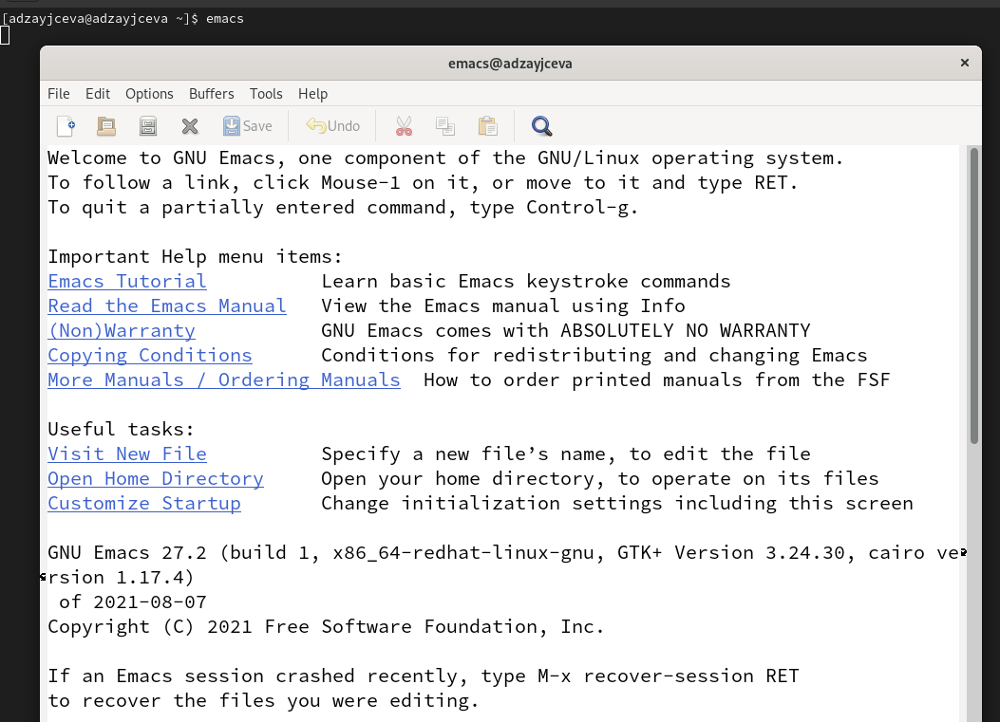
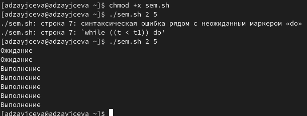
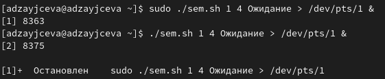
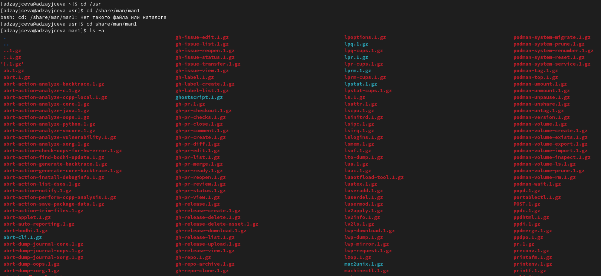
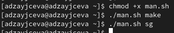
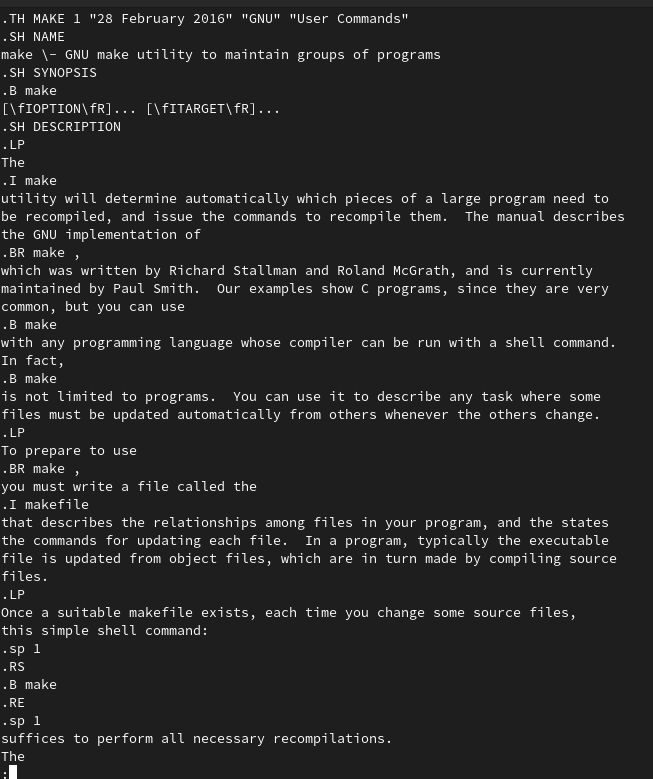
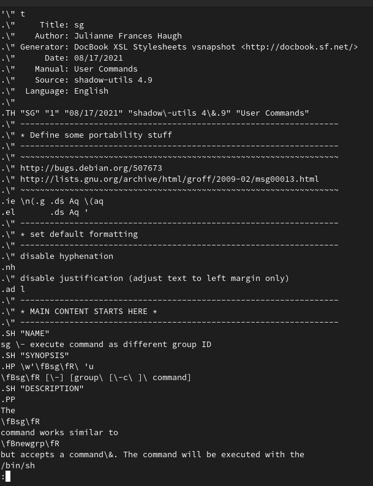

---
## Front matter
lang: ru-RU
title: Laboratory №12
author: |
	Anna D. Zaytseva\inst{1,3}
institute: |
	\inst{1}RUDN University, Moscow, Russian Federation
date: NEC--2022, 28 May, Moscow

## Formatting
toc: false
slide_level: 2
theme: metropolis
header-includes: 
 - \metroset{progressbar=frametitle,sectionpage=progressbar,numbering=fraction}
 - '\makeatletter'
 - '\beamer@ignorenonframefalse'
 - '\makeatother'
aspectratio: 43
section-titles: true
---

# Цель работы

Цель работы --- Изучить основы программирования в оболочке ОС UNIX. Научиться писать более сложные командные файлы с использованием логических управляющих конструкций и циклов.

# Задание

1. Написать командный файл, реализующий упрощённый механизм семафоров. Командный файл должен втечение некоторого времени t1 дожидаться освобождения ресурса, выдавая об этом сообщение,а дождавшись его освобождения, использовать его в течение некоторого времени t2<>t1, также выдавая информацию о том, что ресурс используется соответствующим командным файлом (процессом). Запустить командный файл в одном виртуальном терминале в фоновом режиме, перенаправив его вывод в другой (> /dev/tty#, где # — номер терминала куда перенаправляется вывод),в котором также запущен этот файл, но не фоновом, а в привилегированном режиме. Доработать программу так, чтобы имелась возможность взаимодействия трёх и более процессов.
2. Реализовать команду man с помощью командного файла. Изучите содержимое каталога /usr/share/man/man1.В нем находятся архивы текстовых файлов, содержащих
справку по большинству установленных в системе программ и команд. Каждый архив можно открыть командой less сразу же просмотрев содержимое справки. Командный
файл должен получать в виде аргумента командной строки название команды и в виде результата выдавать справку об этой команде или сообщение об отсутствии справки, если соответствующего файла нет в каталоге man1.
3. Используя встроенную переменную $RANDOM, напишите командный файл, генерирующий случайную последовательность букв латинского алфавита. Учтите, что $RANDOM выдаёт псевдослучайные числа в диапазоне от 0 до 32767.

# Выполнение лабораторной работы

## Step 1

1. Я открыла emacs (команда: *emacs*) (Рис. [-@fig:001]):

{ #fig:001 width=70% }

Создала файл sem.sh с помощью комбинации Ctrl-x Ctrl-f (C-x C-f). Написала командный файл, реализующий упрощённый механизм семафоров. Командный файл должен втечение некоторого времени t1 дожидаться освобождения ресурса, выдавая об этом сообщение,а дождавшись его освобождения, использовать его в течение некоторого времени t2<>t1, также выдавая информацию о том, что ресурс используется соответствующим командным файлом (процессом). Запустить командный файл в одном виртуальном терминале в фоновом режиме, перенаправив его вывод в другой (> /dev/tty#, где # — номер терминала куда перенаправляется вывод),в котором также запущен этот файл, но не фоновом, а в привилегированном режиме. Доработать программу так, чтобы имелась возможность взаимодействия трёх и более процессов. 

Добавила право на исполнение файла (команда: *chmod +x sem.sh*) и запустила его (команда: *./sem.sh 2 5*). Скрипт работает корректно (Рис. [-@fig:002]):

{ #fig:002 width=70% }

Я доработала код программы, чтобы имелась возможность взаимодействия трёх и более процессов.

Запустила её (команда: *sudo ./sem.sh 1 4 Ожидание > /dev/pts/1 &*). Скрипт работает корректно (Рис. [-@fig:003]):

{ #fig:003 width=70% }

## Step 2

2. Изучила содержимое каталога /usr/share/man/man1. В нем находятся архивы текстовых файлов, содержащих справку по большинству установленных в системе программ и команд. Каждый архив можно открыть командой less сразу же просмотрев содержимое справки (Рис. [-@fig:004]):

{ #fig:004 width=70% }

Создала файл man.sh с помощью комбинации Ctrl-x Ctrl-f (C-x C-f). Реализовала команду man с помощью командного файла. Командный файл должен получать в виде аргумента командной строки название команды и в виде результата выдавать справку об этой команде или сообщение об отсутствии справки, если соответствующего файла нет в каталоге man1.

Добавила право на исполнение файла (команда: *chmod +x man.sh*) и запустила скрипт несколько раз (команды: *./man.sh make* и *./man.sh sg*) (Рис. [-@fig:005]) Скрипт работает корректно (Рис. [-@fig:006])(Рис. [-@fig:007]):

{ #fig:005 width=70% }

{ #fig:006 width=70% }

{ #fig:007 width=70% }

## Step 3

3. Создала файл random.sh с помощью комбинации Ctrl-x Ctrl-f (C-x C-f). Используя встроенную переменную $RANDOM, написала командный файл, генерирующий случайную последовательность букв латинского алфавита. Учла, что $RANDOM выдаёт псевдослучайные числа в диапазоне от 0 до 32767.

Добавила право на исполнение файла (команда: *chmod +x random.sh*) и запустила скрипт несколько раз (команды: *./random.sh 2*, *./random.sh 22*, *./random.sh 5* и *./random.sh 14*). Скрипт работает корректно (Рис. [-@fig:008]):

{ #fig:008 width=70% }

## Steps 4 and 5

Ответила на контрольные вопросы и обновила данные на GitHub

# Вывод

В ходе лабораторной работы я изучила основы программирования в оболочке ОС UNIX и научилась писать более сложные командные файлы с использованием логических управляющих конструкций и циклов.

## {.standout}

Спасибо за внимание!
