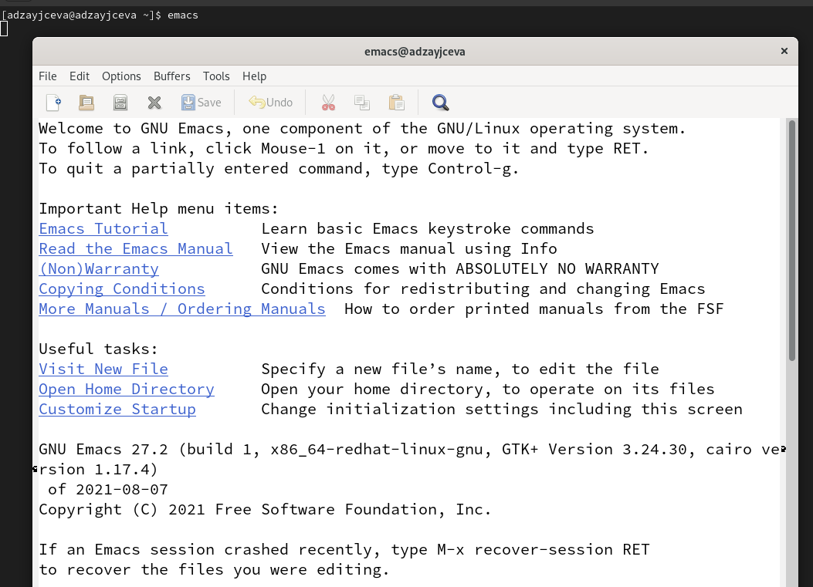
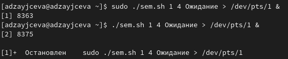
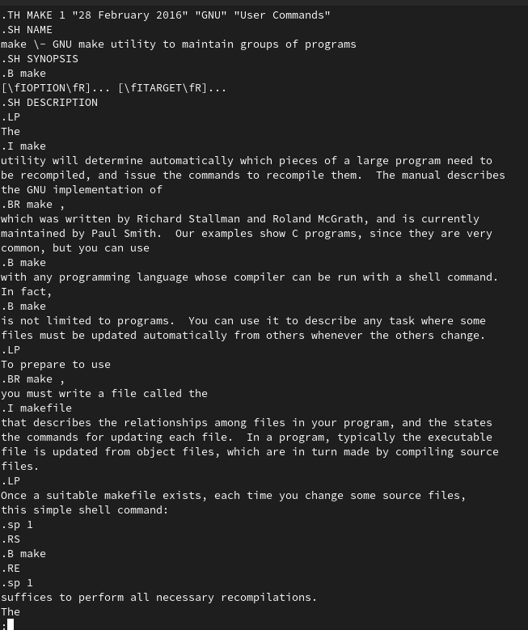
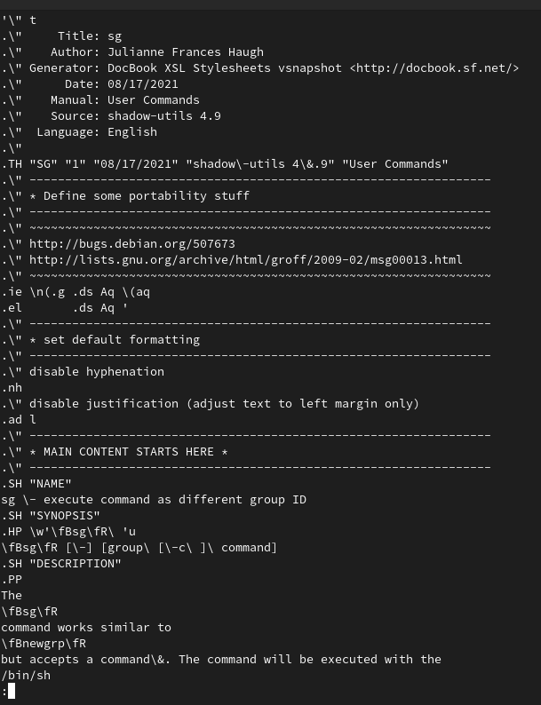
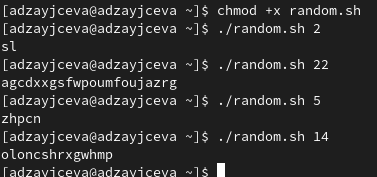

---
## Front matter
title: "Лабораторная работа №12"
subtitle: "Отчёт к лабораторной работе"
author: "Зайцева Анна Дмитриевна"

## Generic options
lang: ru-RU

## Bibliography
bibliography: bib/cite.bib
csl: pandoc/csl/gost-r-7-0-5-2008-numeric.csl

## Pdf output format
toc: true # Table of contents
toc-depth: 2
lof: true # List of figures
lot: true # List of tables
fontsize: 12pt
linestretch: 1.5
papersize: a4
documentclass: scrreprt
## Fonts
mainfont: PT Serif
romanfont: PT Serif
sansfont: PT Sans
monofont: PT Mono
mainfontoptions: Ligatures=TeX
romanfontoptions: Ligatures=TeX
sansfontoptions: Ligatures=TeX,Scale=MatchLowercase
monofontoptions: Scale=MatchLowercase,Scale=0.9
## Pandoc-crossref LaTeX customization
figureTitle: "Рис."
tableTitle: "Таблица"
listingTitle: "Листинг"
lofTitle: "Список иллюстраций"
lotTitle: "Список таблиц"
lolTitle: "Листинги"
## Misc options
indent: true
header-includes:
  - \usepackage{indentfirst}
  - \usepackage{float} # keep figures where there are in the text
  - \floatplacement{figure}{H} # keep figures where there are in the text
---

# Цель работы

Цель работы --- Изучить основы программирования в оболочке ОС UNIX. Научиться писать более сложные командные файлы с использованием логических управляющих конструкций и циклов.

# Задание

1. Написать командный файл, реализующий упрощённый механизм семафоров. Командный файл должен втечение некоторого времени t1 дожидаться освобождения ресурса, выдавая об этом сообщение,а дождавшись его освобождения, использовать его в течение некоторого времени t2<>t1, также выдавая информацию о том, что ресурс используется соответствующим командным файлом (процессом). Запустить командный файл в одном виртуальном терминале в фоновом режиме, перенаправив его вывод в другой (> /dev/tty#, где # — номер терминала куда перенаправляется вывод),в котором также запущен этот файл, но не фоновом, а в привилегированном режиме. Доработать программу так, чтобы имелась возможность взаимодействия трёх и более процессов.
2. Реализовать команду man с помощью командного файла. Изучите содержимое каталога /usr/share/man/man1.В нем находятся архивы текстовых файлов, содержащих
справку по большинству установленных в системе программ и команд. Каждый архив можно открыть командой less сразу же просмотрев содержимое справки. Командный
файл должен получать в виде аргумента командной строки название команды и в виде результата выдавать справку об этой команде или сообщение об отсутствии справки, если соответствующего файла нет в каталоге man1.
3. Используя встроенную переменную $RANDOM, напишите командный файл, генерирующий случайную последовательность букв латинского алфавита. Учтите, что $RANDOM выдаёт псевдослучайные числа в диапазоне от 0 до 32767.

# Выполнение лабораторной работы

1. Я открыла emacs (команда: *emacs*) (Рис. [-@fig:001]):

{ #fig:001 width=70% }

Создала файл sem.sh с помощью комбинации Ctrl-x Ctrl-f (C-x C-f). Написала командный файл, реализующий упрощённый механизм семафоров. Командный файл должен втечение некоторого времени t1 дожидаться освобождения ресурса, выдавая об этом сообщение,а дождавшись его освобождения, использовать его в течение некоторого времени t2<>t1, также выдавая информацию о том, что ресурс используется соответствующим командным файлом (процессом). Запустить командный файл в одном виртуальном терминале в фоновом режиме, перенаправив его вывод в другой (> /dev/tty#, где # — номер терминала куда перенаправляется вывод),в котором также запущен этот файл, но не фоновом, а в привилегированном режиме. Доработать программу так, чтобы имелась возможность взаимодействия трёх и более процессов. 

**sem.sh:**
```
#!/bin/bash
t1=$1
t2=$2
s1=$(date +"%s")
s2=$(date +"%s")
((t=$s2-$s1))
while ((t < t1))
do
      echo "Ожидание"
      sleep 1
      s2=$(date +"%s")
      ((t=$s2-$s1))
done
s1=$(date +"%s")
s2=$(date +"%s")
((t=$s2-$s1))
while ((t < t2))
do
      echo "Выполнение"
      sleep 1
      s2=$(date +"%s")
      ((t=$s2-$s1))
done
```

Добавила право на исполнение файла (команда: *chmod +x sem.sh*) и запустила его (команда: *./sem.sh 2 5*). Скрипт работает корректно (Рис. [-@fig:002]):

{ #fig:002 width=70% }

Я доработала код программы, чтобы имелась возможность взаимодействия трёх и более процессов.

**sem.sh (modified):**
```
#!/bin/bash
function ojidaniye
{
s1=$(date +"%s")
s2=$(date +"%s")
((t=$s2-$s1))
while ((t < t1))
do
      echo "Ожидание"
      sleep 1
      s2=$(date +"%s")
      ((t=$s2-$s1))
done
}
function vipolneniye
{
s1=$(date +"%s")
s2=$(date +"%s")
((t=$s2-$s1))
while ((t < t2))
do
      echo "Выполнение"
      sleep 1
      s2=$(date +"%s")
      ((t=$s2-$s1))
done
}
t1=$1
t2=$2
command=$3
while true
do
    if [ "$command" == "Выход" ]
    then
	echo ""
	exit 0
    fi
    if [ "$command" == "Ожидание" ]
    then ojidaniye
    fi
    if [ "$command" == "Выполнение" ]
    then vipolneniye
    fi
    echo "Следующее действие: "
    read command
done
```
Запустила её (команда: *sudo ./sem.sh 1 4 Ожидание > /dev/pts/1 &*). Скрипт работает корректно (Рис. [-@fig:003]):

{ #fig:003 width=70% }

2. Изучила содержимое каталога /usr/share/man/man1. В нем находятся архивы текстовых файлов, содержащих справку по большинству установленных в системе программ и команд. Каждый архив можно открыть командой less сразу же просмотрев содержимое справки (Рис. [-@fig:004]):

{ #fig:004 width=70% }

Создала файл man.sh с помощью комбинации Ctrl-x Ctrl-f (C-x C-f). Реализовала команду man с помощью командного файла. Командный файл должен получать в виде аргумента командной строки название команды и в виде результата выдавать справку об этой команде или сообщение об отсутствии справки, если соответствующего файла нет в каталоге man1.

**man.sh:**
```
#!/bin/bash
c=$1 # Инициализация названия команды
if [ -f /usr/share/man/man1/$c.1.gz ] # Проверка существования справки
then
    gunzip -c /usr/share/man/man1/$1.1.gz | less # Распаковка архива со справкой, если она есть
else
    echo "Справки нет"
fi
```

Добавила право на исполнение файла (команда: *chmod +x man.sh*) и запустила скрипт несколько раз (команды: *./man.sh make* и *./man.sh sg*) (Рис. [-@fig:005]) Скрипт работает корректно (Рис. [-@fig:006])(Рис. [-@fig:007]):

{ #fig:005 width=70% }

{ #fig:006 width=70% }

{ #fig:007 width=70% }

3. Создала файл random.sh с помощью комбинации Ctrl-x Ctrl-f (C-x C-f). Используя встроенную переменную $RANDOM, написала командный файл, генерирующий случайную последовательность букв латинского алфавита. Учла, что $RANDOM выдаёт псевдослучайные числа в диапазоне от 0 до 32767.

**random.sh:**
```
#!/bin/bash
c=$1 # Инициализация количества символов
for (( i=0; i<$c; i++ )) #Цикл вывода нужного количества символов
do
    (( char=$RANDOM%26+1 )) # Случайные номера от 1 до 26
    case $char in # Вывод символа с помощью оператора выбора
	1) echo -n a;; 2) echo -n b;; 3) echo -n c;; 4) echo -n d;; 5) echo -n e;;
	6) echo -n f;; 7) echo -n g;; 8) echo -n h;; 9) echo -n i;; 10) echo -n j;;
	11) echo -n k;; 12) echo -n l;; 13) echo -n m;; 14) echo -n n;; 15) echo -n o;;
	16) echo -n p;; 17) echo -n q;; 18) echo -n r;; 19) echo -n s;; 20) echo -n t;;
	21) echo -n u;; 22) echo -n v;; 23) echo -n w;; 24) echo -n x;; 25) echo -n y;;
	26) echo -n z
    esac
done
echo
```

Добавила право на исполнение файла (команда: *chmod +x random.sh*) и запустила скрипт несколько раз (команды: *./random.sh 2*, *./random.sh 22*, *./random.sh 5* и *./random.sh 14*). Скрипт работает корректно (Рис. [-@fig:008]):

{ #fig:008 width=70% }

# Ответы на контрольные вопросы

1. while [$1 != "exit"]
В данной строчке допущены следующие ошибки:
- не хватает пробелов после первой скобки [и перед второй скобкой ]
- выражение $1 необходимо взять в “”, потому что эта переменная может содержать пробелы.
Таким образом, правильный вариант должен выглядеть так: while [“$1”!= "exit"]

2. Чтобы объединить несколько строк в одну, можно воспользоваться несколькими способами:
- Первый:
VAR1="Hello,
"VAR2=" World"
VAR3="$VAR1$VAR2"
echo "$VAR3"
Результат: Hello, World
- Второй:
VAR1="Hello, "
VAR1+=" World"
echo "$VAR1"
Результат: Hello, World

3. Команда seq в Linux используется для генерации чисел от ПЕРВОГО до ПОСЛЕДНЕГО шага INCREMENT.
Параметры:
- seq LAST: если задан только один аргумент, он создает числа от 1 до LAST с шагом шага, равным 1. Если LAST меньше 1, значение is не выдает.
- seq FIRST LAST: когда заданы два аргумента, он генерирует числа от FIRST до LAST с шагом 1, равным 1. Если LAST меньше FIRST, он не выдает никаких выходных данных.
- seq FIRST INCREMENT LAST: когда заданы три аргумента, он генерирует числа от FIRST до LAST на шаге INCREMENT . Если LAST меньше, чем FIRST, он не производит вывод.
- seq -f «FORMAT» FIRST INCREMENT LAST: эта команда используется для генерации последовательности в форматированном виде. FIRST и INCREMENT являются необязательными.
- seq -s «STRING» ПЕРВЫЙ ВКЛЮЧЕНО: Эта команда используется для STRING для разделения чисел. По умолчанию это значение равно /n. FIRST и INCREMENT являются необязательными.
- seq -w FIRST INCREMENT LAST:эта команда используется для выравнивания ширины путем заполнения начальными нулями. FIRST и INCREMENT являются необязательными.

4. Результатом данного выражения $((10/3))будет 3, потому что это целочисленное деление без остатка.

5. Отличия командной оболочки zshот bash:
- В zsh более быстрое автодополнение для cdс помощью Тab
- В zsh существует калькулятор zcalc, способный выполнять вычисления внутри терминала
- В zsh поддерживаются числа с плавающей запятой
- В zsh поддерживаются структуры данных «хэш»
- В zsh поддерживается раскрытие полного пути на основе неполных данных
- В zsh поддерживаетсязаменачастипути
- В zsh есть возможность отображать разделенный экран, такой же как разделенный экран vim

6. for((a=1; a<= LIMIT; a++)) синтаксис данной конструкции верен, потому что, используя двойные круглые скобки, можно не писать $ перед переменными ().

7. **Преимущества скриптового языка bash:**
- Один из самых распространенных и ставится по умолчаниюв большинстве дистрибутивах Linux, MacOS
- Удобное перенаправление ввода/вывода
- Большое количество команд для работы с файловыми системами Linux
- Можно писать собственные скрипты, упрощающие работу в Linux

**Недостатки скриптового языка bash:**
- Дополнительные библиотеки других языков позволяют выполнить больше действий
- Bash не является языков общего назначения
- Утилиты, при выполнении скрипта, запускают свои процессы, которые, в свою очередь, отражаются на быстроте выполнения этого скрипта
- Скрипты, написанные на bash, нельзя запустить на других операционных системах без дополнительных действий.

# Вывод

В ходе лабораторной работы я изучила основы программирования в оболочке ОС UNIX и научилась писать более сложные командные файлы с использованием логических управляющих конструкций и циклов.
