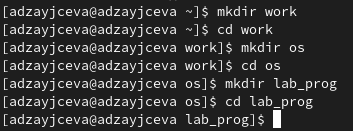
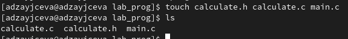
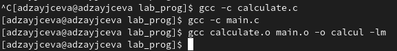
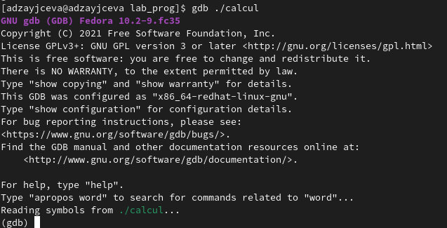
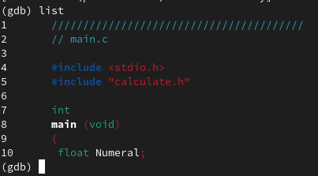
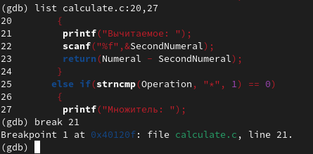
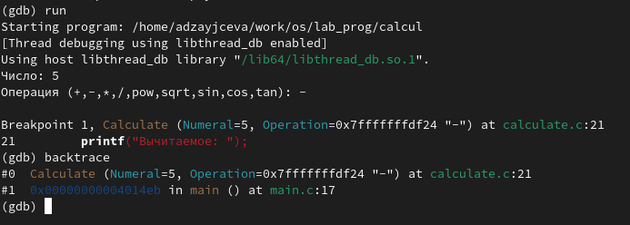

---
## Front matter
lang: ru-RU
title: Laboratory №13
author: |
	Anna D. Zaytseva\inst{1,3}
institute: |
	\inst{1}RUDN University, Moscow, Russian Federation
date: NEC--2022, 4 June, Moscow

## Formatting
toc: false
slide_level: 2
theme: metropolis
header-includes: 
 - \metroset{progressbar=frametitle,sectionpage=progressbar,numbering=fraction}
 - '\makeatletter'
 - '\beamer@ignorenonframefalse'
 - '\makeatother'
aspectratio: 43
section-titles: true
---

# Цель работы

Цель работы --- Приобрести простейшие навыки разработки,анализа,тестирования и отладки приложений в ОС типа UNIX/Linux на примере создания на языке программирования С калькулятора с простейшими функциями.

# Задание

1. В домашнем каталоге создайте подкаталог ~/work/os/lab_prog.
2. Создайте в нём файлы: calculate.h, calculate.c, main.c.
Это будет примитивнейший калькулятор, способный складывать, вычитать, умножать и делить, возводить число в степень, брать квадратный корень, вычислять sin, cos, tan.
При запуске он будет запрашивать первое число, операцию, второе число. После этого программа выведет результат и остановится.
Реализация функций калькулятора в файле calculate.c: (см. код в приложении к лабораторной)
Интерфейсный файл calculate.h, описывающий формат вызова функции-калькулятора: (см. код в приложении к лабораторной)
Основной файл main.c, реализующий интерфейс пользователя к калькулятору: (см. код в приложении к лабораторной)
3. Выполните компиляцию программы посредством gcc: (см. код в приложении к лабораторной)
4. При необходимости исправьте синтаксические ошибки.
5. Создайте Makefile со следующим содержанием: (см. код в приложении к лабораторной)
6. С помощью gdb выполните отладку программы calcul (перед использованием gdb исправьте Makefile):
- Запустите отладчик GDB, загрузив в него программу для отладки: (команда: *gdb ./calcul*)
- Для запуска программы внутри отладчика введите команду run: (команда: *run*)
- Для постраничного (по 9 строк) просмотра исходного код используйте команду list: (команда: *list*)
- Для просмотра строк с 12 по 15 основного файла используйте list с параметрами: (команда: *list 12,15*)
- Для просмотра определённых строк не основного файла используйте list с параметрами: (команда: *list calculate.c:20,29*)
- Установите точку останова в файле calculate.c на строке номер 21: (команды: *list calculate.c:20,27*, *break 21*)
- Выведите информацию об имеющихся в проекте точках останова: (команда: *info breakpoints*)
- Запустите программу внутри отладчика и убедитесь, что программа остановится в момент прохождения точки останова: (команды: *run*, *5*, *-*, *backtrace*)
- Отладчик выдаст следующую информацию: 
(#0 Calculate (Numeral=5, Operation=0x7fffffffd280 "-")
 at calculate.c:21
 #1 0x0000000000400b2b in main () at main.c:17)
а команда backtrace покажет весь стек вызываемых функций от начала программы до текущего места.
- Посмотрите, чему равно на этом этапе значение переменной Numeral, введя: (команда: *print Numeral*)
На экран должно быть выведено число 5.
- Сравните с результатом вывода на экран после использования команды: (команда: *display Numeral*)
- Уберите точки останова: (команды: *info breakpoints*, *delete 1*)
7. С помощью утилиты splint попробуйте проанализировать коды файлов calculate.c и main.c.

# Выполнение лабораторной работы

## Step 1

1. В домашнем каталоге создала подкаталог ~/work/os/lab_prog (Рис. [-@fig:001]):

{ #fig:001 width=70% }

2. Создала в нём файлы: calculate.h, calculate.c, main.c (Рис. [-@fig:002]):

{ #fig:002 width=70% }

Это будет примитивнейший калькулятор, способный складывать, вычитать, умножать и делить, возводить число в степень, брать квадратный корень, вычислять sin, cos, tan.
При запуске он будет запрашивать первое число, операцию, второе число. После этого программа выведет результат и остановится.

## Step 2

3. Выполнила компиляцию программы посредством gcc (команды: *gcc -c calculate.c*, *gcc -c main.c*, *gcc calculate.o main.o -o calcul -lm*) (Рис. [-@fig:003]):

{ #fig:003 width=70% }

4. Синтаксические ошибки не были найдены, поэтому вносить правки не пришлось.

5. Далее я немного поработала с GDB (Рис. [-@fig:004])(Рис. [-@fig:005])(Рис. [-@fig:006])(Рис. [-@fig:007]):

{ #fig:004 width=70% }

{ #fig:005 width=70% }

{ #fig:006 width=70% }

{ #fig:007 width=70% }

## Steps 4 and 5

Ответила на контрольные вопросы и обновила данные на GitHub

# Вывод

В ходе лабораторной работы я приобрела простейшие навыки разработки, анализа, тестирования и отладки приложений в ОС типа UNIX/Linux на примере создания на языке программирования С калькулятора с простейшими функциями.

## {.standout}

Спасибо за внимание!
