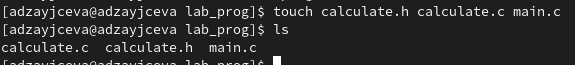
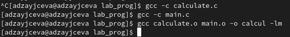
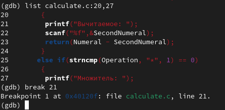

---
## Front matter
title: "Лабораторная работа №13"
subtitle: "Отчёт к лабораторной работе"
author: "Зайцева Анна Дмитриевна"

## Generic options
lang: ru-RU

## Bibliography
bibliography: bib/cite.bib
csl: pandoc/csl/gost-r-7-0-5-2008-numeric.csl

## Pdf output format
toc: true # Table of contents
toc-depth: 2
lof: true # List of figures
lot: true # List of tables
fontsize: 12pt
linestretch: 1.5
papersize: a4
documentclass: scrreprt
## Fonts
mainfont: PT Serif
romanfont: PT Serif
sansfont: PT Sans
monofont: PT Mono
mainfontoptions: Ligatures=TeX
romanfontoptions: Ligatures=TeX
sansfontoptions: Ligatures=TeX,Scale=MatchLowercase
monofontoptions: Scale=MatchLowercase,Scale=0.9
## Pandoc-crossref LaTeX customization
figureTitle: "Рис."
tableTitle: "Таблица"
listingTitle: "Листинг"
lofTitle: "Список иллюстраций"
lotTitle: "Список таблиц"
lolTitle: "Листинги"
## Misc options
indent: true
header-includes:
  - \usepackage{indentfirst}
  - \usepackage{float} # keep figures where there are in the text
  - \floatplacement{figure}{H} # keep figures where there are in the text
---

# Цель работы

Цель работы --- Приобрести простейшие навыки разработки,анализа,тестирования и отладки приложений в ОС типа UNIX/Linux на примере создания на языке программирования С калькулятора с простейшими функциями.

# Задание

1. В домашнем каталоге создайте подкаталог ~/work/os/lab_prog.
2. Создайте в нём файлы: calculate.h, calculate.c, main.c.
Это будет примитивнейший калькулятор, способный складывать, вычитать, умножать и делить, возводить число в степень, брать квадратный корень, вычислять sin, cos, tan.
При запуске он будет запрашивать первое число, операцию, второе число. После этого программа выведет результат и остановится.
Реализация функций калькулятора в файле calculate.c: (см. код в приложении к лабораторной)
Интерфейсный файл calculate.h, описывающий формат вызова функции-калькулятора: (см. код в приложении к лабораторной)
Основной файл main.c, реализующий интерфейс пользователя к калькулятору: (см. код в приложении к лабораторной)
3. Выполните компиляцию программы посредством gcc: (см. код в приложении к лабораторной)
4. При необходимости исправьте синтаксические ошибки.
5. Создайте Makefile со следующим содержанием: (см. код в приложении к лабораторной)
6. С помощью gdb выполните отладку программы calcul (перед использованием gdb исправьте Makefile):
- Запустите отладчик GDB, загрузив в него программу для отладки: (команда: *gdb ./calcul*)
- Для запуска программы внутри отладчика введите команду run: (команда: *run*)
- Для постраничного (по 9 строк) просмотра исходного код используйте команду list: (команда: *list*)
- Для просмотра строк с 12 по 15 основного файла используйте list с параметрами: (команда: *list 12,15*)
- Для просмотра определённых строк не основного файла используйте list с параметрами: (команда: *list calculate.c:20,29*)
- Установите точку останова в файле calculate.c на строке номер 21: (команды: *list calculate.c:20,27*, *break 21*)
- Выведите информацию об имеющихся в проекте точках останова: (команда: *info breakpoints*)
- Запустите программу внутри отладчика и убедитесь, что программа остановится в момент прохождения точки останова: (команды: *run*, *5*, *-*, *backtrace*)
- Отладчик выдаст следующую информацию: 
(#0 Calculate (Numeral=5, Operation=0x7fffffffd280 "-")
 at calculate.c:21
 #1 0x0000000000400b2b in main () at main.c:17)
а команда backtrace покажет весь стек вызываемых функций от начала программы до текущего места.
- Посмотрите, чему равно на этом этапе значение переменной Numeral, введя: (команда: *print Numeral*)
На экран должно быть выведено число 5.
- Сравните с результатом вывода на экран после использования команды: (команда: *display Numeral*)
- Уберите точки останова: (команды: *info breakpoints*, *delete 1*)
7. С помощью утилиты splint попробуйте проанализировать коды файлов calculate.c и main.c.

# Выполнение лабораторной работы

1. В домашнем каталоге создала подкаталог ~/work/os/lab_prog (Рис. [-@fig:001]):

{ #fig:001 width=70% }

2. Создала в нём файлы: calculate.h, calculate.c, main.c (Рис. [-@fig:002]):

{ #fig:002 width=70% }

Это будет примитивнейший калькулятор, способный складывать, вычитать, умножать и делить, возводить число в степень, брать квадратный корень, вычислять sin, cos, tan.
При запуске он будет запрашивать первое число, операцию, второе число. После этого программа выведет результат и остановится.

Реализация функций калькулятора в файле calculate.c:

**calculate.c:**
```
////////////////////////////////////
// calculate.c

#include <stdio.h>
#include <math.h>
#include <string.h>
#include "calculate.h"

float
Calculate(float Numeral, char Operation[4])
{
 float SecondNumeral;
 if(strncmp(Operation, "+", 1) == 0)
  {
   printf("Второе слагаемое: ");
   scanf("%f",&SecondNumeral);
   return(Numeral + SecondNumeral);
  }
 else if(strncmp(Operation, "-", 1) == 0)
  {
   printf("Вычитаемое: ");
   scanf("%f",&SecondNumeral);
   return(Numeral - SecondNumeral);
  }
 else if(strncmp(Operation, "*", 1) == 0)
  {
   printf("Множитель: ");
   scanf("%f",&SecondNumeral);
   return(Numeral * SecondNumeral);
  }
 else if(strncmp(Operation, "/", 1) == 0)
 {
  printf("Делитель: ");
  scanf("%f",&SecondNumeral);
  if(SecondNumeral == 0)
   {
    printf("Ошибка: деление на ноль! ");
    return(HUGE_VAL);
   }
 else
   return(Numeral / SecondNumeral);
}
else if(strncmp(Operation, "pow", 3) == 0)
 {
  printf("Степень: ");
  scanf("%f",&SecondNumeral);
  return(pow(Numeral, SecondNumeral));
 }
else if(strncmp(Operation, "sqrt", 4) == 0)
 return(sqrt(Numeral));
else if(strncmp(Operation, "sin", 3) == 0)
 return(sin(Numeral));
else if(strncmp(Operation, "cos", 3) == 0)
 return(cos(Numeral));
else if(strncmp(Operation, "tan", 3) == 0)
 return(tan(Numeral));
else
 {
  printf("Неправильно введено действие ");
  return(HUGE_VAL);
 }
}
```

Интерфейсный файл calculate.h, описывающий формат вызова функции-калькулятора:

**calculate.h:**
```
///////////////////////////////////////
// calculate.h

#ifndef CALCULATE_H_
#define CALCULATE_H_

float Calculate(float Numeral, char Operation[4]);

#endif /*CALCULATE_H_*/
```

Основной файл main.c, реализующий интерфейс пользователя к калькулятору:
**main.c:**
```
////////////////////////////////////////
// main.c

#include <stdio.h>
#include "calculate.h"

int
main (void)
{
 float Numeral;
 char Operation[4];
 float Result;
 printf("Число: ");
 scanf("%f",&Numeral);
 printf("Операция (+,-,*,/,pow,sqrt,sin,cos,tan): ");
 scanf("%s",&Operation);
 Result = Calculate(Numeral, Operation);
 printf("%6.2f\n",Result);
 return 0;
}
```

3. Выполнила компиляцию программы посредством gcc (команды: *gcc -c calculate.c*, *gcc -c main.c*, *gcc calculate.o main.o -o calcul -lm*) (Рис. [-@fig:003]):

{ #fig:003 width=70% }

4. Синтаксические ошибки не были найдены, поэтому вносить правки не пришлось.

5. Создала Makefile со следующим содержанием:

**Makefile**
```
#
# Makefile
#

CC = gcc
CFLAGS =
LIBS = -lm

calcul: calculate.o main.o
        gcc calculate.o main.o -o calcul $(LIBS)

calculate.o: calculate.c calculate.h
             gcc -c calculate.c $(CFLAGS)

main.o: main.c calculate.h
        gcc -c main.c $(CFLAGS)

clean:
        -rm calcul *.o *~

# End Makefile
```

6. С помощью gdb выполнила отладку программы calcul (перед использованием gdb исправила Makefile):

**Makefile**
```
#
# Makefile
#

CC = gcc
CFLAGS = -g
LIBS = -lm

calcul: calculate.o main.o
	$(CC) calculate.o main.o -o calcul $(LIBS)

calculate.o: calculate.c calculate.h
	$(CC) -c calculate.c $(CFLAGS)

main.o: main.c calculate.h
	$(CC) -c main.c $(CFLAGS)

clean:
	-rm calcul *.o *~

# End Makefile
```
В переменную CFLAGS добавила опцию -g, необходимую для компиляции объектных файлов и их использования в программе отладчика GDB. Сделала так, что утилита компиляции выбирается с помощью переменной CC. После этого я удалила исполняемые и объектные файлы из каталога с помощью команды *make clean* (Рис. [-@fig:004]):

{ #fig:004 width=70% }

Выполнила компиляцию файлов, используя команды *make calculate.o*, *make main.o*, *make calcul* (Рис. [-@fig:005]):

{ #fig:005 width=70% }

- Запустила отладчик GDB, загрузив в него программу для отладки: (команда: *gdb ./calcul*) (Рис. [-@fig:006]):

{ #fig:006 width=70% }

- Для запуска программы внутри отладчика ввела команду run: (команда: *run*) (Рис. [-@fig:007]):

{ #fig:007 width=70% }

- Для постраничного (по 9 строк) просмотра исходного кода использовала команду list: (команда: *list*) (Рис. [-@fig:008]):

{ #fig:008 width=70% }

- Для просмотра строк с 12 по 15 основного файла использовала list с параметрами: (команда: *list 12,15*) (Рис. [-@fig:009]):

{ #fig:009 width=70% }

- Для просмотра определённых строк не основного файла использовала list с параметрами: (команда: *list calculate.c:20,29*) (Рис. [-@fig:010]):

{ #fig:010 width=70% }

- Установила точку останова в файле calculate.c на строке номер 21: (команды: *list calculate.c:20,27*, *break 21*) (Рис. [-@fig:011]):

{ #fig:011 width=70% }

- Вывела информацию об имеющихся в проекте точках останова: (команда: *info breakpoints*) (Рис. [-@fig:012]):

{ #fig:012 width=70% }

- Запустила программу внутри отладчика и убедилась, что программа остановится в момент прохождения точки останова: (команды: *run*, *5*, *-*, *backtrace*) (Рис. [-@fig:013]):

{ #fig:013 width=70% }

- Отладчик выдал следующую информацию: 
(#0 Calculate (Numeral=5, Operation=0x7fffffffd280 "-")
 at calculate.c:21
 #1 0x0000000000400b2b in main () at main.c:17)
а команда backtrace показала весь стек вызываемых функций от начала программы до текущего места.
- Посмотрите, чему равно на этом этапе значение переменной Numeral, введя: (команда: *print Numeral*)
На экран должно быть выведено число 5. Оно вывелось (Рис. [-@fig:014]):

{ #fig:014 width=70% }

- Сравните с результатом вывода на экран после использования команды: (команда: *display Numeral*) (Рис. [-@fig:015]):

{ #fig:015 width=70% }

Отличий в значениях нет, но они есть лишь в форматах вывода

- Убрала точки останова: (команды: *info breakpoints*, *delete 1*) (Рис. [-@fig:016]):

{ #fig:016 width=70% }

7. С помощью утилиты splint попробуйте проанализировать коды файлов calculate.c и main.c.

Я воспользовалась командами *splint calculate.c* (Рис. [-@fig:017]):

{ #fig:017 width=70% }

 и *splint main.c* (Рис. [-@fig:018]):

{ #fig:018 width=70% }

C помощью утилиты splint выяснилось, что в файлах calculate.c и main.c присутствует функция чтения scanf, возвращающая целое число (тип int), но эти числа не используются и нигде не сохранятся. Утилита вывела предупреждение о том, что в файле calculate.c происходит сравнение вещественного числа с нулем. Также возвращаемые значения (тип double) в функциях pow, sqrt, sin, cos и tan записываются в переменную типа float, что свидетельствует о потери данных.

# Ответы на контрольные вопросы

1. Чтобы получить информацию о возможностях программ gcc, make, gdbи др.нужно воспользоваться командой manили опцией -help(-h)для каждой команды.

2. Процесс разработки программного обеспечения обычно разделяется на следующие этапы: 

- планирование,  включающее  сбор  и  анализ  требований  к 
функционалу  и  другим  характеристикам  разрабатываемого приложения; 
- проектирование,  включающее  в  себя  разработку  базовых алгоритмов    и    спецификаций,    определение    языка программирования; 
- непосредственная разработка приложения: oкодирование −по  сути  создание  исходного  текста программы (возможно в нескольких вариантах); –анализ разработанного кода; oсборка, компиляция и разработка исполняемого модуля; oтестирование  и  отладка,  сохранение  произведённых изменений; 
- документирование. Для  создания  исходного  текста  программы  разработчик  может воспользоваться любым удобным для него редактором текста: vi, vim, mceditor, emacs, geanyи др. После  завершения  написания  исходного  кода  программы  (возможно состоящей из нескольких файлов), необходимо её скомпилировать и получить исполняемый модуль.

3. Для имени  входного  файла  суффикс  определяет  какая  компиляция требуется. Суффиксы указывают на тип объекта. Файлы с расширением (суффиксом) .cвоспринимаются gccкак программы на языке С, файлы с  расширением  .ccили  .C−как  файлы  на  языке C++,  а  файлы cрасширением .oсчитаются объектными.Например, в команде «gcc-cmain.c»:gccпо расширению (суффиксу) .cраспознает тип файла для компиляции и формирует объектный модуль −файл с расширением .o. Если требуется получить исполняемый файл с определённым именем (например, hello), то требуется воспользоваться опцией -oи в качестве параметра задать имя создаваемого файла: «gcc-ohellomaiВ  ходе  выполнения  данной  лабораторной  работы  я  приобрелапростейшие  навыки  разработки,  анализа,  тестирования  и  отладки приложений  в  ОС  типа UNIX/Linuxна  примере  создания  на  языке программирования С калькулятора с простейшими функциями.n.c».

4. Основное  назначение  компилятора языка  Си  в UNIX заключается в компиляции всей программы и получении исполняемого файла/модуля.

5. Для сборки разрабатываемого приложения и собственно компиляции полезно   воспользоваться   утилитой make.   Она   позволяет автоматизировать процесс преобразования файлов программы из одной формы в другую, отслеживает взаимосвязи между файлами.

6. Для работы с утилитой makeнеобходимо в корне рабочего каталога с Вашим проектом создать файл с названием makefileили Makefile, в котором  будут  описаны  правила  обработки  файлов  Вашего программного комплекса. В самом простом случае Makefile имеет следующий синтаксис: <цель_1> <цель_2> ... : <зависимость_1> <зависимость_2> ...<команда 1>...<команда n>Сначала задаётся список целей, разделённых пробелами, за которым идёт двоеточие и список зависимостей. Затем в следующих строках указываются  команды.  Строки  с  командами  обязательно  должны начинаться с табуляции. В качестве цели в Makefileможет выступать имя файла или название какого-то действия. Зависимость задаёт исходные параметры (условия) для  достижения  указанной  цели.  Зависимость  также  может  быть названием  какого-то  действия.  Команды  −  собственно  действия, которые необходимо выполнить для достижения цели.Общий синтаксис Makefileимеет вид: target1 [target2...]:[:] [dependment1...][(tab)commands] [#commentary][(tab)commands] [#commentary]. Здесь знак # определяет начало комментария (содержимое от знака # и до  конца  строки  не  будет  обрабатываться.  Одинарное  двоеточие указывает на то, что последовательность команд должна содержаться в 
одной строке. Для переноса можно в длинной строке команд можно использовать обратный слэш (\). Двойное двоеточие указывает на то, что  последовательность  команд  может  содержаться  в  нескольких последовательных строках.Пример более сложного синтаксиса Makefile:## Makefile for abcd.c#CC = gccCFLAGS =# Compile abcd.c normalyabcd: abcd.c$(CC) -o abcd $(CFLAGS) abcd.cclean:-rm abcd *.o *~# EndMakefileforabcd.c. В этом примере в начале файла заданы три переменные: CC и CFLAGS. Затем указаны цели, их зависимости и соответствующие команды. В командах  происходит  обращение  к  значениям  переменных.  Цель  с именем cleanпроизводит очистку каталога от файлов, полученных в результате  компиляции. Для  её  описания  использованы  регулярные выражения.

7. Во  время  работы  над  кодом  программы  программист  неизбежно сталкивается с появлением ошибок в ней. Использование отладчика для поиска и устранения ошибок в программе существенно облегчает жизнь программиста. В комплект программ GNUдля ОС типа UNIXвходит отладчик GDB(GNUDebugger). Для использования GDB необходимо скомпилировать анализируемый код  программы  таким  образом,  чтобы  отладочная  информация содержалась  в  результирующем  бинарном  файле.  Для  этого  следует воспользоваться опцией -gкомпилятора gcc: gcc-cfile.c-g. После этого для начала работы с gdbнеобходимо в командной строке ввести  одноимённую  команду,  указав  в  качестве  аргумента анализируемый бинарный файл: gdbfile.o

8. Основные команды отладчика gdb:
- backtrace − вывод на экран пути к текущей точке останова (по сутивывод − названий всех функций);
- break − установить точку останова (в качестве параметра можетбыть указан номер строки или название функции);
- clear − удалить все точки останова в функции;
- continue − продолжить выполнение программы;
- delete − удалить точку останова;
- display − добавить  выражение  в  список  выражений,  значения которых  отображаются  при  достижении  точки  останова программы;
- finish − выполнить программу до момента выхода из функции;
- info breakpoints −вывести на экран список используемых точек останова;
- info  watchpoints −вывести  на  экран  список  используемых контрольных выражений;
- list − вывести на экран исходный код (вВ  ходе  выполнения  данной  лабораторной  работы  я  приобрелапростейшие  навыки  разработки,  анализа,  тестирования  и  отладки приложений  в  ОС  типа UNIX/Linuxна  примере  создания  на  языке программирования С калькулятора с простейшими функциями. качестве параметра может быть указано название файла и через двоеточие номера начальнойи конечной строк);
- next − выполнить  программу  пошагово,  но  без  выполнения вызываемых в программе функций;
- print − вывести  значение  указываемого  в  качестве  параметра выражения;
- run − запуск программы на выполнение;
- set − установить новое значение переменной;
- step − пошаговое выполнение программы;
- watch − установить  контрольное  выражение,  при  изменении значения которого программа будет остановлена. Для выхода из gdbможно воспользоваться командой quit (или её сокращённым  вариантом q)  или  комбинацией  клавиш Ctrl-d. Более подробную информацию по работе с gdb можно получить с помощью команд gdb-hи mangdb.

9. Cхема отладки программы показана в 6 пункте лабораторной работы.

10. При первом запуске компилятор не выдал никаких ошибок, но в коде программы main.c допущена  ошибка,  которую  компилятор  мог пропустить (возможно, из-за версии 8.3.0-19): в строке  scanf(“%s”, &Operation); нужно убрать знак &, потому что имя массивасимволов уже является указателемна первый элементэтого массива.

11. Система  разработки приложений UNIX предоставляет  различные средства, повышающие понимание исходного кода. К ним относятся:cscope −исследование функций, содержащихся в программе,lint −критическая проверка программ, написанных на языке Си.

12. Утилита splint анализирует  программный  код,  проверяет корректность  задания  аргументов  использованных  в  программе функций   и   типов   возвращаемых   значений,   обнаруживает синтаксические и семантические ошибки. В отличие от компилятора Cанализатор splintгенерирует комментарии с описанием разбора кода программы и осуществляет общий контроль, обнаруживая такие ошибки, как одинаковые объекты, определённые в разных файлах, или объекты, чьи значения не используются в работt программы,  переменные  с  некорректно  заданными  значениямии типами и многое другое.

# Вывод

В ходе лабораторной работы я приобрела простейшие навыки разработки, анализа, тестирования и отладки приложений в ОС типа UNIX/Linux на примере создания на языке программирования С калькулятора с простейшими функциями.
