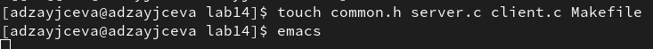
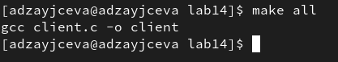
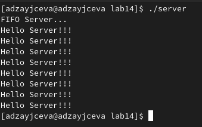
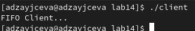

---
## Front matter
lang: ru-RU
title: Laboratory №14
author: |
	Anna D. Zaytseva\inst{1,3}
institute: |
	\inst{1}RUDN University, Moscow, Russian Federation
date: NEC--2022, 4 June, Moscow

## Formatting
toc: false
slide_level: 2
theme: metropolis
header-includes: 
 - \metroset{progressbar=frametitle,sectionpage=progressbar,numbering=fraction}
 - '\makeatletter'
 - '\beamer@ignorenonframefalse'
 - '\makeatother'
aspectratio: 43
section-titles: true
---

# Цель работы

Цель работы --- Приобретение практических навыков работы с именованными каналами.

# Задание

Изучите приведённые в тексте программы server.c и client.c. Взяв данные примеры за образец, напишите аналогичные программы, внеся следующие изменения:
1. Работает не 1 клиент, а несколько (например, два).
2. Клиенты передают текущее время с некоторой периодичностью (например, раз в пять секунд). Используйте функцию sleep() для приостановки работы клиента.
3. Сервер работает не бесконечно, а прекращает работу через некоторое время (например, 30 сек). Используйте функцию clock() для определения времени работы сервера.
Что будет в случае, если сервер завершит работу, не закрыв канал?

# Выполнение лабораторной работы

## Step 1

1. В каталоге нашей лабораторной работы 14 я создала файлы: common.h, server.c, client.c, Makefile (Рис. [-@fig:001]):

{ #fig:001 width=70% }

2. Я добавила в common.h две строки со стандартными заголовочными файлами, необходимыми для корректной работы кодов других файлов.
```
#include <unistd.h>
#include <time.h>
```

3. Я добавила в server.c цикл while для того, чтобы контролировать время работы сервера. Разница между настоящим временем time(NULL) и временем начала работы clock_t start=time(NULL) (инициализация до цикла) не должна превышать 30 секунд.

4. В client.c добавила цикл, отвечающий за количество сообщений о текущем времени (4 сообщения), которое получается в результате выполнения команд из Makefile и команду sleep(5) для приостановки работы клиента на 5 секунд.

5. В Makefile я изменений не вносила.

## Step 2

6. С помощью команды *make all* я скомпилировала необходимые файлы (Рис. [-@fig:002]):

{ #fig:002 width=70% }

7. Открыла 3 терминала (в первом команда: *./server*, а во втором и третьем - *./client*) (Рис. [-@fig:003])(Рис. [-@fig:004]):

{ #fig:003 width=70% }

{ #fig:004 width=70% }

Для каждого клиента выведено по 4 сообщения. Спустя 30 секунд работа сервера прекратилась. Программа работает корректно.

Если сервер завершит свою работу, не закрыв канал, то, когда мы будем запускать этот сервер снова, появится ошибка «Невозможно создать FIFO», так как у нас уже есть один канал.

## Steps 3 and 4

Ответила на контрольные вопросы и обновила данные на GitHub

# Вывод

В ходе лабораторной работы я приобрела практические навыки работы с именованными каналами.

## {.standout}

Спасибо за внимание!
