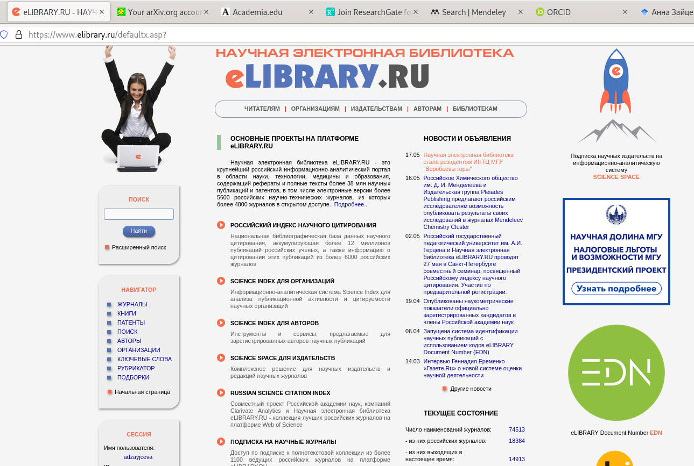
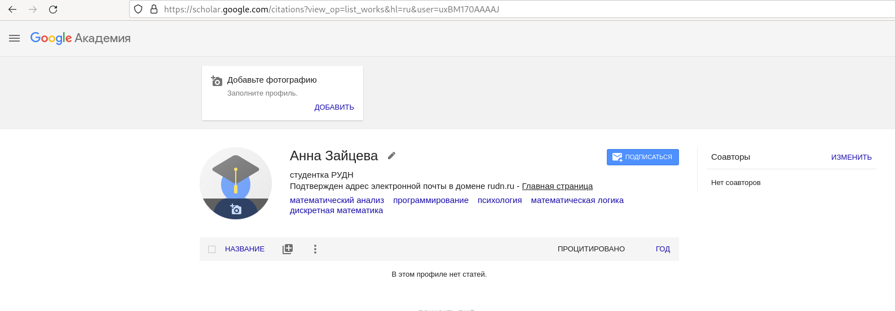
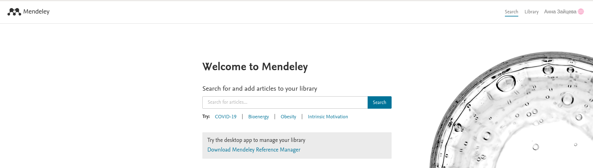
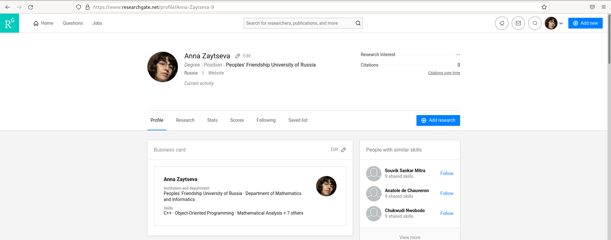
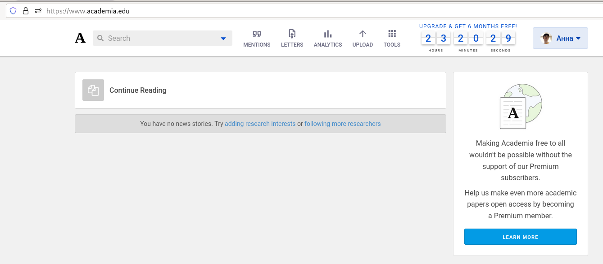
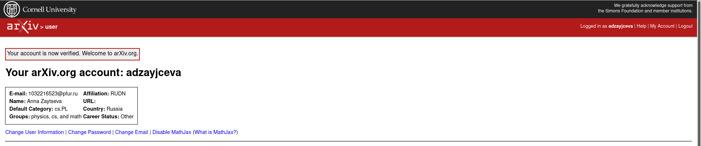
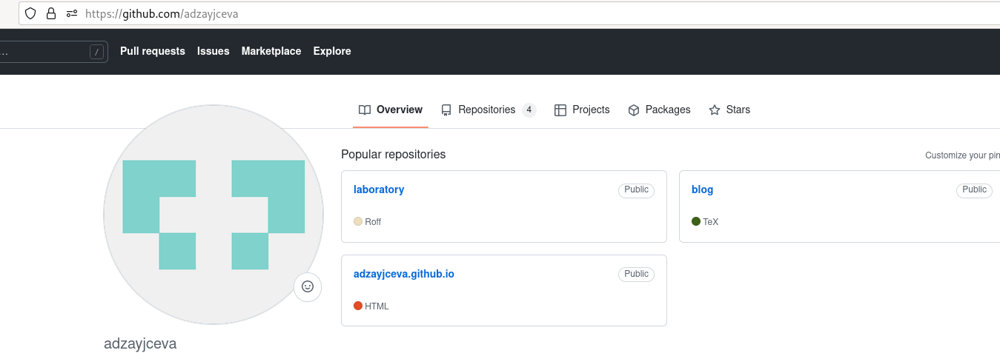
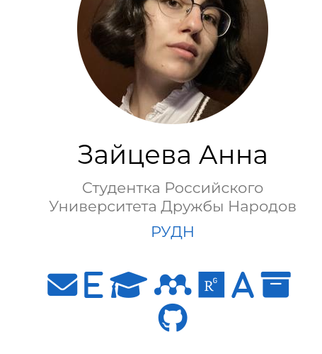
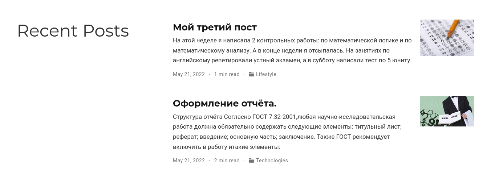

---
## Front matter
lang: ru-RU
title: Индивидуальный проект. Этап 4
author: |
	Anna D. Zaytseva\inst{1,3}
institute: |
	\inst{1}RUDN University, Moscow, Russian Federation
date: NEC--2022, 21 May, Moscow

## Formatting
toc: false
slide_level: 2
theme: metropolis
header-includes: 
 - \metroset{progressbar=frametitle,sectionpage=progressbar,numbering=fraction}
 - '\makeatletter'
 - '\beamer@ignorenonframefalse'
 - '\makeatother'
aspectratio: 43
section-titles: true
---

# Цель работы

Цель работы --- Добавить к сайту ссылки на научные и библиометрические ресурсы.

# Задание

- Зарегистрироваться на соответствующих ресурсах и разместить на них ссылки на сайте:

    eLibrary : https://elibrary.ru/;
    Google Scholar : https://scholar.google.com/;
    ORCID : https://orcid.org/;
    Mendeley : https://www.mendeley.com/;
    ResearchGate : https://www.researchgate.net/;
    Academia.edu : https://www.academia.edu/;
    arXiv : https://arxiv.org/;
    github : https://github.com/.

- Сделать пост по прошедшей неделе.
- Добавить пост на тему по выбору: Оформление отчёта.

# Выполнение этапа 3

## Step 1

1. Я зарегистрировалась на нужных ресурсах (Рис. [-@fig:001])(Рис. [-@fig:002])(Рис. [-@fig:003])(Рис. [-@fig:004])(Рис. [-@fig:005])(Рис. [-@fig:006])(Рис. [-@fig:007]):

{ #fig:001 width=70% }

{ #fig:002 width=70% }

{ #fig:003 width=70% }

{ #fig:004 width=70% }

{ #fig:005 width=70% }

{ #fig:006 width=70% }

{ #fig:007 width=70% }

2. Разместила ссылки на эти ресурсы на своём сайте (~/blog/content/authors/admin/_index.md) (Рис. [-@fig:008]):

{ #fig:008 width=70% }

## Step 2

4. Создала пост по прошедшей неделе и тематический пост (Рис. [-@fig:007]):

{ #fig:009 width=70% }

## Step 3

Обновляем данные на GitHub и переходим на наш сайт.

# Вывод

Я добавила к сайту ссылки на научные и библиометрические ресурсы.

## {.standout}

Спасибо за внимание!
