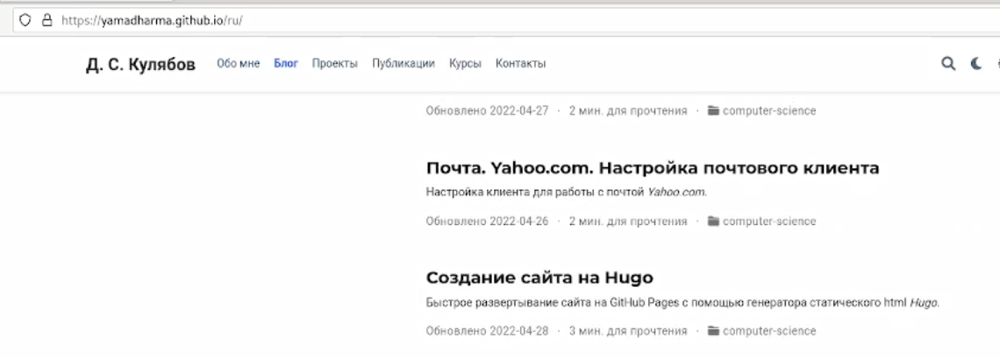
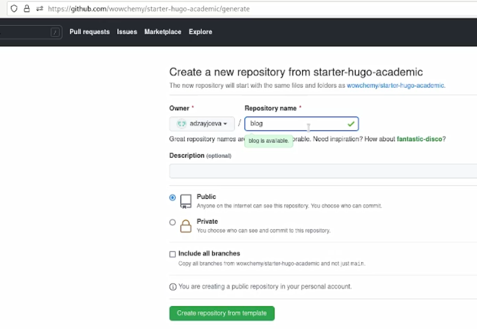
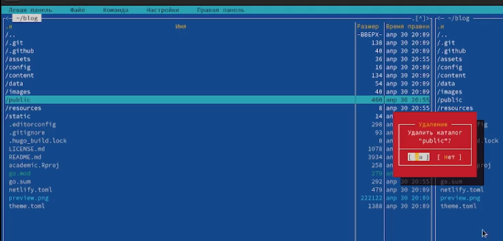
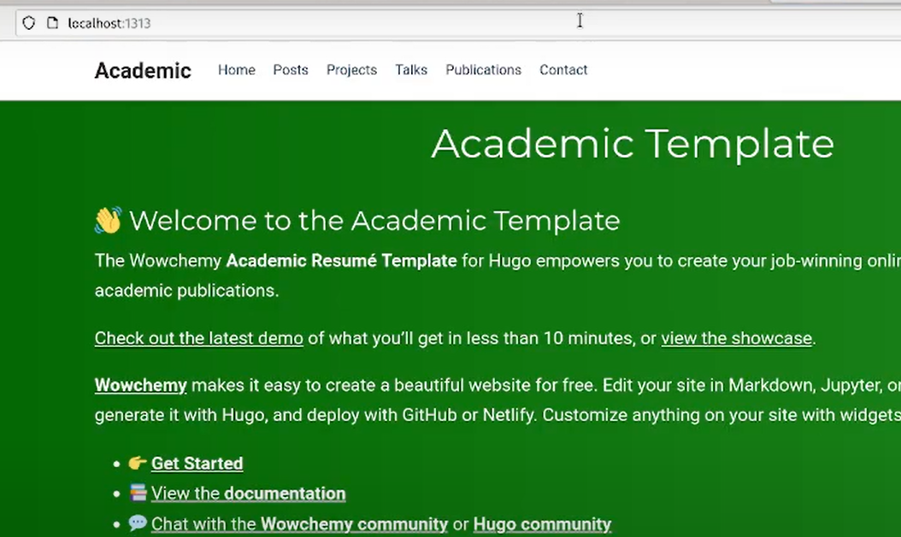
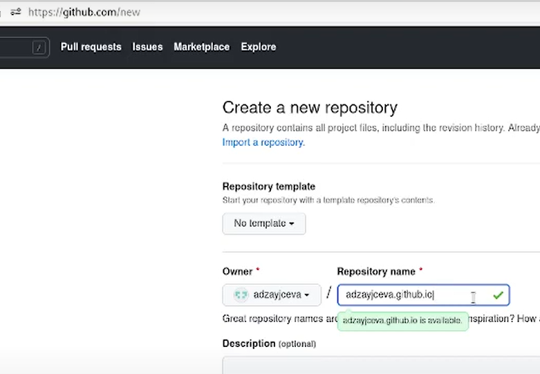
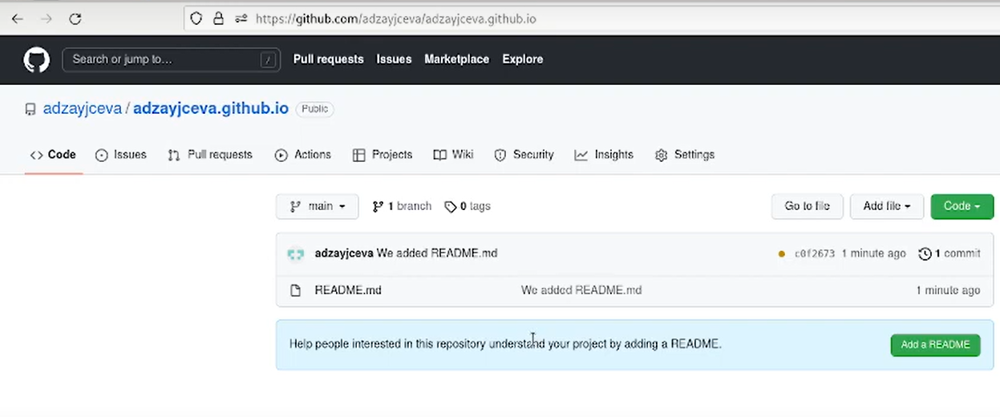
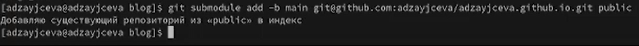
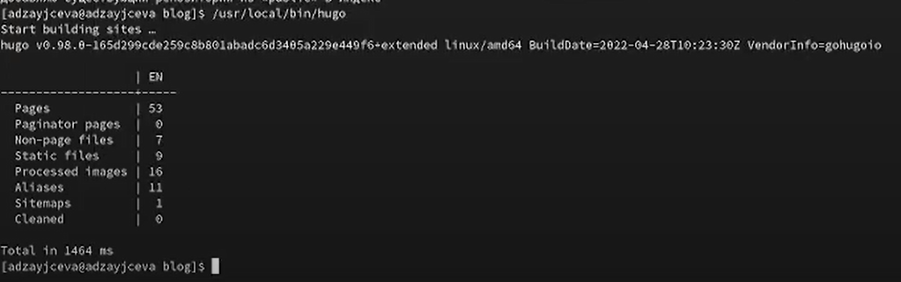
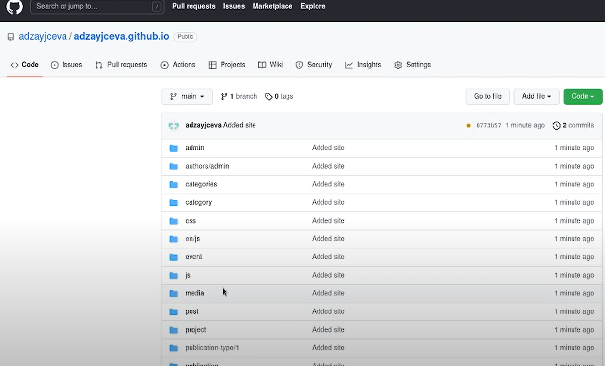
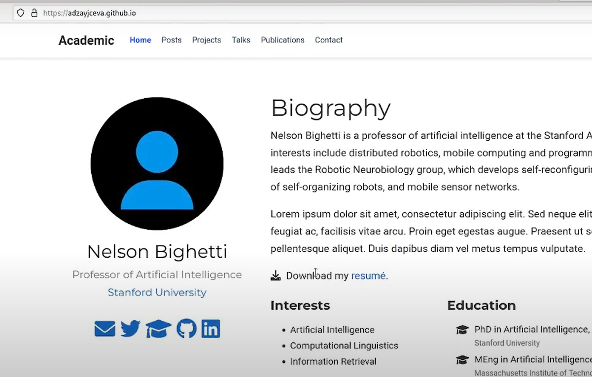

---
## Front matter
lang: ru-RU
title: Индивидуальный проект. Этап 1
author: |
	Anna D. Zaytseva\inst{1,3}
institute: |
	\inst{1}RUDN University, Moscow, Russian Federation
date: NEC--2022, 30 April, Moscow

## Formatting
toc: false
slide_level: 2
theme: metropolis
header-includes: 
 - \metroset{progressbar=frametitle,sectionpage=progressbar,numbering=fraction}
 - '\makeatletter'
 - '\beamer@ignorenonframefalse'
 - '\makeatother'
aspectratio: 43
section-titles: true
---

# Цель работы

Цель работы --- Размещение на Github pages заготовки для персонального сайта.

# Задание

- Установить необходимое программное обеспечение.
- Скачать шаблон темы сайта.
- Разместить его на хостинге git.
- Установить параметр для URLs сайта.
- Разместить заготовку сайта на Github pages.

# Выполнение лабораторной работы

## Step 1

Создадим новую папку для первого этапа выполнения индивидуального проекта, а затем мы перейдём к созданию сайта на hugo (Рис. [-@fig:001]):

{ #fig:001 width=70% }

## Step 2

Выполняем все задания из списка (указала тут лишь часть скринов) (Рис. [-@fig:004])(Рис. [-@fig:010])(Рис. [-@fig:012])(Рис. [-@fig:015])(Рис. [-@fig:020])(Рис. [-@fig:026])(Рис. [-@fig:027])(Рис. [-@fig:032]):

{ #fig:004 width=70% }

{ #fig:010 width=70% }

{ #fig:012 width=70% }

{ #fig:015 width=70% }

{ #fig:020 width=70% }

{ #fig:026 width=70% }

{ #fig:027 width=70% }

{ #fig:032 width=70% }

## Step 3

Обновляем данные на GitHub и переходим на наш сайт (Рис. [-@fig:033]):

{ #fig:033 width=70% }

# Вывод

Я разместила на Github pages заготовку для персонального сайта.

## {.standout}

Спасибо за внимание!
