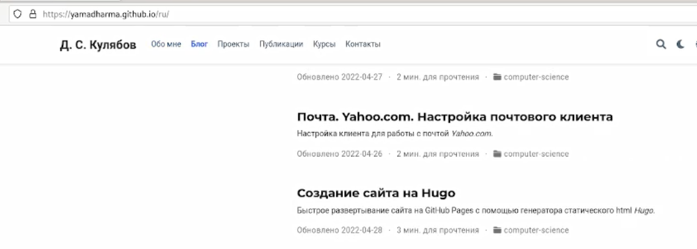
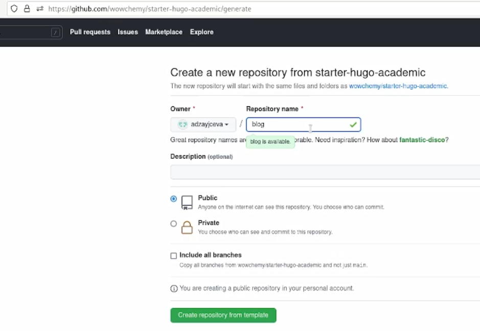
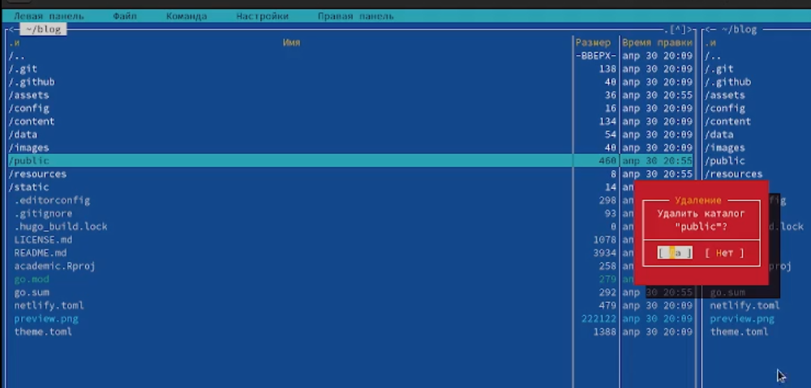
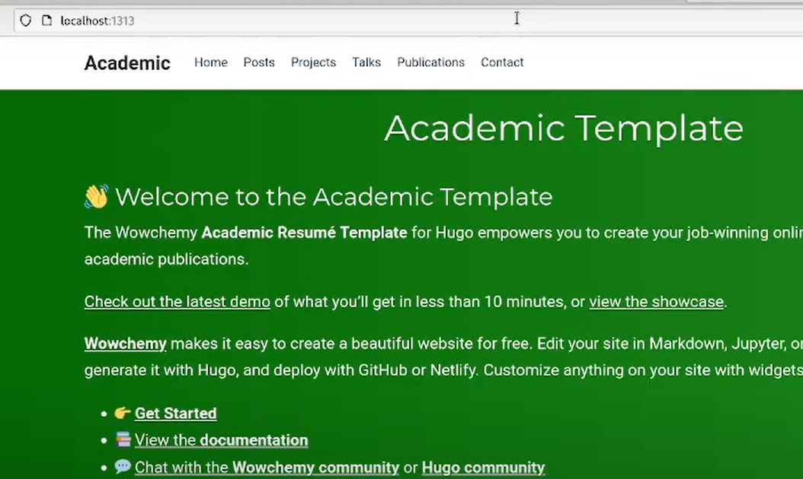
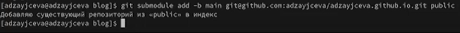
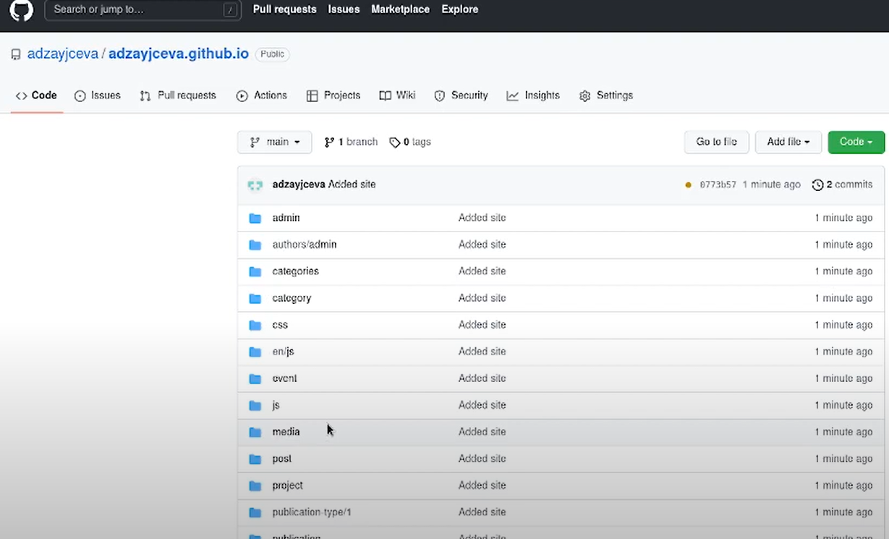

---
## Front matter
title: "Индивидуальный проект. Этап 1"
subtitle: "Отчёт к 1 этапу индивидуального проекта"
author: "Зайцева Анна Дмитриевна"

## Generic options
lang: ru-RU

## Bibliography
bibliography: bib/cite.bib
csl: pandoc/csl/gost-r-7-0-5-2008-numeric.csl

## Pdf output format
toc: true # Table of contents
toc-depth: 2
lof: true # List of figures
lot: true # List of tables
fontsize: 12pt
linestretch: 1.5
papersize: a4
documentclass: scrreprt
## Fonts
mainfont: PT Serif
romanfont: PT Serif
sansfont: PT Sans
monofont: PT Mono
mainfontoptions: Ligatures=TeX
romanfontoptions: Ligatures=TeX
sansfontoptions: Ligatures=TeX,Scale=MatchLowercase
monofontoptions: Scale=MatchLowercase,Scale=0.9
## Pandoc-crossref LaTeX customization
figureTitle: "Рис."
tableTitle: "Таблица"
listingTitle: "Листинг"
lofTitle: "Список иллюстраций"
lotTitle: "Список таблиц"
lolTitle: "Листинги"
## Misc options
indent: true
header-includes:
  - \usepackage{indentfirst}
  - \usepackage{float} # keep figures where there are in the text
  - \floatplacement{figure}{H} # keep figures where there are in the text
---

# Цель работы

Цель работы --- Размещение на Github pages заготовки для персонального сайта.

# Задание

- Установить необходимое программное обеспечение.
- Скачать шаблон темы сайта.
- Разместить его на хостинге git.
- Установить параметр для URLs сайта.
- Разместить заготовку сайта на Github pages.

# Выполнение 1 этапа индивидуального проекта

1. Переходим в создание сайта на hugo (Рис. [-@fig:001]):

{ #fig:001 width=70% }

2. Вручную устанавливаем последнюю версию хьюго в каталог /usr/local/bin (Рис. [-@fig:002]):

{ #fig:002 width=70% }

3. Ту, что hugo_extended_0.98.0_Linux-64bit.tar.gz (Рис. [-@fig:003]):

{ #fig:003 width=70% }

4. Создаём новый репозиторий blog (Рис. [-@fig:004]):

{ #fig:004 width=70% }

5. Копируем ссылку (Рис. [-@fig:005]):

{ #fig:005 width=70% }

6. Клонируем (Рис. [-@fig:006]):

{ #fig:006 width=70% }

7. Проверяем версию hugo (Рис. [-@fig:007]):

{ #fig:007 width=70% }

8. Запускаем hugo (Рис. [-@fig:008]):

{ #fig:008 width=70% }

9. Появился каталог public. Его нужно удалить (Рис. [-@fig:009]):

{ #fig:009 width=70% }

10. Удалим его через mc (Рис. [-@fig:010]):

{ #fig:010 width=70% }

11. Выполняем /usr/local/bin/hugo server и копируем получившуюся ссылку (http://localhost:1313/) (Рис. [-@fig:011]):

{ #fig:011 width=70% }

12. Открываем её в браузере (Рис. [-@fig:012]):

{ #fig:012 width=70% }

13. Удаляем demo.md, чтобы убрать зелёную панель шаблона (Рис. [-@fig:013]):

{ #fig:013 width=70% }

14. Панель удалилась.
Теперь перенесём этот наш сайт на репозиторий, чтобы его можно было смотреть с других компьютеров (Рис. [-@fig:014]):

{ #fig:014 width=70% }

15. Создаём новый репозиторий adzayjceva.github.io (остальные настройки пропускаем) (Рис. [-@fig:015]):

{ #fig:015 width=70% }

16. Переходим в корневой каталог и клонируем наш пустой репозиторий (Рис. [-@fig:016]):

{ #fig:016 width=70% }

17. Проверяем правильность нахождения клонированного репозитория (Рис. [-@fig:017]):

{ #fig:017 width=70% }

18. Переходим в него и переключаемся на новую ветку в main (Рис. [-@fig:018]):

{ #fig:018 width=70% }

19. Создаём пустой файл README.md и делаем коммит обязательно через ветку main (Рис. [-@fig:019]):

{ #fig:019 width=70% }

20. Проверяем, всё ли правильно получилось. Всё получилось правильно (Рис. [-@fig:020]):

{ #fig:020 width=70% }

21. Переходим обратно в blog (Рис. [-@fig:021]):

{ #fig:021 width=70% }

22. Подключаем созданный репозиторий к папке файлов блога. Чтобы мы могли генерировать файлы для станицы нашего сайта. Не получилось добавить подмодуль public. Будем это исправлять через mc (Рис. [-@fig:022]):

{ #fig:022 width=70% }

23. Заходим в .gitignore (F4, чтобы зайти в этот каталог) (Рис. [-@fig:023]):

{ #fig:023 width=70% }

24. Комментируем public с помощью знака решётки (#)
И сохраняем изменения (F2) (Рис. [-@fig:024]):

{ #fig:024 width=70% }

25. Через cat .gitignore проверяем, точно ли мы закомментировали public. Да, точно (Рис. [-@fig:025]):

{ #fig:025 width=70% }

26. Повторяем введённую ранее команду, чтобы в этот раз подмодуль public добавился
Всё, что мы будем добавлять в папку public, впоследствии будет оказываться в нашем репозитории adzayjceva.github.io В папку public мы будем автоматически генерировать файлы (Рис. [-@fig:026]):

{ #fig:026 width=70% }

27. Выполняем команду, чтобы в каталоге public появились файлы (Рис. [-@fig:027]):

{ #fig:027 width=70% }

28. Файлы действительно появились
Теперь синхронизируем файлы с репозиторием (Рис. [-@fig:028]):

{ #fig:028 width=70% }

29. Переходим в каталог public и убеждаемся в том, что он подключён к репозиторию (Рис. [-@fig:029]):

{ #fig:029 width=70% }

30. Синхронизируем (Рис. [-@fig:030])(Рис. [-@fig:031]):

{ #fig:030 width=70% }

{ #fig:031 width=70% }

31. Убеждаемся в том, что файлы появились (Рис. [-@fig:032]):

{ #fig:032 width=70% }

32. Теперь по ссылке у нас появляется наш сайт (Рис. [-@fig:033]):

{ #fig:033 width=70% }

# Вывод

Я разместила на Github pages заготовку для персонального сайта.
