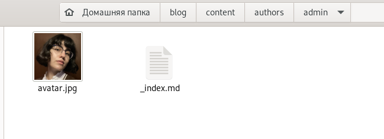
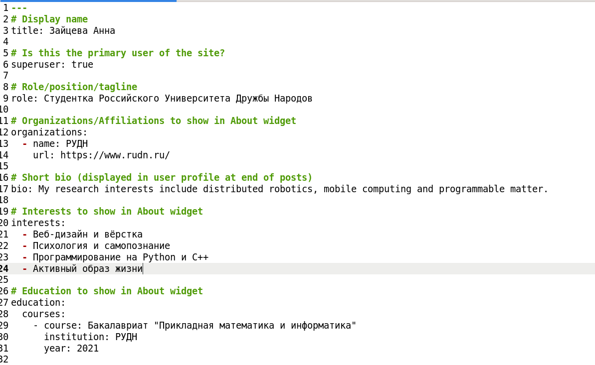
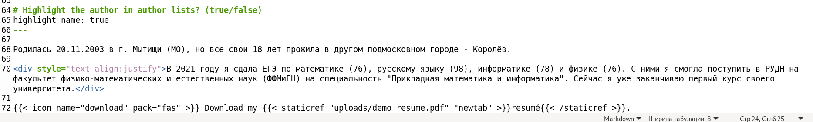
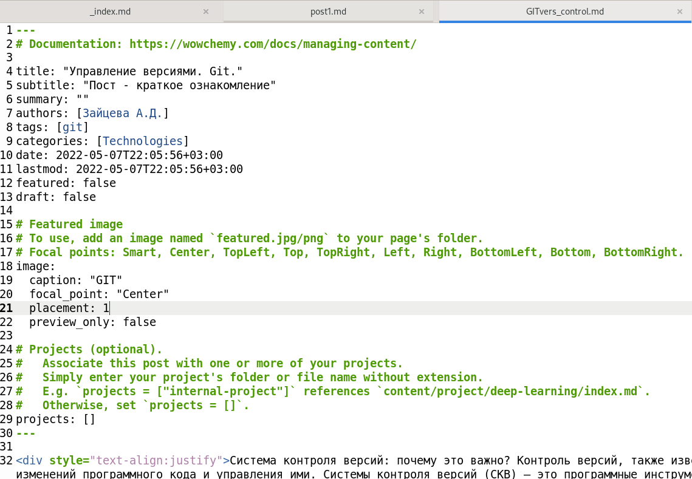

---
## Front matter
title: "Индивидуальный проект. Этап 2"
subtitle: "Отчёт ко 2 этапу индивидуального проекта"
author: "Зайцева Анна Дмитриевна"

## Generic options
lang: ru-RU

## Bibliography
bibliography: bib/cite.bib
csl: pandoc/csl/gost-r-7-0-5-2008-numeric.csl

## Pdf output format
toc: true # Table of contents
toc-depth: 2
lof: true # List of figures
lot: true # List of tables
fontsize: 12pt
linestretch: 1.5
papersize: a4
documentclass: scrreprt
## Fonts
mainfont: PT Serif
romanfont: PT Serif
sansfont: PT Sans
monofont: PT Mono
mainfontoptions: Ligatures=TeX
romanfontoptions: Ligatures=TeX
sansfontoptions: Ligatures=TeX,Scale=MatchLowercase
monofontoptions: Scale=MatchLowercase,Scale=0.9
## Pandoc-crossref LaTeX customization
figureTitle: "Рис."
tableTitle: "Таблица"
listingTitle: "Листинг"
lofTitle: "Список иллюстраций"
lotTitle: "Список таблиц"
lolTitle: "Листинги"
## Misc options
indent: true
header-includes:
  - \usepackage{indentfirst}
  - \usepackage{float} # keep figures where there are in the text
  - \floatplacement{figure}{H} # keep figures where there are in the text
---

# Цель работы

Цель работы --- Добавить к сайту данные о себе.

# Задание

  -  Разместить фотографию владельца сайта.
  -  Разместить краткое описание владельца сайта (Biography).
  -  Добавить информацию об интересах (Interests).
  -  Добавить информацию от образовании (Education).

- Сделать пост по прошедшей неделе (см. Шаблон поста по прошедшей неделе).
- Добавить пост на тему Управление версиями. Git.

# Выполнение 2 этапа индивидуального проекта

1. Переходим по папкам ка на фото и меняем изображение аватара и вносим изменения в файл рядом (Рис. [-@fig:001]):

{ #fig:001 width=70% }

2. Размещаем краткое описание владельца сайта (Biography), информацию об интересах (Interests), информацию от образовании (Education) (Рис. [-@fig:002])(Рис. [-@fig:003]):

{ #fig:002 width=70% }

{ #fig:003 width=70% }

3. Создаём пост по прошедшей неделе и тематический пост (Рис. [-@fig:004]):

{ #fig:004 width=70% }

5. Обновляем данные на Гитхабе.

# Вывод

Я добавила к сайту информацию о себе
