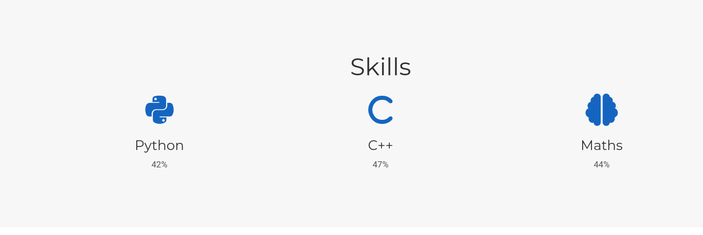

---
## Front matter
lang: ru-RU
title: Индивидуальный проект. Этап 3
author: |
	Anna D. Zaytseva\inst{1,3}
institute: |
	\inst{1}RUDN University, Moscow, Russian Federation
date: NEC--2022, 14 May, Moscow

## Formatting
toc: false
slide_level: 2
theme: metropolis
header-includes: 
 - \metroset{progressbar=frametitle,sectionpage=progressbar,numbering=fraction}
 - '\makeatletter'
 - '\beamer@ignorenonframefalse'
 - '\makeatother'
aspectratio: 43
section-titles: true
---

# Цель работы

Цель работы --- Добавить к сайту достижения.

# Задание

-  Список достижений.
   * Добавить информацию о навыках (Skills).
   * Добавить информацию об опыте (Experience).
   * Добавить информацию о достижениях (Accomplishments).
- Сделать пост по прошедшей неделе.
- Добавить пост на тему:
   * Легковесные языки разметки.

# Выполнение этапа 3

## Step 1

1. Добавила информацию о навыках (Skills) (~/blog/content/home/skills.md) (Рис. [-@fig:001])(Рис. [-@fig:002]):

{ #fig:001 width=70% }

{ #fig:002 width=70% }

2. Добавила информацию об опыте (Experience) (~/blog/content/home/experience.md) (Рис. [-@fig:003])(Рис. [-@fig:004]):

{ #fig:003 width=70% }

{ #fig:004 width=70% }

3. Добавила информацию о достижениях (Accomplishments) (~/blog/content/home/experience.md) (Рис. [-@fig:005])(Рис. [-@fig:006]):

{ #fig:005 width=70% }

{ #fig:006 width=70% }

## Step 2

4. Создаём пост по прошедшей неделе и тематический пост (Рис. [-@fig:007]):

{ #fig:007 width=70% }

## Step 3

Обновляем данные на GitHub и переходим на наш сайт.

# Вывод

Я добавила к сайту достижения.

## {.standout}

Спасибо за внимание!
