---
## Front matter
title: "Индивидуальный проект. Этап 5"
subtitle: "Отчёт к 5 этапу индивидуального проекта"
author: "Зайцева Анна Дмитриевна"

## Generic options
lang: ru-RU

## Bibliography
bibliography: bib/cite.bib
csl: pandoc/csl/gost-r-7-0-5-2008-numeric.csl

## Pdf output format
toc: true # Table of contents
toc-depth: 2
lof: true # List of figures
lot: true # List of tables
fontsize: 12pt
linestretch: 1.5
papersize: a4
documentclass: scrreprt
## Fonts
mainfont: PT Serif
romanfont: PT Serif
sansfont: PT Sans
monofont: PT Mono
mainfontoptions: Ligatures=TeX
romanfontoptions: Ligatures=TeX
sansfontoptions: Ligatures=TeX,Scale=MatchLowercase
monofontoptions: Scale=MatchLowercase,Scale=0.9
## Pandoc-crossref LaTeX customization
figureTitle: "Рис."
tableTitle: "Таблица"
listingTitle: "Листинг"
lofTitle: "Список иллюстраций"
lotTitle: "Список таблиц"
lolTitle: "Листинги"
## Misc options
indent: true
header-includes:
  - \usepackage{indentfirst}
  - \usepackage{float} # keep figures where there are in the text
  - \floatplacement{figure}{H} # keep figures where there are in the text
---

# Цель работы

Цель работы --- Добавить к сайту все остальные элементы.

# Задание

- Сделать записи для персональных проектов.
- Сделать пост по прошедшей неделе.
- Добавить пост на тему по выбору: Языки научного программирования.

# Выполнение 5 этапа индивидуального проекта

1. В папке ~/blog/content/project я создала 2 новые папки для записей для 2 персональных проектов (Programming и JavaScript) (Рис. [-@fig:001]):

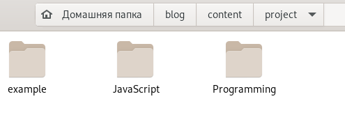{ #fig:001 width=70% }

Скопировала файл index.md из папки с примером записи для персонального проекта. И вставила его в обе новые папки. Там я изменила эти файлы под 2 новых проекта (Рис. [-@fig:002])(Рис. [-@fig:003]):

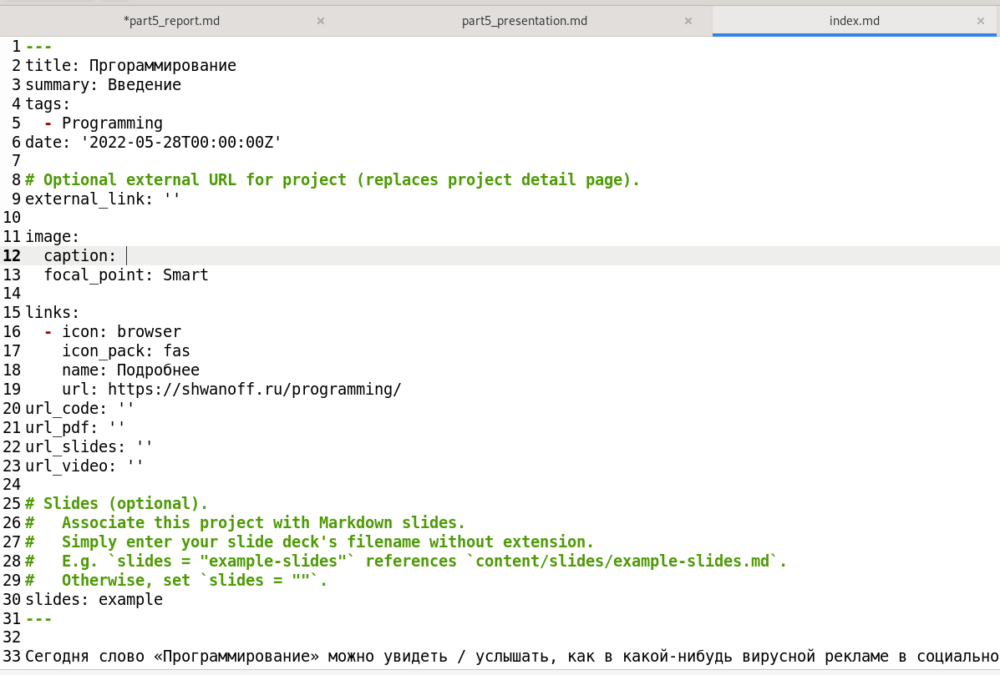{ #fig:002 width=70% }

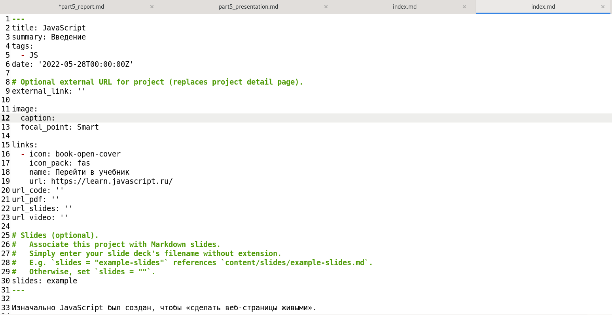{ #fig:003 width=70% }

После этого я добавила в обе новых папки по картинке с именами featured.jpg.

В папке ~/blog/content/home я зашла в файл projects.md (Рис. [-@fig:004]) и добавила туда новые теги для записей для персональных проектов (Рис. [-@fig:005]):

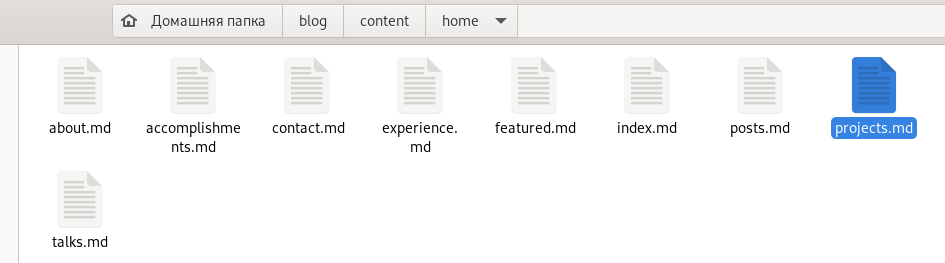{ #fig:004 width=70% }

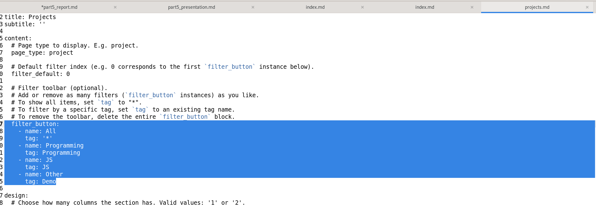{ #fig:005 width=70% }

В папке ~/blog/content/slides я создала 2 новые папки для записей для 2 персональных проектов (Programming и JavaScript) (Рис. [-@fig:006]):

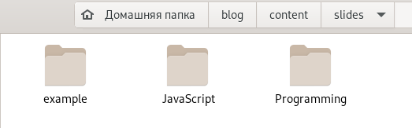{ #fig:006 width=70% }

И внесла в файлы index.md изменения (Рис. [-@fig:007])(Рис. [-@fig:008]):

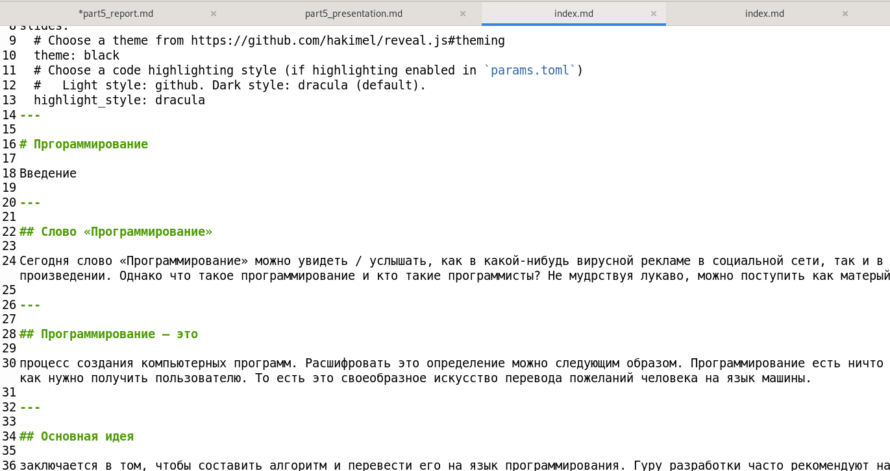{ #fig:007 width=70% }

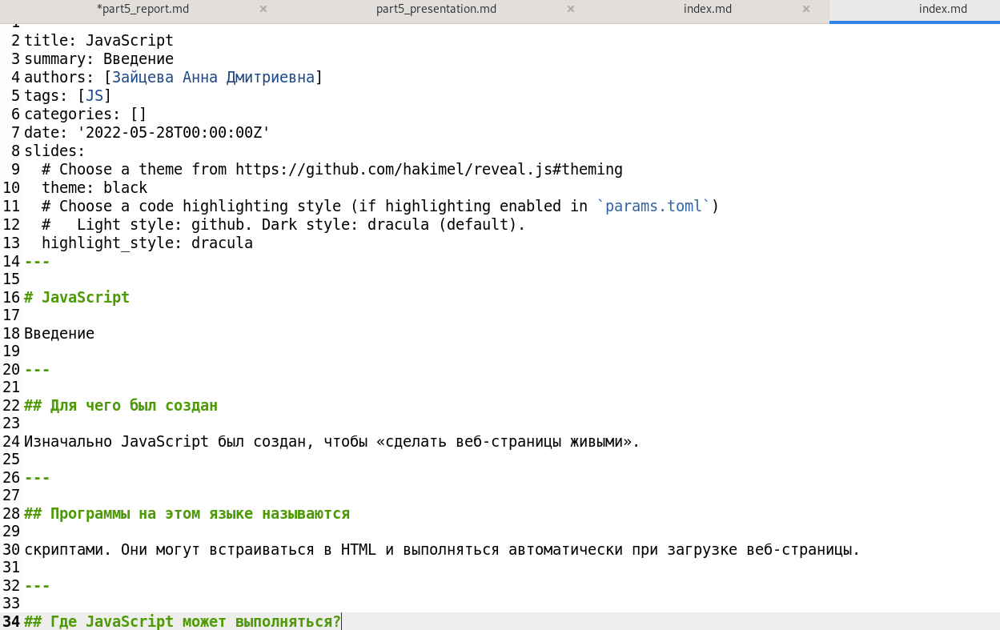{ #fig:008 width=70% }

И привязала эти слайды к своим проектам в документах index.md в папках проектов (Рис. [-@fig:009])(Рис. [-@fig:010]):

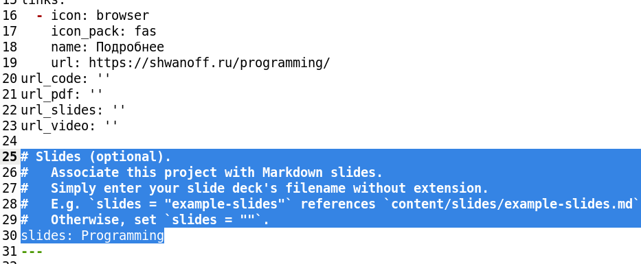{ #fig:009 width=70% }

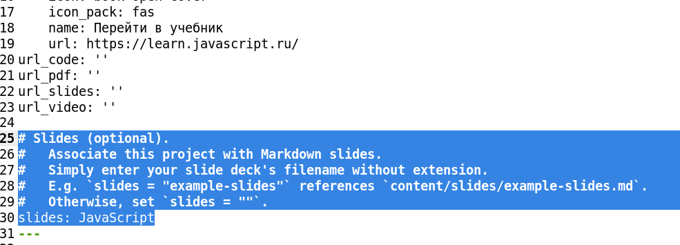{ #fig:010 width=70% }

Теперь при нажатии кнопок Slides у проектов будут открываться их презентации (Рис. [-@fig:011]):

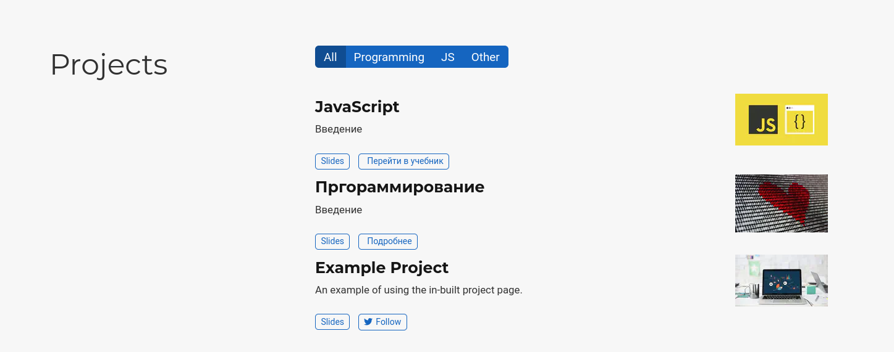{ #fig:011 width=70% }

2. Создала пост по прошедшей неделе и тематический пост (Рис. [-@fig:012]):

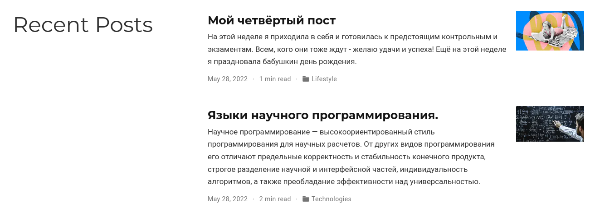{ #fig:012 width=70% }

3. Обновила данные на Гитхабе.

# Вывод

Я добавила к сайту все остальные элементы.
