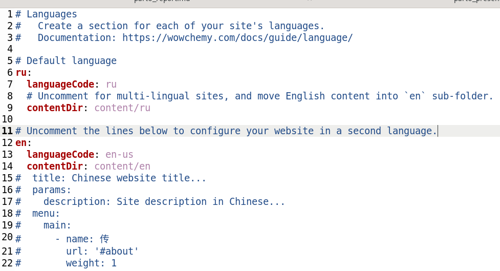
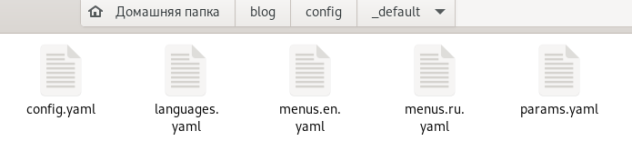
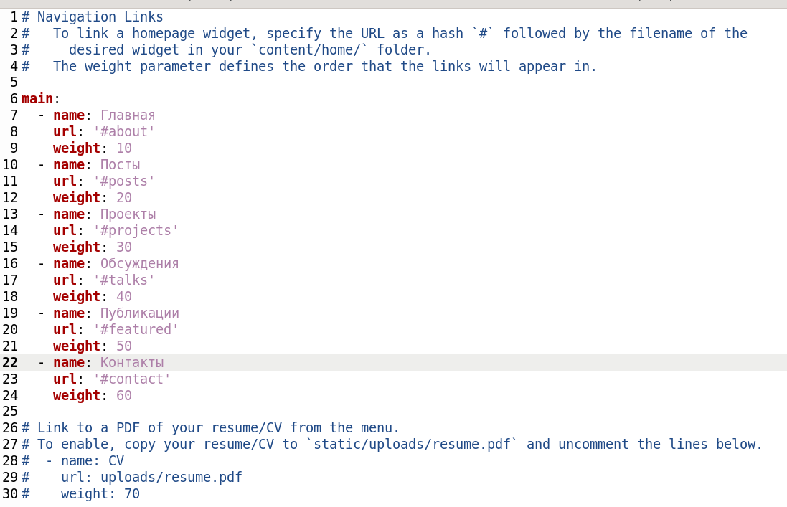
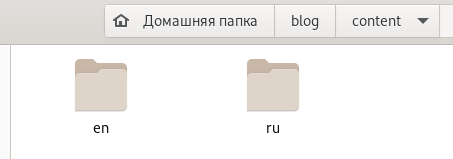
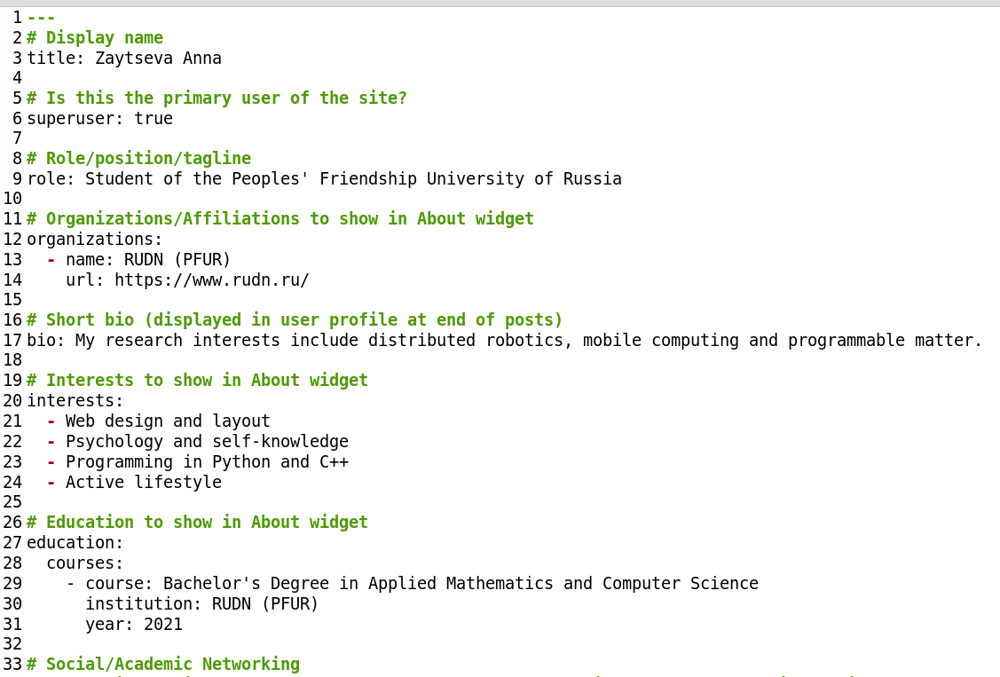
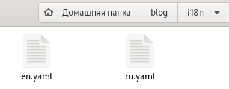
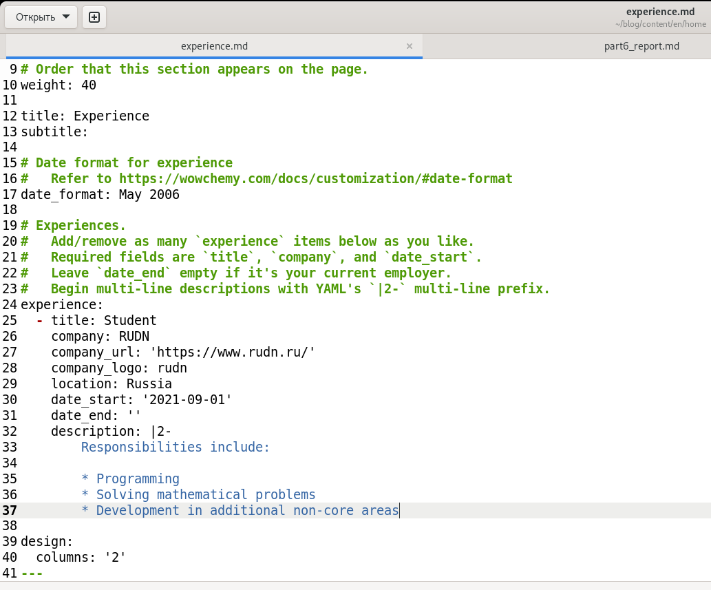
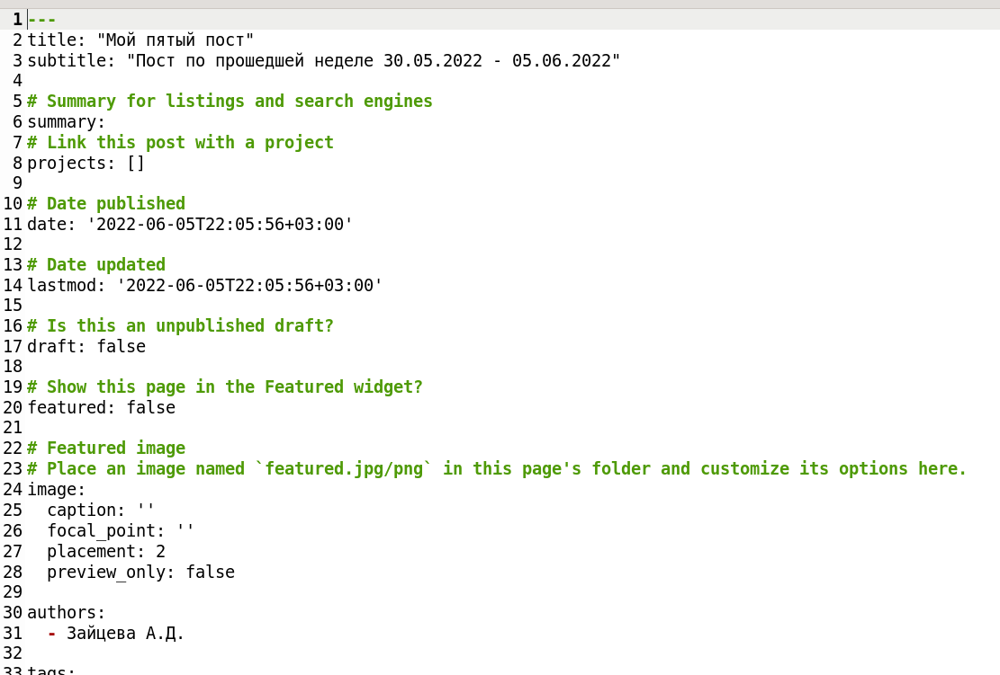

---
## Front matter
title: "Индивидуальный проект. Этап 6"
subtitle: "Отчёт к 6 этапу индивидуального проекта"
author: "Зайцева Анна Дмитриевна"

## Generic options
lang: ru-RU

## Bibliography
bibliography: bib/cite.bib
csl: pandoc/csl/gost-r-7-0-5-2008-numeric.csl

## Pdf output format
toc: true # Table of contents
toc-depth: 2
lof: true # List of figures
lot: true # List of tables
fontsize: 12pt
linestretch: 1.5
papersize: a4
documentclass: scrreprt
## Fonts
mainfont: PT Serif
romanfont: PT Serif
sansfont: PT Sans
monofont: PT Mono
mainfontoptions: Ligatures=TeX
romanfontoptions: Ligatures=TeX
sansfontoptions: Ligatures=TeX,Scale=MatchLowercase
monofontoptions: Scale=MatchLowercase,Scale=0.9
## Pandoc-crossref LaTeX customization
figureTitle: "Рис."
tableTitle: "Таблица"
listingTitle: "Листинг"
lofTitle: "Список иллюстраций"
lotTitle: "Список таблиц"
lolTitle: "Листинги"
## Misc options
indent: true
header-includes:
  - \usepackage{indentfirst}
  - \usepackage{float} # keep figures where there are in the text
  - \floatplacement{figure}{H} # keep figures where there are in the text
---

# Цель работы

Цель работы --- Размещение двуязычного сайта на Github.

# Задание

- Сделать поддержку английского и русского языков.
- Разместить элементы сайта на обоих языках.
- Разместить контент на обоих языках.
- Сделать пост по прошедшей неделе.
- Добавить пост на тему по выбору (на двух языках).

# Выполнение 6 этапа индивидуального проекта

1. В папке ~/blog/config/_default я отредактировала файл languages.yaml (Рис. [-@fig:001]):

{ #fig:001 width=70% }

2. В той же папке (~/blog/config/_default) я скопировала в эту же папку menus.yaml и переименовала копию в menus.ru.yaml, а оригинал переименовала в menus.en.yaml (Рис. [-@fig:002]):

{ #fig:002 width=70% }

3. Я внесла изменения в файл menus.ru.yaml (перевела пункты меню на русский) (Рис. [-@fig:003]):

{ #fig:003 width=70% }

4. В папке ~/blog/content я создала 2 папки en и ru, в которые перенесла (в каждую) все документы и папки, находившиеся изначально в ~/blog/content (Рис. [-@fig:004]):

{ #fig:004 width=70% }

5. В папке ~/blog/content/en/authors/admin я внесла изменения в файл _index.md, переведя информацию о себе на английский язык (Рис. [-@fig:005]):

{ #fig:005 width=70% }

6. В основной папке проекта создаём каталог i18n с 2 файлами: en.yaml, ru.yaml, скачанными с сайта wowchemy.com (Рис. [-@fig:006]):

{ #fig:006 width=70% }

7. Во всех файлах в ~/blog/content/en мы переводим всё с русского на английский (Рис. [-@fig:007]):

{ #fig:007 width=70% }

Также я перевела все посты, проекты и слайды с русского на английский.

8. Создала пост по прошедшей неделе и тематический пост и перевела их на английский (Рис. [-@fig:08]):

{ #fig:08 width=70% }

9. Обновила данные на Гитхабе.

# Вывод

Я разместила двуязычный сайт на GitHub.
